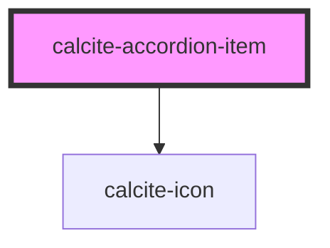

# calcite-accordion-item

A child component of `calcite-accordion`, where some behavior is inherited from its parent such as the `appearance` and `selectionMode`.

<!-- Auto Generated Below -->

## Properties

| Property      | Attribute       | Description                                                                                                 | Type                         | Default     |
| ------------- | --------------- | ----------------------------------------------------------------------------------------------------------- | ---------------------------- | ----------- |
| `description` | `description`   | Specifies a description for the component.                                                                  | `string`                     | `undefined` |
| `expanded`    | `expanded`      | When `true`, the component is expanded.                                                                     | `boolean`                    | `false`     |
| `heading`     | `heading`       | Specifies heading text for the component.                                                                   | `string`                     | `undefined` |
| `iconEnd`     | `icon-end`      | Specifies an icon to display at the end of the component.                                                   | `string`                     | `undefined` |
| `iconFlipRtl` | `icon-flip-rtl` | Displays the `iconStart` and/or `iconEnd` as flipped when the element direction is right-to-left (`"rtl"`). | `"both" \| "end" \| "start"` | `undefined` |
| `iconStart`   | `icon-start`    | Specifies an icon to display at the start of the component.                                                 | `string`                     | `undefined` |

## Slots

| Slot              | Description                                                                                 |
| ----------------- | ------------------------------------------------------------------------------------------- |
|                   | A slot for adding custom content, including nested `calcite-accordion-item`s.               |
| `"actions-end"`   | A slot for adding `calcite-action`s or content to the end side of the component's header.   |
| `"actions-start"` | A slot for adding `calcite-action`s or content to the start side of the component's header. |

## Dependencies

### Depends on

- [calcite-icon](../icon)

### Graph

---

_Built with [StencilJS](https://stenciljs.com/)_
