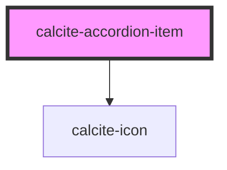

# calcite-accordion-item

For comprehensive guidance on using and implementing `calcite-accordion-item`, refer to the [documentation page](https://developers.arcgis.com/calcite-design-system/components/accordion-item/).

<!-- Auto Generated Below -->

## Properties

| Property      | Attribute       | Description                                                                                                 | Type                         | Default     |
| ------------- | --------------- | ----------------------------------------------------------------------------------------------------------- | ---------------------------- | ----------- |
| `description` | `description`   | Specifies a description for the component.                                                                  | `string`                     | `undefined` |
| `expanded`    | `expanded`      | When `true`, the component is expanded.                                                                     | `boolean`                    | `false`     |
| `heading`     | `heading`       | Specifies heading text for the component.                                                                   | `string`                     | `undefined` |
| `iconEnd`     | `icon-end`      | Specifies an icon to display at the end of the component.                                                   | `string`                     | `undefined` |
| `iconFlipRtl` | `icon-flip-rtl` | Displays the `iconStart` and/or `iconEnd` as flipped when the element direction is right-to-left (`"rtl"`). | `"both" \| "end" \| "start"` | `undefined` |
| `iconStart`   | `icon-start`    | Specifies an icon to display at the start of the component.                                                 | `string`                     | `undefined` |

## Methods

### `setFocus() => Promise<void>`

Sets focus on the component.

#### Returns

Type: `Promise<void>`

## Slots

| Slot              | Description                                                                                 |
| ----------------- | ------------------------------------------------------------------------------------------- |
|                   | A slot for adding custom content, including nested `calcite-accordion-item`s.               |
| `"actions-end"`   | A slot for adding `calcite-action`s or content to the end side of the component's header.   |
| `"actions-start"` | A slot for adding `calcite-action`s or content to the start side of the component's header. |

## CSS Custom Properties

| Name                                               | Description                                                                                                           |
| -------------------------------------------------- | --------------------------------------------------------------------------------------------------------------------- |
| `--calcite-accordion-border-color`                 | [Deprecated] Use `--calcite-accordion-item-border-color`. Specifies the component's border color.                     |
| `--calcite-accordion-item-background-color`        | Specifies the component's background color.                                                                           |
| `--calcite-accordion-item-border-color`            | Specifies the component's border color.                                                                               |
| `--calcite-accordion-item-content-space`           | Specifies the component's padding.                                                                                    |
| `--calcite-accordion-item-end-icon-color`          | Specifies the component's `iconEnd` color. Fallback to `--calcite-accordion-item-icon-color` or current color.        |
| `--calcite-accordion-item-expand-icon-color`       | Specifies the component's expand icon color.                                                                          |
| `--calcite-accordion-item-header-background-color` | Specifies the component's `heading` background color.                                                                 |
| `--calcite-accordion-item-heading-text-color`      | Specifies the component's `heading` text color.                                                                       |
| `--calcite-accordion-item-icon-color`              | Specifies the component's default icon color.                                                                         |
| `--calcite-accordion-item-start-icon-color`        | Specifies the component's `iconStart` color. Fallback to `--calcite-accordion-item-icon-color` or current color.      |
| `--calcite-accordion-item-text-color`              | Specifies the component's text color.                                                                                 |
| `--calcite-accordion-text-color`                   | [Deprecated] Use `--calcite-accordion-item-text-color`. Specifies the component's text color.                         |
| `--calcite-accordion-text-color-hover`             | [Deprecated] Use `--calcite-accordion-item-text-color-hover`. Specifies the component's main text color on hover.     |
| `--calcite-accordion-text-color-pressed`           | [Deprecated] Use `--calcite-accordion-item-text-color-press`. Specifies the component's main text color when pressed. |

## Dependencies

### Depends on

- [calcite-icon](../icon)

### Graph

---
