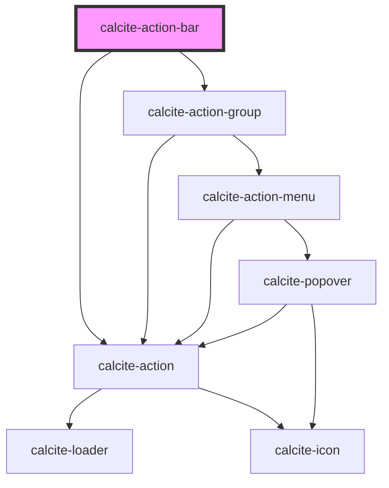

# calcite-action-bar

## Description

The `calcite-action-bar` component is made up of multiple `calcite-action`s in the form of clickable icons. The action bar can be expanded to view actions with descriptive text or made smaller to view with just icons.

<!-- Auto Generated Below -->

## Usage

### Actions-end

The actions-end slot renders `calcite-action`s that stick to the end of the bar prior to the expand/collapse icon.

```html
<calcite-action-bar>
  <calcite-action text="Information" icon="information"></calcite-action>
  <calcite-action text="Feedback" slot="actions-end" icon="mega-phone"></calcite-action>
</calcite-action-bar>
```

### Basic

Renders `calcite-action`s that stick to the top of the bar.

```html
<calcite-action-bar>
  <calcite-action text="Add" icon="plus"></calcite-action>
  <calcite-action text="Save" icon="save"></calcite-action>
</calcite-action-bar>
```

### Tooltip

Renders with a tooltip on the expand action.

```html
<calcite-action-bar id="action-bar-test">
  <calcite-tooltip slot="expand-tooltip">Expand</calcite-tooltip>
  <calcite-action text="Add" icon="plus"></calcite-action>
</calcite-action-bar>
```

### With-grouping

Renders a group of `calcite-action`s contained in a `calcite-action-group`. Actions in a group are visually separated from other groups or actions in the bar.

```html
<calcite-action-bar>
  <calcite-action-group label="Manage item">
    <calcite-action text="Add" icon="plus"></calcite-action>
    <calcite-action text="Save" icon="save"></calcite-action>
  </calcite-action-group>

  <calcite-action-group label="Item types">
    <calcite-action text="Layers" icon="layers"></calcite-action>
    <calcite-action text="Basemaps" icon="layer-basemap"></calcite-action>
  </calcite-action-group>
</calcite-action-bar>
```

## Properties

| Property                  | Attribute                   | Description                                                                     | Type                                      | Default      |
| ------------------------- | --------------------------- | ------------------------------------------------------------------------------- | ----------------------------------------- | ------------ |
| `actionsEndGroupLabel`    | `actions-end-group-label`   | Specifies the accessible label for the last `calcite-action-group`.             | `string`                                  | `undefined`  |
| `expandDisabled`          | `expand-disabled`           | When `true`, the expand-toggling behavior is disabled.                          | `boolean`                                 | `false`      |
| `expanded`                | `expanded`                  | When `true`, the component is expanded.                                         | `boolean`                                 | `false`      |
| `layout`                  | `layout`                    | Specifies the layout direction of the actions.                                  | `"horizontal" \| "vertical"`              | `"vertical"` |
| `messageOverrides`        | --                          | Use this property to override individual strings used by the component.         | `{ expand?: string; collapse?: string; }` | `undefined`  |
| `overflowActionsDisabled` | `overflow-actions-disabled` | Disables automatically overflowing `calcite-action`s that won't fit into menus. | `boolean`                                 | `false`      |
| `position`                | `position`                  | Arranges the component depending on the element's `dir` property.               | `"end" \| "start"`                        | `undefined`  |
| `scale`                   | `scale`                     | Specifies the size of the expand `calcite-action`.                              | `"l" \| "m" \| "s"`                       | `undefined`  |

## Events

| Event                    | Description                                    | Type                |
| ------------------------ | ---------------------------------------------- | ------------------- |
| `calciteActionBarToggle` | Emits when the `expanded` property is toggled. | `CustomEvent<void>` |

## Methods

### `setFocus() => Promise<void>`

Sets focus on the component's first focusable element.

#### Returns

Type: `Promise<void>`

## Slots

| Slot               | Description                                                                                                                                                               |
| ------------------ | ------------------------------------------------------------------------------------------------------------------------------------------------------------------------- |
|                    | A slot for adding `calcite-action`s that will appear at the top of the component.                                                                                         |
| `"actions-end"`    | A slot for adding `calcite-action`s that will appear at the end of the component, prior to the collapse/expand button.                                                    |
| `"bottom-actions"` | [Deprecated] Use the `"actions-end"` slot instead. A slot for adding `calcite-action`s that will appear at the bottom of the component, above the collapse/expand button. |
| `"expand-tooltip"` | A slot to set the `calcite-tooltip` for the expand toggle.                                                                                                                |

## CSS Custom Properties

| Name                                      | Description                                                                       |
| ----------------------------------------- | --------------------------------------------------------------------------------- |
| `--calcite-action-bar-expanded-max-width` | When `layout` is `"vertical"`, specifies the expanded max width of the component. |

## Dependencies

### Depends on

- [calcite-action-group](../action-group)
- [calcite-action](../action)

### Graph



---

*Built with [StencilJS](https://stenciljs.com/)*
