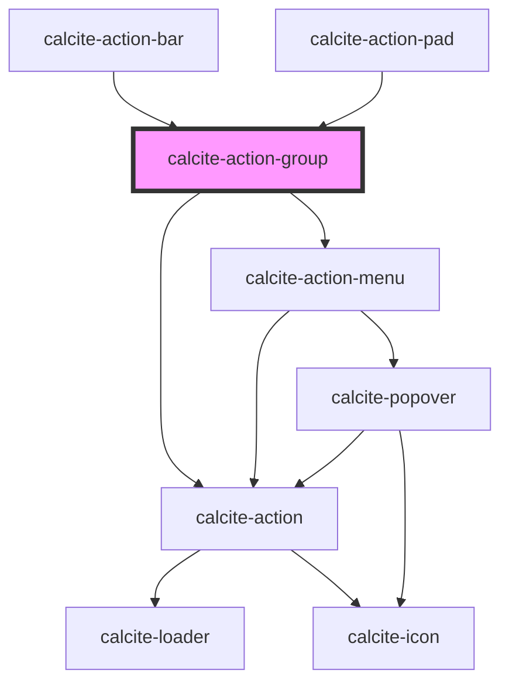

# calcite-action-group

For comprehensive guidance on using and implementing `calcite-action-group`, refer to the [documentation page](https://developers.arcgis.com/calcite-design-system/components/action-group/).

<!-- Auto Generated Below -->

## Properties

| Property             | Attribute             | Description                                                                                                                                                                                                                                                                                                                                                                 | Type                                   | Default      |
| -------------------- | --------------------- | --------------------------------------------------------------------------------------------------------------------------------------------------------------------------------------------------------------------------------------------------------------------------------------------------------------------------------------------------------------------------- | -------------------------------------- | ------------ |
| `columns`            | `columns`             | Indicates number of columns.                                                                                                                                                                                                                                                                                                                                                | `1 \| 2 \| 3 \| 4 \| 5 \| 6`           | `undefined`  |
| `expanded`           | `expanded`            | When `true`, the component is expanded.                                                                                                                                                                                                                                                                                                                                     | `boolean`                              | `false`      |
| `label`              | `label`               | Accessible name for the component.                                                                                                                                                                                                                                                                                                                                          | `string`                               | `undefined`  |
| `layout`             | `layout`              | **[DEPRECATED]** Use the `layout` property on the component's parent instead.  Indicates the layout of the component.                                                                                                                                                                                                                | `"grid" \| "horizontal" \| "vertical"` | `"vertical"` |
| `menuOpen`           | `menu-open`           | When `true`, the `calcite-action-menu` is open.                                                                                                                                                                                                                                                                                                                             | `boolean`                              | `false`      |
| `messageOverrides`   | `message-overrides`   | Use this property to override individual strings used by the component.                                                                                                                                                                                                                                                                                                     | `ActionGroupMessages`                  | `undefined`  |
| `overlayPositioning` | `overlay-positioning` | Determines the type of positioning to use for the overlaid content. Using `"absolute"` will work for most cases. The component will be positioned inside of overflowing parent containers and will affect the container's layout. `"fixed"` should be used to escape an overflowing parent container, or when the reference element's `position` CSS property is `"fixed"`. | `"absolute" \| "fixed"`                | `"absolute"` |
| `scale`              | `scale`               | Specifies the size of the `calcite-action-menu`.                                                                                                                                                                                                                                                                                                                            | `"l" \| "m" \| "s"`                    | `undefined`  |

## Methods

### `setFocus() => Promise<void>`

Sets focus on the component's first focusable element.

#### Returns

Type: `Promise<void>`

## Slots

| Slot             | Description                                                                            |
| ---------------- | -------------------------------------------------------------------------------------- |
|                  | A slot for adding a group of `calcite-action`s.                                        |
| `"menu-actions"` | A slot for adding an overflow menu with `calcite-action`s inside a `calcite-dropdown`. |
| `"menu-tooltip"` | A slot for adding a `calcite-tooltip` for the menu.                                    |

## CSS Custom Properties

| Name                                  | Description                                                                                      |
| ------------------------------------- | ------------------------------------------------------------------------------------------------ |
| `--calcite-action-background-color`   | Specifies the component's background color.                                                      |
| `--calcite-action-group-border-color` | Specifies the component's border color when used in a calcite-action-bar or calcite-action-menu. |
| `--calcite-action-group-columns`      | Specifies the component's grid-template-columns when the `layout` property is `"grid"`.          |
| `--calcite-action-group-gap`          | Specifies the component's gap when the `layout` property is `"grid" and padding`.                |
| `--calcite-action-group-padding`      | [Deprecated] Use --calcite-action-group-gap. Specifies the component's padding.                  |

## Dependencies

### Used by

- [calcite-action-bar](../action-bar)
- [calcite-action-pad](../action-pad)

### Depends on

- [calcite-action-menu](../action-menu)
- [calcite-action](../action)

### Graph

---

*Built with [StencilJS](https://stenciljs.com/)*
