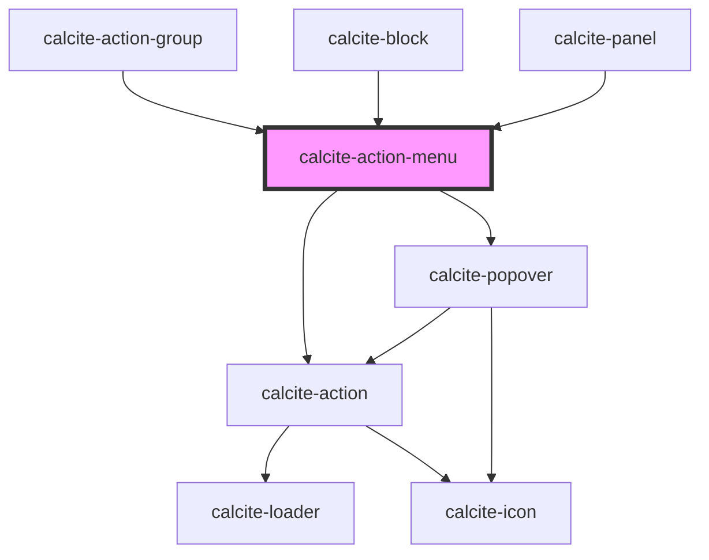

# calcite-action-menu

<!-- Auto Generated Below -->

## Properties

| Property             | Attribute             | Description                                                                                                                                                                                                                                                                                                                                                                 | Type                                                                                                                                                                                                                                                                                                              | Default      |
| -------------------- | --------------------- | --------------------------------------------------------------------------------------------------------------------------------------------------------------------------------------------------------------------------------------------------------------------------------------------------------------------------------------------------------------------------- | ----------------------------------------------------------------------------------------------------------------------------------------------------------------------------------------------------------------------------------------------------------------------------------------------------------------- | ------------ |
| `appearance`         | `appearance`          | Specifies the appearance of the component.                                                                                                                                                                                                                                                                                                                                  | `"solid" \| "transparent"`                                                                                                                                                                                                                                                                                        | `"solid"`    |
| `expanded`           | `expanded`            | When `true`, the component is expanded.                                                                                                                                                                                                                                                                                                                                     | `boolean`                                                                                                                                                                                                                                                                                                         | `false`      |
| `flipPlacements`     | --                    | Defines the available placements that can be used when a flip occurs.                                                                                                                                                                                                                                                                                                       | `Placement[]`                                                                                                                                                                                                                                                                                                     | `undefined`  |
| `label` *(required)* | `label`               | Specifies the text string for the component.                                                                                                                                                                                                                                                                                                                                | `string`                                                                                                                                                                                                                                                                                                          | `undefined`  |
| `open`               | `open`                | When `true`, the component is open.                                                                                                                                                                                                                                                                                                                                         | `boolean`                                                                                                                                                                                                                                                                                                         | `false`      |
| `overlayPositioning` | `overlay-positioning` | Determines the type of positioning to use for the overlaid content. Using `"absolute"` will work for most cases. The component will be positioned inside of overflowing parent containers and will affect the container's layout. `"fixed"` should be used to escape an overflowing parent container, or when the reference element's `position` CSS property is `"fixed"`. | `"absolute" \| "fixed"`                                                                                                                                                                                                                                                                                           | `"absolute"` |
| `placement`          | `placement`           | Determines where the component will be positioned relative to the `referenceElement`.                                                                                                                                                                                                                                                                                       | `"auto" \| "top" \| "right" \| "bottom" \| "left" \| "top-start" \| "top-end" \| "right-start" \| "right-end" \| "bottom-start" \| "bottom-end" \| "left-start" \| "left-end" \| "auto-start" \| "auto-end" \| "leading-start" \| "leading" \| "leading-end" \| "trailing-end" \| "trailing" \| "trailing-start"` | `"auto"`     |
| `scale`              | `scale`               | Specifies the size of the component's trigger `calcite-action`.                                                                                                                                                                                                                                                                                                             | `"l" \| "m" \| "s"`                                                                                                                                                                                                                                                                                               | `undefined`  |

## Events

| Event                   | Description                                | Type                |
| ----------------------- | ------------------------------------------ | ------------------- |
| `calciteActionMenuOpen` | Fires when the `open` property is toggled. | `CustomEvent<void>` |

## Methods

### `setFocus() => Promise<void>`

Sets focus on the component.

#### Returns

Type: `Promise<void>`

## Slots

| Slot        | Description                                                       |
| ----------- | ----------------------------------------------------------------- |
|             | A slot for adding `calcite-action`s.                              |
| `"tooltip"` | A slot for adding an tooltip for the menu.                        |
| `"trigger"` | A slot for adding a `calcite-action` to trigger opening the menu. |

## Dependencies

### Used by

- [calcite-action-group](../action-group)
- [calcite-block](../block)
- [calcite-panel](../panel)

### Depends on

- [calcite-action](../action)
- [calcite-popover](../popover)

### Graph

---

*Built with [StencilJS](https://stenciljs.com/)*
