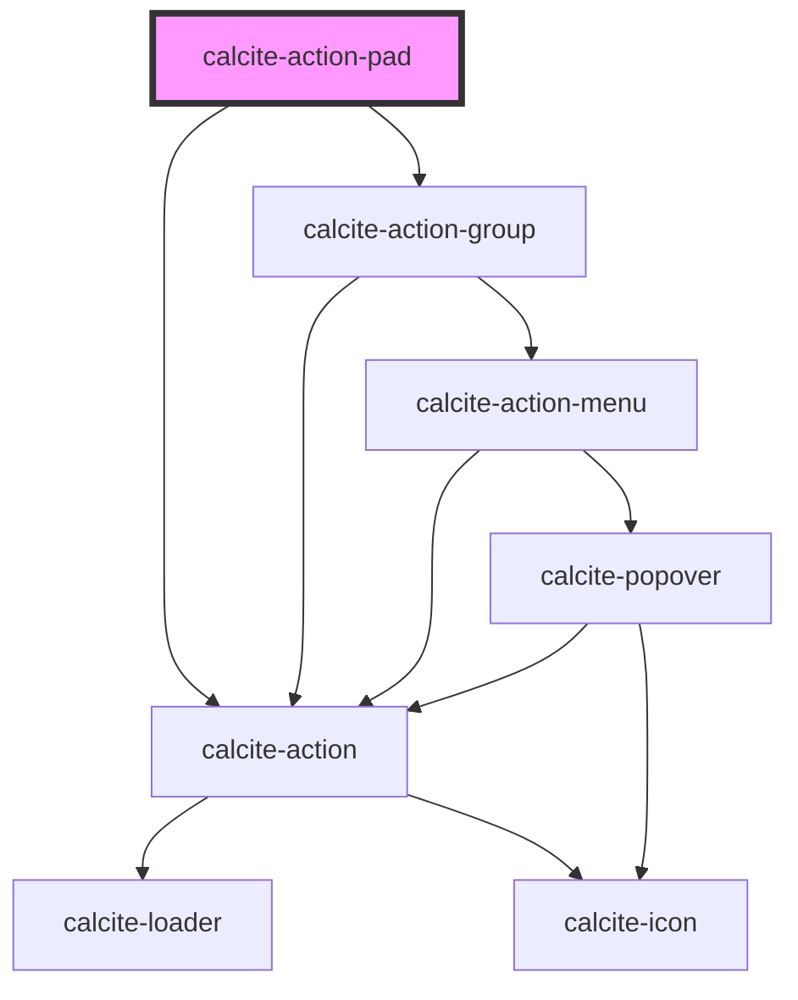

# calcite-action-pad

The `calcite-action-pad` component is made up of `calcite-action`s in the form of clickable icons. This does not have an expandable option and is a smaller and simpler component than `calcite-action-bar`.

<!-- Auto Generated Below -->

## Usage

### Basic

Renders a basic action pad with `calcite-action`s.

```html
<calcite-action-pad>
  <calcite-action text="Undo" icon="undo"></calcite-action>
  <calcite-action text="Redo" icon="redo"></calcite-action>
</calcite-action-pad>
```

### Tooltip

Renders an action pad with a tooltip on the expand action.

```html
<calcite-action-pad id="action-pad-test">
  <calcite-action text="Add" icon="plus"></calcite-action>
  <calcite-tooltip slot="expand-tooltip">Let's expand</calcite-tooltip>
</calcite-action-pad>
```

### With-grouping

Renders a group of `calcite-action`s contained in a `calcite-action-group`. Actions in a group are visually separated from other groups or actions in the pad.

```html
<calcite-action-pad>
  <calcite-action-group label="Manage item">
    <calcite-action text="Home" icon="home"></calcite-action>
    <calcite-action text="Styles" icon="add-in-edit"></calcite-action>
  </calcite-action-group>

  <calcite-action text="Tips" icon="lightbulb"></calcite-action>
</calcite-action-pad>
```

## Properties

| Property               | Attribute                 | Description                                                             | Type                                   | Default      |
| ---------------------- | ------------------------- | ----------------------------------------------------------------------- | -------------------------------------- | ------------ |
| `actionsEndGroupLabel` | `actions-end-group-label` | Specifies the accessible label for the last `calcite-action-group`.     | `string`                               | `undefined`  |
| `expandDisabled`       | `expand-disabled`         | When `true`, the expand-toggling behavior is disabled.                  | `boolean`                              | `false`      |
| `expanded`             | `expanded`                | When `true`, the component is expanded.                                 | `boolean`                              | `false`      |
| `layout`               | `layout`                  | Indicates the layout of the component.                                  | `"grid" \| "horizontal" \| "vertical"` | `"vertical"` |
| `messageOverrides`     | `message-overrides`       | Use this property to override individual strings used by the component. | `ActionPadMessages`                    | `undefined`  |
| `position`             | `position`                | Arranges the component depending on the element's `dir` property.       | `"end" \| "start"`                     | `undefined`  |
| `scale`                | `scale`                   | Specifies the size of the expand `calcite-action`.                      | `"l" \| "m" \| "s"`                    | `undefined`  |

## Events

| Event                    | Description                                    | Type                |
| ------------------------ | ---------------------------------------------- | ------------------- |
| `calciteActionPadToggle` | Emits when the `expanded` property is toggled. | `CustomEvent<void>` |

## Methods

### `setFocus() => Promise<void>`

Sets focus on the component's first focusable element.

#### Returns

Type: `Promise<void>`

## Slots

| Slot               | Description                                                |
| ------------------ | ---------------------------------------------------------- |
|                    | A slot for adding `calcite-action`s to the component.      |
| `"expand-tooltip"` | A slot to set the `calcite-tooltip` for the expand toggle. |

## CSS Custom Properties

| Name                                      | Description                                                                       |
| ----------------------------------------- | --------------------------------------------------------------------------------- |
| `--calcite-action-pad-expanded-max-width` | When `layout` is `"vertical"`, specifies the expanded max width of the component. |

## Dependencies

### Depends on

- [calcite-action-group](../action-group)
- [calcite-action](../action)

### Graph



---

*Built with [StencilJS](https://stenciljs.com/)*
