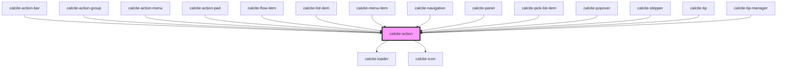

# calcite-action

For comprehensive guidance on using and implementing `calcite-action`, refer to the [documentation page](https://developers.arcgis.com/calcite-design-system/components/action/).

<!-- Auto Generated Below -->

## Properties

| Property            | Attribute           | Description                                                                                                                              | Type                           | Default     |
| ------------------- | ------------------- | ---------------------------------------------------------------------------------------------------------------------------------------- | ------------------------------ | ----------- |
| `active`            | `active`            | When `true`, the component is highlighted.                                                                                               | `boolean`                      | `false`     |
| `alignment`         | `alignment`         | Specifies the horizontal alignment of button elements with text content.                                                                 | `"center" \| "end" \| "start"` | `undefined` |
| `appearance`        | `appearance`        | Specifies the appearance of the component.                                                                                               | `"solid" \| "transparent"`     | `"solid"`   |
| `compact`           | `compact`           | **[DEPRECATED]** No longer necessary.  When `true`, the side padding of the component is reduced. | `boolean`                      | `false`     |
| `disabled`          | `disabled`          | When `true`, interaction is prevented and the component is displayed with lower opacity.                                                 | `boolean`                      | `false`     |
| `icon`              | `icon`              | Specifies an icon to display.                                                                                                            | `string`                       | `undefined` |
| `iconFlipRtl`       | `icon-flip-rtl`     | When `true`, the icon will be flipped when the element direction is right-to-left (`"rtl"`).                                             | `boolean`                      | `false`     |
| `indicator`         | `indicator`         | When `true`, displays a visual indicator.                                                                                                | `boolean`                      | `false`     |
| `label`             | `label`             | Specifies the label of the component. If no label is provided, the label inherits what's provided for the `text` prop.                   | `string`                       | `undefined` |
| `loading`           | `loading`           | When `true`, a busy indicator is displayed.                                                                                              | `boolean`                      | `false`     |
| `messageOverrides`  | `message-overrides` | Use this property to override individual strings used by the component.                                                                  | `ActionMessages`               | `undefined` |
| `scale`             | `scale`             | Specifies the size of the component.                                                                                                     | `"l" \| "m" \| "s"`            | `"m"`       |
| `text` *(required)* | `text`              | Specifies text that accompanies the icon.                                                                                                | `string`                       | `undefined` |
| `textEnabled`       | `text-enabled`      | Indicates whether the text is displayed.                                                                                                 | `boolean`                      | `false`     |

## Methods

### `setFocus() => Promise<void>`

Sets focus on the component.

#### Returns

Type: `Promise<void>`

## Slots

| Slot        | Description                                               |
| ----------- | --------------------------------------------------------- |
|             | A slot for adding a `calcite-icon`.                       |
| `"tooltip"` | [Deprecated] Use the `calcite-tooltip` component instead. |

## CSS Custom Properties

| Name                               | Description                                       |
| ---------------------------------- | ------------------------------------------------- |
| `--calcite-action-indicator-color` | Specifies the color of the component's indicator. |

## Dependencies

### Used by

- [calcite-action-bar](../action-bar)
- [calcite-action-group](../action-group)
- [calcite-action-menu](../action-menu)
- [calcite-action-pad](../action-pad)
- [calcite-flow-item](../flow-item)
- [calcite-list-item](../list-item)
- [calcite-menu-item](../menu-item)
- [calcite-navigation](../navigation)
- [calcite-panel](../panel)
- [calcite-pick-list-item](../pick-list-item)
- [calcite-popover](../popover)
- [calcite-stepper](../stepper)
- [calcite-tip](../tip)
- [calcite-tip-manager](../tip-manager)

### Depends on

- [calcite-loader](../loader)
- [calcite-icon](../icon)

### Graph

---

*Built with [StencilJS](https://stenciljs.com/)*
