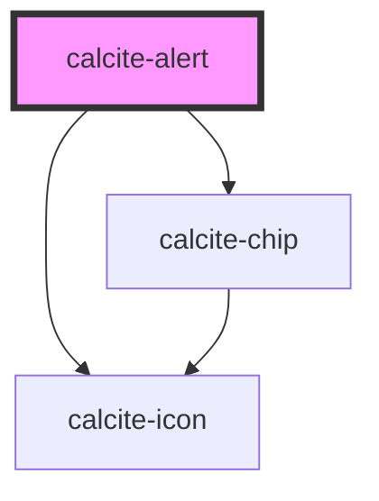

# calcite-alert

<!-- Auto Generated Below -->

## Usage

### Basic

A single instance of an alert. Multiple alerts will aggregate in a queue.

```html
<calcite-alert open>
  <div slot="title">Title of alert</div>
  <div slot="message">Message text of the alert</div>
  <a slot="link" href="#">Retry</a>
</calcite-alert>
```

## Properties

| Property             | Attribute             | Description                                                                                                           | Type                                                                                                                                                                                                                                    | Default     |
| -------------------- | --------------------- | --------------------------------------------------------------------------------------------------------------------- | --------------------------------------------------------------------------------------------------------------------------------------------------------------------------------------------------------------------------------------- | ----------- |
| `autoClose`          | `auto-close`          | When `true`, the component closes automatically (recommended for passive, non-blocking alerts).                       | `boolean`                                                                                                                                                                                                                               | `false`     |
| `autoCloseDuration`  | `auto-close-duration` | Specifies the duration before the component automatically closes (only use with `autoClose`).                         | `"fast" \| "medium" \| "slow"`                                                                                                                                                                                                          | `"medium"`  |
| `icon`               | `icon`                | When `true`, shows a default recommended icon. Alternatively, pass a Calcite UI Icon name to display a specific icon. | `boolean \| string`                                                                                                                                                                                                                     | `undefined` |
| `iconFlipRtl`        | `icon-flip-rtl`       | When `true`, the icon will be flipped when the element direction is right-to-left (`"rtl"`).                          | `boolean`                                                                                                                                                                                                                               | `false`     |
| `kind`               | `kind`                | Specifies the kind of the component (will apply to top border and icon).                                              | `"brand" \| "danger" \| "info" \| "success" \| "warning"`                                                                                                                                                                               | `"brand"`   |
| `label` _(required)_ | `label`               | Specifies an accessible name for the component.                                                                       | `string`                                                                                                                                                                                                                                | `undefined` |
| `messageOverrides`   | --                    | Use this property to override individual strings used by the component.                                               | `{ close?: string; }`                                                                                                                                                                                                                   | `undefined` |
| `numberingSystem`    | `numbering-system`    | Specifies the Unicode numeral system used by the component for localization.                                          | `"arab" \| "arabext" \| "bali" \| "beng" \| "deva" \| "fullwide" \| "gujr" \| "guru" \| "hanidec" \| "khmr" \| "knda" \| "laoo" \| "latn" \| "limb" \| "mlym" \| "mong" \| "mymr" \| "orya" \| "tamldec" \| "telu" \| "thai" \| "tibt"` | `undefined` |
| `open`               | `open`                | When `true`, displays and positions the component.                                                                    | `boolean`                                                                                                                                                                                                                               | `false`     |
| `placement`          | `placement`           | Specifies the placement of the component                                                                              | `"bottom" \| "bottom-end" \| "bottom-start" \| "top" \| "top-end" \| "top-start"`                                                                                                                                                       | `"bottom"`  |
| `scale`              | `scale`               | Specifies the size of the component.                                                                                  | `"l" \| "m" \| "s"`                                                                                                                                                                                                                     | `"m"`       |

## Events

| Event                     | Description                                                                                              | Type                |
| ------------------------- | -------------------------------------------------------------------------------------------------------- | ------------------- |
| `calciteAlertBeforeClose` | Fires when the component is requested to be closed and before the closing transition begins.             | `CustomEvent<void>` |
| `calciteAlertBeforeOpen`  | Fires when the component is added to the DOM but not rendered, and before the opening transition begins. | `CustomEvent<void>` |
| `calciteAlertClose`       | Fires when the component is closed and animation is complete.                                            | `CustomEvent<void>` |
| `calciteAlertOpen`        | Fires when the component is open and animation is complete.                                              | `CustomEvent<void>` |

## Methods

### `setFocus() => Promise<void>`

Sets focus on the component's "close" button (the first focusable item).

#### Returns

Type: `Promise<void>`

## Slots

| Slot            | Description                                                                                                        |
| --------------- | ------------------------------------------------------------------------------------------------------------------ |
| `"actions-end"` | A slot for adding `calcite-action`s to the end of the component. It is recommended to use two or fewer actions.    |
| `"link"`        | A slot for adding a `calcite-action` to take from the component such as: "undo", "try again", "link to page", etc. |
| `"message"`     | A slot for adding main text to the component.                                                                      |
| `"title"`       | A slot for adding a title to the component.                                                                        |

## CSS Custom Properties

| Name                    | Description                           |
| ----------------------- | ------------------------------------- |
| `--calcite-alert-width` | Specifies the width of the component. |

## Dependencies

### Depends on

- [calcite-icon](../icon)
- [calcite-chip](../chip)

### Graph



---

_Built with [StencilJS](https://stenciljs.com/)_
