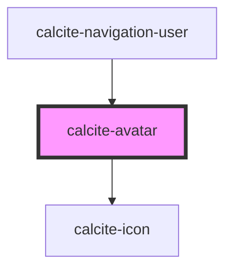

# calcite-avatar

For comprehensive guidance on using and implementing `calcite-avatar`, refer to the [documentation page](https://developers.arcgis.com/calcite-design-system/components/avatar/).

<!-- Auto Generated Below -->

## Properties

| Property    | Attribute   | Description                                                                                                                         | Type                | Default     |
| ----------- | ----------- | ----------------------------------------------------------------------------------------------------------------------------------- | ------------------- | ----------- |
| `fullName`  | `full-name` | Specifies the full name of the user. When `label` and `thumbnail` are not defined, specifies the accessible name for the component. | `string`            | `undefined` |
| `label`     | `label`     | Specifies alternative text when `thumbnail` is defined, otherwise specifies an accessible label.                                    | `string`            | `undefined` |
| `scale`     | `scale`     | Specifies the size of the component.                                                                                                | `"l" \| "m" \| "s"` | `"m"`       |
| `thumbnail` | `thumbnail` | Specifies the `src` to an image (remember to add a token if the user is private).                                                   | `string`            | `undefined` |
| `userId`    | `user-id`   | Specifies the unique id of the user.                                                                                                | `string`            | `undefined` |
| `username`  | `username`  | Specifies the username of the user.                                                                                                 | `string`            | `undefined` |

## Dependencies

### Used by

- [calcite-navigation-user](../navigation-user)

### Depends on

- [calcite-icon](../icon)

### Graph

---

*Built with [StencilJS](https://stenciljs.com/)*
