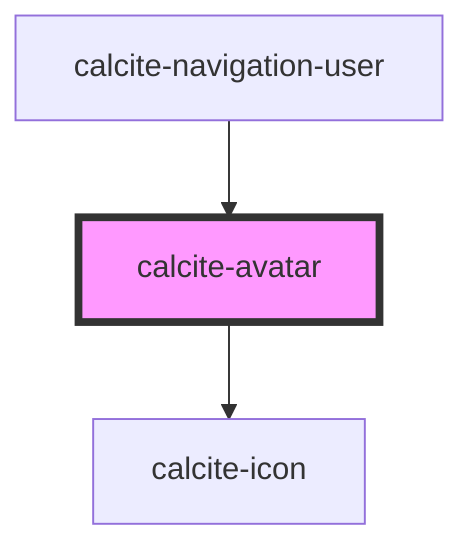

# calcite-avatar

Avatars are visual representations of users' accounts that can be presented by an image or initials, they can be used inside of other components or by themselves to represent the user.

A randomly generated AA accessible background will fill behind the initials. That generated fill will stay assigned to the user until their account is deleted or an image is used.

<!-- Auto Generated Below -->

## Usage

### Basic

The JSON sample user below is returned from a [search for users](https://developers.arcgis.com/rest/users-groups-and-items/user-search.htm). You can create an avatar for Ron by passing these properties directly to the avatar component.

When no thumbnail is provided, the avatar component will construct a useful placeholder, leveraging the user's information to construct a unique background-color with initials.

**Note:** if your user is private, remember to append a token to the end of the thumbnail using the form `thumbnail.jpg?token=YOUR_LOGGED_IN_USER_TOKEN`.

```json
{
  "username": "ron_swanson_pawnee",
  "id": "a81470986eaeee1833b74b7d8abcd5b2",
  "fullName": "Ron Swanson",
  "firstName": "Ron",
  "lastName": "Swanson",
  "thumbnail": "mySelf.jpg",
  ...
}
```

```html
<calcite-avatar
  username="ron_swanson_pawnee"
  user-id="a81470986eaeee1833b74b7d8abcd5b2"
  full-name="Ron Swanson"
  thumbnail="mySelf.jpg"
>
</calcite-avatar>
```

## Properties

| Property    | Attribute   | Description                                                                                                                         | Type                | Default     |
| ----------- | ----------- | ----------------------------------------------------------------------------------------------------------------------------------- | ------------------- | ----------- |
| `fullName`  | `full-name` | Specifies the full name of the user. When `label` and `thumbnail` are not defined, specifies the accessible name for the component. | `string`            | `undefined` |
| `label`     | `label`     | Specifies alternative text when `thumbnail` is defined, otherwise specifies an accessible label.                                    | `string`            | `undefined` |
| `scale`     | `scale`     | Specifies the size of the component.                                                                                                | `"l" \| "m" \| "s"` | `"m"`       |
| `thumbnail` | `thumbnail` | Specifies the `src` to an image (remember to add a token if the user is private).                                                   | `string`            | `undefined` |
| `userId`    | `user-id`   | Specifies the unique id of the user.                                                                                                | `string`            | `undefined` |
| `username`  | `username`  | Specifies the username of the user.                                                                                                 | `string`            | `undefined` |

## Dependencies

### Used by

- [calcite-navigation-user](../navigation-user)

### Depends on

- [calcite-icon](../icon)

### Graph



---

*Built with [StencilJS](https://stenciljs.com/)*
