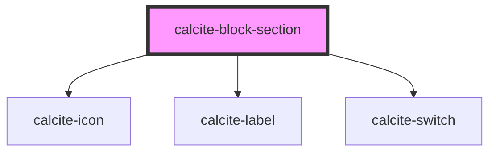

# calcite-block-section

For comprehensive guidance on using and implementing `calcite-block-section`, refer to the [documentation page](https://developers.arcgis.com/calcite-design-system/components/block-section/).

<!-- Auto Generated Below -->

## Properties

| Property           | Attribute           | Description                                                                                                                                              | Type                             | Default     |
| ------------------ | ------------------- | -------------------------------------------------------------------------------------------------------------------------------------------------------- | -------------------------------- | ----------- |
| `iconEnd`          | `icon-end`          | Specifies an icon to display at the end of the component.                                                                                                | `string`                         | `undefined` |
| `iconFlipRtl`      | `icon-flip-rtl`     | Displays the `iconStart` and/or `iconEnd` as flipped when the element direction is right-to-left (`"rtl"`).                                              | `"both" \| "end" \| "start"`     | `undefined` |
| `iconStart`        | `icon-start`        | Specifies an icon to display at the start of the component.                                                                                              | `string`                         | `undefined` |
| `messageOverrides` | `message-overrides` | Use this property to override individual strings used by the component.                                                                                  | `BlockSectionMessages`           | `undefined` |
| `open`             | `open`              | When `true`, expands the component and its contents.                                                                                                     | `boolean`                        | `false`     |
| `status`           | `status`            | **[DEPRECATED]** Use `icon-start` instead.  Displays a status-related indicator icon.                             | `"idle" \| "invalid" \| "valid"` | `undefined` |
| `text`             | `text`              | The component header text.                                                                                                                               | `string`                         | `undefined` |
| `toggleDisplay`    | `toggle-display`    | Specifies how the component's toggle is displayed, where: `"button"` sets the toggle to a selectable header, and `"switch"` sets the toggle to a switch. | `"button" \| "switch"`           | `"button"`  |

## Events

| Event                       | Description                             | Type                |
| --------------------------- | --------------------------------------- | ------------------- |
| `calciteBlockSectionToggle` | Fires when the header has been clicked. | `CustomEvent<void>` |

## Methods

### `setFocus() => Promise<void>`

Sets focus on the component's first tabbable element.

#### Returns

Type: `Promise<void>`

## Slots

| Slot | Description                       |
| ---- | --------------------------------- |
|      | A slot for adding custom content. |

## Dependencies

### Depends on

- [calcite-icon](../icon)
- [calcite-label](../label)
- [calcite-switch](../switch)

### Graph

---

*Built with [StencilJS](https://stenciljs.com/)*
