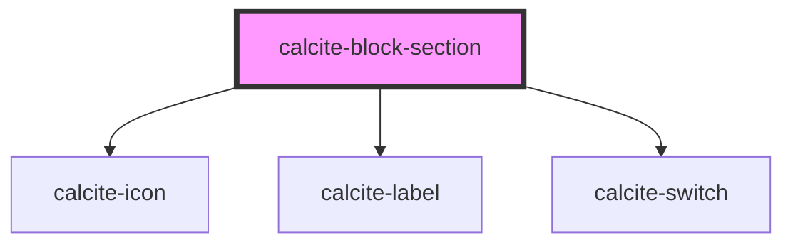

# calcite-block-section

The `calcite-block-section` component is a child element of `calcite-block`. Sections can have their own header and content and can be toggled open or closed.

<!-- Auto Generated Below -->

## Properties

| Property           | Attribute        | Description                                                                                               | Type                                      | Default     |
| ------------------ | ---------------- | --------------------------------------------------------------------------------------------------------- | ----------------------------------------- | ----------- |
| `messageOverrides` | --               | Use this property to override individual strings used by the component.                                   | `{ collapse?: string; expand?: string; }` | `undefined` |
| `open`             | `open`           | When `true`, expands the component and its contents.                                                      | `boolean`                                 | `false`     |
| `status`           | `status`         | Displays a status-related indicator icon.                                                                 | `"idle" \| "invalid" \| "valid"`          | `undefined` |
| `text`             | `text`           | The component header text.                                                                                | `string`                                  | `undefined` |
| `toggleDisplay`    | `toggle-display` | Specifies the component's toggle display - `"button"` (selectable header), or `"switch"` (toggle switch). | `"button" \| "switch"`                    | `"button"`  |

## Events

| Event                       | Description                             | Type                |
| --------------------------- | --------------------------------------- | ------------------- |
| `calciteBlockSectionToggle` | Emits when the header has been clicked. | `CustomEvent<void>` |

## Methods

### `setFocus() => Promise<void>`

Sets focus on the component's first tabbable element.

#### Returns

Type: `Promise<void>`

## Slots

| Slot | Description                       |
| ---- | --------------------------------- |
|      | A slot for adding custom content. |

## Dependencies

### Depends on

- [calcite-icon](../icon)
- [calcite-label](../label)
- [calcite-switch](../switch)

### Graph

---

*Built with [StencilJS](https://stenciljs.com/)*
