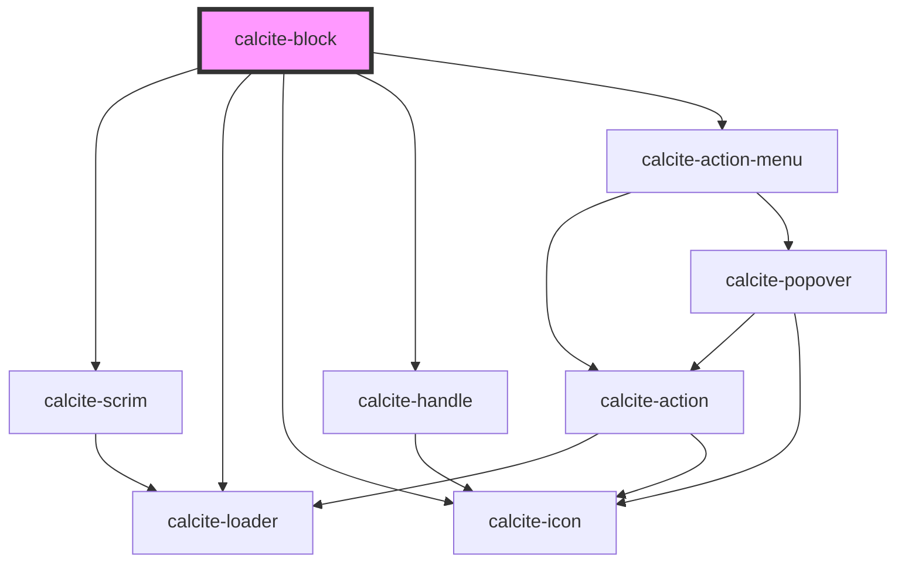

# calcite-block

The `calcite-block` component is intended for displaying a heading and content. Content can also include stacked, collapsible `calcite-block-section`s typically housed in a panel.

<!-- Auto Generated Below -->

## Usage

### Always-open

Renders a header and content that remains open - no collapsible option.

```html
<calcite-block heading="Dogs" open>
  <ul>
    <li>The first species to be domesticated</li>
    <li>Domesticated from wolves over 15,000 years ago</li>
    <li>Adapted to human behavior performing many roles such as hunting, protection, military, therapy, etc.</li>
  </ul>
</calcite-block>
```

### Basic

Renders a basic, non-collapsible block.

```html
<calcite-block heading="Fruit" description="It's nature's candy"> </calcite-block>
```

### Collapsible

Renders a header with a clickable icon to toggle the block open and closed.

```html
<calcite-block heading="Domestic pets" open collapsible>
  <calcite-block-section text="Dogs" open>
    <ul>
      <li>The first species to be domesticated</li>
      <li>Domesticated from wolves over 15,000 years ago</li>
      <li>Adapted to human behavior performing many roles such as hunting, protection, military, therapy, etc.</li>
    </ul>
  </calcite-block-section>
</calcite-block>
```

### Header-with-control

Renders a header and control with a slot for adding a single HTML element (in the header).

```html
<calcite-block heading="A fantastic heading" description="Add a control, such as an editing action">
  <calcite-action icon="pencil" text="edit" slot="control"></calcite-action>
</calcite-block>
```

### Header-with-icon

Renders a header and icon with the icon.

```html
<calcite-block heading="Dogs">
  <div slot="icon">🐕</div>
</calcite-block>
```

## Properties

| Property               | Attribute           | Description                                                                              | Type                             | Default     |
| ---------------------- | ------------------- | ---------------------------------------------------------------------------------------- | -------------------------------- | ----------- |
| `collapsible`          | `collapsible`       | When `true`, the component is collapsible.                                               | `boolean`                        | `false`     |
| `description`          | `description`       | A description for the component, which displays below the heading.                       | `string`                         | `undefined` |
| `disabled`             | `disabled`          | When `true`, interaction is prevented and the component is displayed with lower opacity. | `boolean`                        | `false`     |
| `dragHandle`           | `drag-handle`       | When `true`, displays a drag handle in the header.                                       | `boolean`                        | `false`     |
| `heading` *(required)* | `heading`           | The component header text.                                                               | `string`                         | `undefined` |
| `headingLevel`         | `heading-level`     | Specifies the number at which section headings should start.                             | `1 \| 2 \| 3 \| 4 \| 5 \| 6`     | `undefined` |
| `loading`              | `loading`           | When `true`, a busy indicator is displayed.                                              | `boolean`                        | `false`     |
| `messageOverrides`     | `message-overrides` | Use this property to override individual strings used by the component.                  | `BlockMessages`                  | `undefined` |
| `open`                 | `open`              | When `true`, expands the component and its contents.                                     | `boolean`                        | `false`     |
| `status`               | `status`            | Displays a status-related indicator icon.                                                | `"idle" \| "invalid" \| "valid"` | `undefined` |

## Events

| Event                     | Description                                                                                                                                                                                        | Type                |
| ------------------------- | -------------------------------------------------------------------------------------------------------------------------------------------------------------------------------------------------- | ------------------- |
| `calciteBlockBeforeClose` | Fires when the component is requested to be closed and before the closing transition begins.                                                                                                       | `CustomEvent<void>` |
| `calciteBlockBeforeOpen`  | Fires when the component is added to the DOM but not rendered, and before the opening transition begins.                                                                                           | `CustomEvent<void>` |
| `calciteBlockClose`       | Fires when the component is closed and animation is complete.                                                                                                                                      | `CustomEvent<void>` |
| `calciteBlockOpen`        | Fires when the component is open and animation is complete.                                                                                                                                        | `CustomEvent<void>` |
| `calciteBlockToggle`      | <span style="color:red">**[DEPRECATED]**</span> use `openClose` events: `calciteBlock[Before]Open` and `calciteBlock[Before]Close` instead.<br/><br/>Emits when the component's header is clicked. | `CustomEvent<void>` |

## Methods

### `setFocus() => Promise<void>`

Sets focus on the component's first tabbable element.

#### Returns

Type: `Promise<void>`

## Slots

| Slot                    | Description                                                                       |
| ----------------------- | --------------------------------------------------------------------------------- |
|                         | A slot for adding custom content.                                                 |
| `"control"`             | A slot for adding a single HTML input element in a header.                        |
| `"header-menu-actions"` | A slot for adding an overflow menu with `calcite-action`s inside a dropdown menu. |
| `"icon"`                | A slot for adding a leading header icon with `calcite-icon`.                      |

## CSS Custom Properties

| Name                      | Description                                        |
| ------------------------- | -------------------------------------------------- |
| `--calcite-block-padding` | Specifies the padding of the block `default` slot. |

## Dependencies

### Depends on

- [calcite-scrim](../scrim)
- [calcite-loader](../loader)
- [calcite-icon](../icon)
- [calcite-handle](../handle)
- [calcite-action-menu](../action-menu)

### Graph



---

*Built with [StencilJS](https://stenciljs.com/)*
