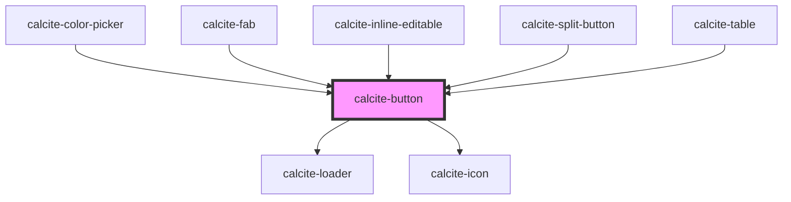

# calcite-button

The `calcite-button` component facilitates actions through an application. Priority and intent can be communicated by using different variants.

Buttons communicate actions that the user can take. It is important to note that the primary Button should be used sparingly as it utilizes the [Brand color](https://developers.arcgis.com/calcite-design-system/foundations/colors/#primary-colors), which typically stands out in the interface.

<!-- Auto Generated Below -->

## Usage

### Basic

```html
<calcite-button icon-start="plus">Go!</calcite-button>
```

### Focusing

You can programmatically focus a `calcite-button` with the `setFocus()` method:

```html
<div onclick="document.querySelector('#my-button').setFocus()">Focus!</div>
```

### Internals

Any additional attributes set on `<calcite-button>` are passed to the internal `<a>` or `<button>` tag. For example, the first button below sets `target="_blank` On the internal `<a>`. The second button sets `type="submit"` on the internal `<button>`.

- ```html
  <calcite-button href="https://github.com/Esri/calcite-design-system" target="_blank">
    Calcite Components on GitHub
  </calcite-button>

  <calcite-button type="submit">Submit</calcite-button>
  ```

### With-icons

```html
<calcite-button appearance="solid" icon-start="arrow-left">Back</calcite-button>
<calcite-button icon-end="map" kind="danger">Delete Map Options</calcite-button>
<calcite-button icon-end="plus" appearance="outline-fill" kind="inverse">Add to favorites</calcite-button>
```

### With-loader-disabled

```html
<calcite-button loading kind="neutral">Fetching data...</calcite-button>
<calcite-button disabled>Can't touch this</calcite-button>
```

### Within-form

```html
<form name="sign-up">
  <calcite-label>
    First name
    <calcite-input name="first-name" required value="Jane"></calcite-input>
  </calcite-label>
  <calcite-button type="reset">I should reset the form (type reset)</calcite-button>
  <calcite-button type="button">I should not submit the form (type button)</calcite-button>
  <calcite-button type="submit">Submit</calcite-button>
</form>
```

## Properties

| Property           | Attribute           | Description                                                                                                                                             | Type                                                                                                        | Default     |
| ------------------ | ------------------- | ------------------------------------------------------------------------------------------------------------------------------------------------------- | ----------------------------------------------------------------------------------------------------------- | ----------- |
| `alignment`        | `alignment`         | Specifies the alignment of the component's elements.                                                                                                    | `"center" \| "end" \| "icon-end-space-between" \| "icon-start-space-between" \| "space-between" \| "start"` | `"center"`  |
| `appearance`       | `appearance`        | Specifies the appearance style of the component.                                                                                                        | `"outline" \| "outline-fill" \| "solid" \| "transparent"`                                                   | `"solid"`   |
| `disabled`         | `disabled`          | When `true`, interaction is prevented and the component is displayed with lower opacity.                                                                | `boolean`                                                                                                   | `false`     |
| `form`             | `form`              | The `id` of the form that will be associated with the component. When not set, the component will be associated with its ancestor form element, if any. | `string`                                                                                                    | `undefined` |
| `href`             | `href`              | Specifies the URL of the linked resource, which can be set as an absolute or relative path.                                                             | `string`                                                                                                    | `undefined` |
| `iconEnd`          | `icon-end`          | Specifies an icon to display at the end of the component.                                                                                               | `string`                                                                                                    | `undefined` |
| `iconFlipRtl`      | `icon-flip-rtl`     | Displays the `iconStart` and/or `iconEnd` as flipped when the element direction is right-to-left (`"rtl"`).                                             | `"both" \| "end" \| "start"`                                                                                | `undefined` |
| `iconStart`        | `icon-start`        | Specifies an icon to display at the start of the component.                                                                                             | `string`                                                                                                    | `undefined` |
| `kind`             | `kind`              | Specifies the kind of the component, which will apply to the border and background if applicable.                                                       | `"brand" \| "danger" \| "inverse" \| "neutral"`                                                             | `"brand"`   |
| `label`            | `label`             | Accessible name for the component.                                                                                                                      | `string`                                                                                                    | `undefined` |
| `loading`          | `loading`           | When `true`, a busy indicator is displayed and interaction is disabled.                                                                                 | `boolean`                                                                                                   | `false`     |
| `messageOverrides` | `message-overrides` | Use this property to override individual strings used by the component.                                                                                 | `ButtonMessages`                                                                                            | `undefined` |
| `name`             | `name`              | Specifies the name of the component on form submission.                                                                                                 | `string`                                                                                                    | `undefined` |
| `rel`              | `rel`               | Defines the relationship between the `href` value and the current document.                                                                             | `string`                                                                                                    | `undefined` |
| `round`            | `round`             | When `true`, adds a round style to the component.                                                                                                       | `boolean`                                                                                                   | `false`     |
| `scale`            | `scale`             | Specifies the size of the component.                                                                                                                    | `"l" \| "m" \| "s"`                                                                                         | `"m"`       |
| `splitChild`       | `split-child`       | Specifies if the component is a child of a `calcite-split-button`.                                                                                      | `"primary" \| "secondary" \| boolean`                                                                       | `false`     |
| `target`           | `target`            | Specifies where to open the linked document defined in the `href` property.                                                                             | `string`                                                                                                    | `undefined` |
| `type`             | `type`              | Specifies the default behavior of the component.                                                                                                        | `string`                                                                                                    | `"button"`  |
| `width`            | `width`             | Specifies the width of the component.                                                                                                                   | `"auto" \| "full" \| "half"`                                                                                | `"auto"`    |

## Methods

### `setFocus() => Promise<void>`

Sets focus on the component.

#### Returns

Type: `Promise<void>`

## Slots

| Slot | Description             |
| ---- | ----------------------- |
|      | A slot for adding text. |

## Dependencies

### Used by

- [calcite-color-picker](../color-picker)
- [calcite-fab](../fab)
- [calcite-inline-editable](../inline-editable)
- [calcite-split-button](../split-button)
- [calcite-table](../table)

### Depends on

- [calcite-loader](../loader)
- [calcite-icon](../icon)

### Graph



---

*Built with [StencilJS](https://stenciljs.com/)*
