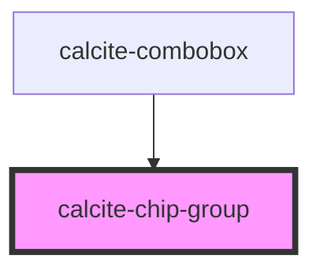

# calcite-card-group

<!-- Auto Generated Below -->

## Properties

| Property        | Attribute        | Description                                                                                                                                                                    | Type                                                   | Default  |
| --------------- | ---------------- | ------------------------------------------------------------------------------------------------------------------------------------------------------------------------------ | ------------------------------------------------------ | -------- |
| `disabled`      | `disabled`       | When true, interaction is prevented and the component is displayed with lower opacity.                                                                                         | `boolean`                                              | `false`  |
| `scale`         | `scale`          | Specifies the size of the component.                                                                                                                                           | `"l" \| "m" \| "s"`                                    | `"m"`    |
| `selectionMode` | `selection-mode` | Specifies the selection mode - "multiple" (allow any number of selected items), "single" (allow one selected item), or "single-persist" (allow and require one selected item). | `"multiple" \| "none" \| "single" \| "single-persist"` | `"none"` |

## Events

| Event                    | Description                            | Type                         |
| ------------------------ | -------------------------------------- | ---------------------------- |
| `calciteChipGroupChange` | emitted when the selected items change | `CustomEvent<SelectedItems>` |

## Slots

| Slot | Description                        |
| ---- | ---------------------------------- |
|      | A slot for adding `calcite-chip`s. |

## Dependencies

### Used by

- [calcite-combobox](../combobox)

### Graph

---

_Built with [StencilJS](https://stenciljs.com/)_
