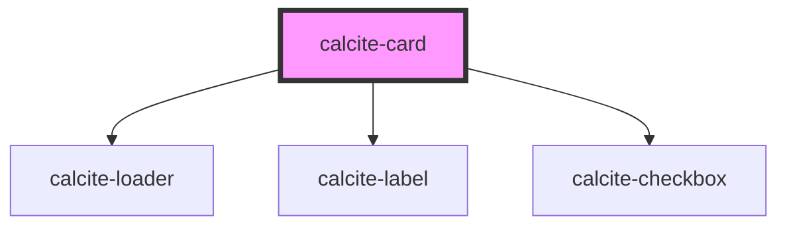

# calcite-card

The `calcite-card` component is a presentational surfaces used to house data or information representing an entity, asset, or item.

Cards are most often presented in a [Card Group](https://developers.arcgis.com/calcite-design-system/components/card-group/). An individual Card may contain details or information about an instance within a set. Because Cards are most typically presented in groups, they are intended to be visually consistent and predictable in their layout and content.

<!-- Auto Generated Below -->

## Usage

### Basic

```html
<div style="width:260px">
  <calcite-card>
    <h3 slot="title">ArcGIS Online: Gallery and Organization pages</h3>
    <span slot="subtitle">
      A great example of a study description that might wrap to a line or two, but isn't overly verbose.
    </span>
  </calcite-card>
</div>
```

## Properties

| Property            | Attribute            | Description                                                             | Type                                                             | Default         |
| ------------------- | -------------------- | ----------------------------------------------------------------------- | ---------------------------------------------------------------- | --------------- |
| `loading`           | `loading`            | When `true`, a busy indicator is displayed.                             | `boolean`                                                        | `false`         |
| `messageOverrides`  | `message-overrides`  | Use this property to override individual strings used by the component. | `CardMessages`                                                   | `undefined`     |
| `selectable`        | `selectable`         | When `true`, the component is selectable.                               | `boolean`                                                        | `false`         |
| `selected`          | `selected`           | When `true`, the component is selected.                                 | `boolean`                                                        | `false`         |
| `thumbnailPosition` | `thumbnail-position` | Sets the placement of the thumbnail defined in the `thumbnail` slot.    | `"block-end" \| "block-start" \| "inline-end" \| "inline-start"` | `"block-start"` |

## Events

| Event               | Description                                                      | Type                |
| ------------------- | ---------------------------------------------------------------- | ------------------- |
| `calciteCardSelect` | Fires when `selectable` is `true` and the component is selected. | `CustomEvent<void>` |

## Slots

| Slot             | Description                                      |
| ---------------- | ------------------------------------------------ |
|                  | A slot for adding subheader/description content. |
| `"footer-end"`   | A slot for adding a trailing footer.             |
| `"footer-start"` | A slot for adding a leading footer.              |
| `"subtitle"`     | A slot for adding a subtitle or short summary.   |
| `"thumbnail"`    | A slot for adding a thumbnail to the component.  |
| `"title"`        | A slot for adding a title.                       |

## Dependencies

### Depends on

- [calcite-loader](../loader)
- [calcite-label](../label)
- [calcite-checkbox](../checkbox)

### Graph



---

*Built with [StencilJS](https://stenciljs.com/)*
