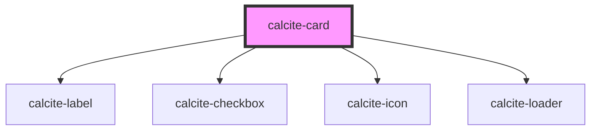

# calcite-card

<!-- Auto Generated Below -->

## Usage

### Basic

```html
<div style="width:260px">
  <calcite-card>
    <h3 slot="title">ArcGIS Online: Gallery and Organization pages</h3>
    <span slot="subtitle">
      A great example of a study description that might wrap to a line or two, but isn't overly verbose.
    </span>
  </calcite-card>
</div>
```

## Properties

| Property            | Attribute            | Description                                                                                                                                                               | Type                                                             | Default         |
| ------------------- | -------------------- | ------------------------------------------------------------------------------------------------------------------------------------------------------------------------- | ---------------------------------------------------------------- | --------------- |
| `disabled`          | `disabled`           | When `true`, interaction is prevented and the component is displayed with lower opacity.                                                                                  | `boolean`                                                        | `false`         |
| `label`             | `label`              | Accessible name for the component.                                                                                                                                        | `string`                                                         | `undefined`     |
| `loading`           | `loading`            | When `true`, a busy indicator is displayed.                                                                                                                               | `boolean`                                                        | `false`         |
| `messageOverrides`  | --                   | Use this property to override individual strings used by the component.                                                                                                   | `{ select?: string; loading?: string; }`                         | `undefined`     |
| `selectable`        | `selectable`         | <span style="color:red">**[DEPRECATED]**</span> use `selectionMode` property on a parent `calcite-card-group` instead.<br/><br/>When `true`, the component is selectable. | `boolean`                                                        | `false`         |
| `selected`          | `selected`           | When `true`, the component is selected.                                                                                                                                   | `boolean`                                                        | `false`         |
| `thumbnailPosition` | `thumbnail-position` | Sets the placement of the thumbnail defined in the `thumbnail` slot.                                                                                                      | `"block-end" \| "block-start" \| "inline-end" \| "inline-start"` | `"block-start"` |

## Events

| Event               | Description                                                                                                                                        | Type                |
| ------------------- | -------------------------------------------------------------------------------------------------------------------------------------------------- | ------------------- |
| `calciteCardSelect` | Fires when the deprecated `selectable` is true, or `selectionMode` set on parent `calcite-card-group` is not `none` and the component is selected. | `CustomEvent<void>` |

## Methods

### `setFocus() => Promise<void>`

Sets focus on the component.

#### Returns

Type: `Promise<void>`

## Slots

| Slot             | Description                                                              |
| ---------------- | ------------------------------------------------------------------------ |
|                  | A slot for adding content.                                               |
| `"description"`  | A slot for adding a description.                                         |
| `"footer-end"`   | A slot for adding a trailing footer.                                     |
| `"footer-start"` | A slot for adding a leading footer.                                      |
| `"heading"`      | A slot for adding a heading.                                             |
| `"subtitle"`     | [Deprecated] use `description` instead. A slot for adding a description. |
| `"thumbnail"`    | A slot for adding a thumbnail.                                           |
| `"title"`        | [Deprecated] use `heading` instead. A slot for adding a heading.         |

## CSS Custom Properties

| Name                                                 | Description                                                                       |
| ---------------------------------------------------- | --------------------------------------------------------------------------------- |
| `--calcite-card-accent-color-selected`               | Specifies the accent color of the component when `selected`.                      |
| `--calcite-card-background-color`                    | Specifies the background color of the component.                                  |
| `--calcite-card-border-color`                        | Specifies the border color of the component.                                      |
| `--calcite-card-corner-radius`                       | Specifies the corner radius of the component.                                     |
| `--calcite-card-loader-color-one-third`              | Specifies the starting color of the loader                                        |
| `--calcite-card-loader-color-start`                  | Specifies the starting color of the loader                                        |
| `--calcite-card-loader-color-two-thirds`             | Specifies the starting color of the loader                                        |
| `--calcite-card-selection-background-color`          | Specifies the background color of the component's selection element.              |
| `--calcite-card-selection-background-color-active`   | Specifies the background color of the component's selection element when active.  |
| `--calcite-card-selection-background-color-hover`    | Specifies the background color of the component's selection element when hovered. |
| `--calcite-card-selection-background-color-selected` | Specifies the icon color of the component's selection element when `selected`.    |
| `--calcite-card-selection-icon-color`                | Specifies the icon color of the component's selection element.                    |
| `--calcite-card-selection-icon-color-hover`          | Specifies the icon color of the component's selection element when hovered.       |
| `--calcite-card-selection-icon-color-selected`       | Specifies the icon color of the component's selection element when `selected`.    |
| `--calcite-card-shadow`                              | Specifies the shadow of the component.                                            |

## Dependencies

### Depends on

- [calcite-label](../label)
- [calcite-checkbox](../checkbox)
- [calcite-icon](../icon)
- [calcite-loader](../loader)

### Graph



---

*Built with [StencilJS](https://stenciljs.com/)*
