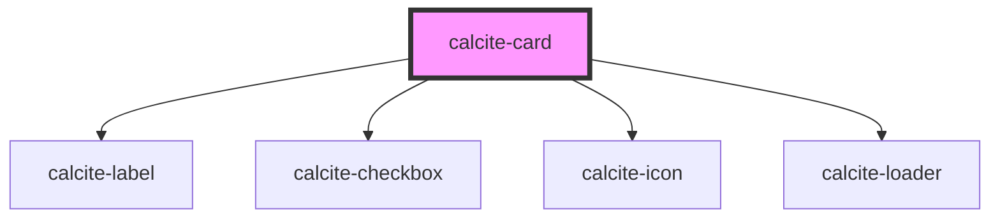

# calcite-card

For comprehensive guidance on using and implementing `calcite-card`, refer to the [documentation page](https://developers.arcgis.com/calcite-design-system/components/card/).

<!-- Auto Generated Below -->

## Properties

| Property            | Attribute            | Description                                                                                                                                                               | Type                                                             | Default         |
| ------------------- | -------------------- | ------------------------------------------------------------------------------------------------------------------------------------------------------------------------- | ---------------------------------------------------------------- | --------------- |
| `disabled`          | `disabled`           | When `true`, interaction is prevented and the component is displayed with lower opacity.                                                                                  | `boolean`                                                        | `false`         |
| `label`             | `label`              | Accessible name for the component.                                                                                                                                        | `string`                                                         | `undefined`     |
| `loading`           | `loading`            | When `true`, a busy indicator is displayed.                                                                                                                               | `boolean`                                                        | `false`         |
| `messageOverrides`  | `message-overrides`  | Use this property to override individual strings used by the component.                                                                                                   | `CardMessages`                                                   | `undefined`     |
| `selectable`        | `selectable`         | **[DEPRECATED]** use `selectionMode` property on a parent `calcite-card-group` instead.  When `true`, the component is selectable. | `boolean`                                                        | `false`         |
| `selected`          | `selected`           | When `true`, the component is selected.                                                                                                                                   | `boolean`                                                        | `false`         |
| `thumbnailPosition` | `thumbnail-position` | Sets the placement of the thumbnail defined in the `thumbnail` slot.                                                                                                      | `"block-end" \| "block-start" \| "inline-end" \| "inline-start"` | `"block-start"` |

## Events

| Event               | Description                                                                                                                                        | Type                |
| ------------------- | -------------------------------------------------------------------------------------------------------------------------------------------------- | ------------------- |
| `calciteCardSelect` | Fires when the deprecated `selectable` is true, or `selectionMode` set on parent `calcite-card-group` is not `none` and the component is selected. | `CustomEvent<void>` |

## Methods

### `setFocus() => Promise<void>`

Sets focus on the component.

#### Returns

Type: `Promise<void>`

## Slots

| Slot             | Description                                                              |
| ---------------- | ------------------------------------------------------------------------ |
|                  | A slot for adding content.                                               |
| `"description"`  | A slot for adding a description.                                         |
| `"footer-end"`   | A slot for adding a trailing footer.                                     |
| `"footer-start"` | A slot for adding a leading footer.                                      |
| `"heading"`      | A slot for adding a heading.                                             |
| `"subtitle"`     | [Deprecated] use `description` instead. A slot for adding a description. |
| `"thumbnail"`    | A slot for adding a thumbnail.                                           |
| `"title"`        | [Deprecated] use `heading` instead. A slot for adding a heading.         |

## CSS Custom Properties

| Name                                                 | Description                                                                                                                                   |
| ---------------------------------------------------- | --------------------------------------------------------------------------------------------------------------------------------------------- |
| `--calcite-card-accent-color-selected`               | Specifies the component's accent color when `selected`.                                                                                       |
| `--calcite-card-background-color`                    | Specifies the component's background color.                                                                                                   |
| `--calcite-card-border-color`                        | Specifies the component's border color.                                                                                                       |
| `--calcite-card-corner-radius`                       | Specifies the component's corner radius.                                                                                                      |
| `--calcite-card-selection-background-color`          | [Deprecated] Use `--calcite-card-background-color`. Specifies the component's selection element background color.                             |
| `--calcite-card-selection-background-color-active`   | [Deprecated] Use `--calcite-card-selection-background-color-press`. Specifies the component's selection element background color when active. |
| `--calcite-card-selection-background-color-hover`    | Specifies the component's selection element background color when hovered.                                                                    |
| `--calcite-card-selection-background-color-press`    | Specifies the component's selection element background color when active.                                                                     |
| `--calcite-card-selection-background-color-selected` | [Deprecated] Use `--calcite-card-background-color`. Specifies the component's selection element icon color when `selected`.                   |
| `--calcite-card-selection-color`                     | Specifies the component's selection element color.                                                                                            |
| `--calcite-card-selection-color-hover`               | Specifies the component's selection element color when hovered or focused.                                                                    |
| `--calcite-card-selection-icon-color`                | [Deprecated] Use `--calcite-card-selection-color`. Specifies the component's selection element icon color.                                    |
| `--calcite-card-selection-icon-color-hover`          | [Deprecated] Use `--calcite-card-selection-color-hover`. Specifies the component's selection element icon color when hovered.                 |
| `--calcite-card-selection-icon-color-selected`       | [Deprecated] Use `--calcite-card-accent-color-selected`. Specifies the component's selection element icon color when `selected`.              |
| `--calcite-card-shadow`                              | Specifies the component's shadow.                                                                                                             |

## Dependencies

### Depends on

- [calcite-label](../label)
- [calcite-checkbox](../checkbox)
- [calcite-icon](../icon)
- [calcite-loader](../loader)

### Graph

---

*Built with [StencilJS](https://stenciljs.com/)*
