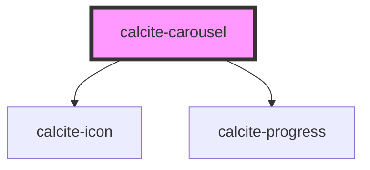

# calcite-carousel

<!-- Auto Generated Below -->

## Properties

| Property             | Attribute           | Description                                                                                                                                                                      | Type                             | Default     |
| -------------------- | ------------------- | -------------------------------------------------------------------------------------------------------------------------------------------------------------------------------- | -------------------------------- | ----------- |
| `arrowType`          | `arrow-type`        | Specifies how and if the "previous" and "next" arrows are displayed.                                                                                                             | `"edge" \| "inline" \| "none"`   | `"inline"`  |
| `autoplay`           | `autoplay`          | When `true`, the carousel will autoplay and controls will be displayed. When "paused" at time of initialization, the carousel will not autoplay, but controls will be displayed. | `"" \| "paused" \| boolean`      | `false`     |
| `autoplayDuration`   | `autoplay-duration` | When `autoplay` is `true`, specifies in milliseconds the length of time to display each Carousel Item.                                                                           | `number`                         | `DURATION`  |
| `controlOverlay`     | `control-overlay`   | Specifies if the component's controls are positioned absolutely on top of slotted Carousel Items.                                                                                | `boolean`                        | `false`     |
| `disabled`           | `disabled`          | When `true`, interaction is prevented and the component is displayed with lower opacity.                                                                                         | `boolean`                        | `false`     |
| `label` *(required)* | `label`             | Accessible name for the component.                                                                                                                                               | `string`                         | `undefined` |
| `messageOverrides`   | `message-overrides` | Use this property to override individual strings used by the component.                                                                                                          | `CarouselMessages`               | `undefined` |
| `selectedItem`       | --                  | The component's selected `calcite-carousel-item`.                                                                                                                                | `HTMLCalciteCarouselItemElement` | `undefined` |

## Events

| Event                   | Description                                                                                                                                        | Type                |
| ----------------------- | -------------------------------------------------------------------------------------------------------------------------------------------------- | ------------------- |
| `calciteCarouselChange` | Fires when the selected `calcite-carousel-item` changes.                                                                                           | `CustomEvent<void>` |
| `calciteCarouselPause`  | Fires when the carousel autoplay state pauses due to a user hovering over the component or focusing on the component or slotted content            | `CustomEvent<void>` |
| `calciteCarouselPlay`   | Fires when the carousel autoplay is invoked by the user.                                                                                           | `CustomEvent<void>` |
| `calciteCarouselResume` | Fires when the carousel autoplay state resumes due to a user no longer hovering over the component or focusing on the component or slotted content | `CustomEvent<void>` |
| `calciteCarouselStop`   | Fires when the carousel autoplay state is stopped by a user.                                                                                       | `CustomEvent<void>` |

## Methods

### `play() => Promise<void>`

Play the carousel. If `autoplay` is not enabled (initialized either to `true` or `"paused"`), these methods will have no effect.

#### Returns

Type: `Promise<void>`

### `setFocus() => Promise<void>`

Sets focus on the component.

#### Returns

Type: `Promise<void>`

### `stop() => Promise<void>`

Stop the carousel. If `autoplay` is not enabled (initialized either to `true` or `"paused"`), these methods will have no effect.

#### Returns

Type: `Promise<void>`

## Slots

| Slot | Description                                 |
| ---- | ------------------------------------------- |
|      | A slot for adding `calcite-carousel-item`s. |

## Dependencies

### Depends on

- [calcite-icon](../icon)
- [calcite-progress](../progress)

### Graph

---

*Built with [StencilJS](https://stenciljs.com/)*
