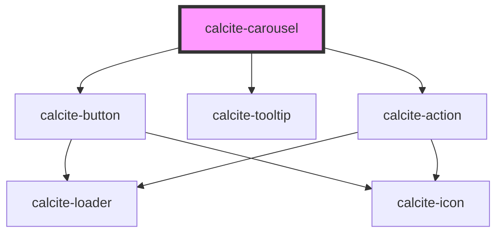

# calcite-carousel

<!-- Auto Generated Below -->

## Properties

| Property             | Attribute         | Description                                                                                                                    | Type                                                                                                                 | Default     |
| -------------------- | ----------------- | ------------------------------------------------------------------------------------------------------------------------------ | -------------------------------------------------------------------------------------------------------------------- | ----------- | --- | ---------- |
| `activeItem`         | --                | The component's selected item `carousel-item`.                                                                                 | `HTMLCalciteCarouselItemElement`                                                                                     | `undefined` |
| `controlOverlay`     | `control-overlay` | control if the dot / bar and arrows are overlaid on the slotted content container or displayed adjacent to the slotted content | `boolean`                                                                                                            | `undefined` |     | `"circle"` |
| `disabled`           | `disabled`        | When `true`, interaction is prevented and the component is displayed with lower opacity.                                       | `boolean`                                                                                                            | `false`     |
| `displayArrows`      | `display-arrows`  | control if the displayed control are dot, or bar                                                                               | `boolean`                                                                                                            | `undefined` |
| `label` *(required)* | `label`           | Accessible name for the component.                                                                                             | `string`                                                                                                             | `undefined` |
| `messageOverrides`   | --                | Use this property to override individual strings used by the component.                                                        | `{ defaultGroupTitle?: string; defaultPaginationLabel?: string; close?: string; previous?: string; next?: string; }` | `undefined` |
| `scale`              | `scale`           | Specifies the size of the component.                                                                                           | `"l" \| "m" \| "s"`                                                                                                  | `"m"`       |

## Events

| Event                   | Description                                    | Type                |
| ----------------------- | ---------------------------------------------- | ------------------- |
| `calciteCarouselChange` | Fires when the selected carousel item changes. | `CustomEvent<void>` |

## Slots

| Slot | Description                                 |
| ---- | ------------------------------------------- |
|      | A slot for adding `calcite-carousel-item`s. |

## Dependencies

### Depends on

- [calcite-button](../button)
- [calcite-tooltip](../tooltip)
- [calcite-action](../action)

### Graph

---

*Built with [StencilJS](https://stenciljs.com/)*
