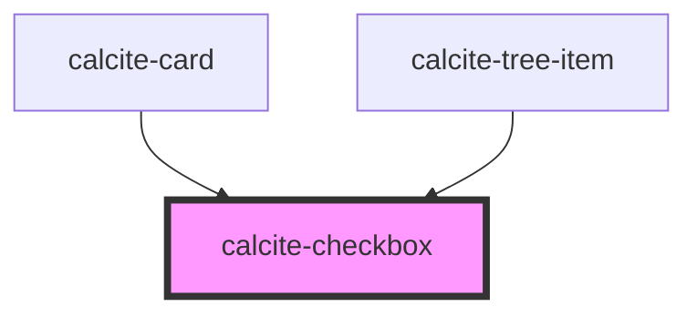

# calcite-checkbox

<!-- Auto Generated Below -->

## Usage

### Basic

```html
<calcite-checkbox id="first-name" name="first-name"></calcite-checkbox>
```

### Checked-with-calcite-label

```html
<calcite-label layout="inline" for="checked-item">
  To do
  <calcite-checkbox checked id="checked-item" name="checked-item"></calcite-checkbox>
</calcite-label>
```

### Indeterminate-with-native-label

```html
<calcite-label for="checked-indeterminate">Status</calcite-label>
<calcite-checkbox checked indeterminate id="checked-indeterminate" name="checked-indeterminate"></calcite-checkbox>
```

## Properties

| Property        | Attribute       | Description                                                                                                                                                             | Type                | Default     |
| --------------- | --------------- | ----------------------------------------------------------------------------------------------------------------------------------------------------------------------- | ------------------- | ----------- |
| `checked`       | `checked`       | When `true`, the component is checked.                                                                                                                                  | `boolean`           | `false`     |
| `disabled`      | `disabled`      | When `true`, interaction is prevented and the component is displayed with lower opacity.                                                                                | `boolean`           | `false`     |
| `form`          | `form`          | The ID of the form that will be associated with the component. When not set, the component will be associated with its ancestor form element, if any.                   | `string`            | `undefined` |
| `guid`          | `guid`          | The `id` attribute of the component. When omitted, a globally unique identifier is used.                                                                                | `string`            | `undefined` |
| `indeterminate` | `indeterminate` | When `true`, the component is initially indeterminate, which is independent from its `checked` value. The state is visual only, and can look different across browsers. | `boolean`           | `false`     |
| `name`          | `name`          | Specifies the name of the component on form submission.                                                                                                                 | `any`               | `undefined` |
| `scale`         | `scale`         | Specifies the size of the component.                                                                                                                                    | `"l" \| "m" \| "s"` | `"m"`       |
| `value`         | `value`         | The component's value.                                                                                                                                                  | `any`               | `undefined` |

## Events

| Event                   | Description                                          | Type                |
| ----------------------- | ---------------------------------------------------- | ------------------- |
| `calciteCheckboxChange` | Emits when the component's `checked` status changes. | `CustomEvent<void>` |

## Methods

### `setFocus() => Promise<void>`

Sets focus on the component.

#### Returns

Type: `Promise<void>`

## CSS Custom Properties

| Name                      | Description                                 |
| ------------------------- | ------------------------------------------- |
| `--calcite-checkbox-size` | Specifies the component's height and width. |

## Dependencies

### Used by

- [calcite-card](../card)
- [calcite-tree-item](../tree-item)

### Graph



---

*Built with [StencilJS](https://stenciljs.com/)*
