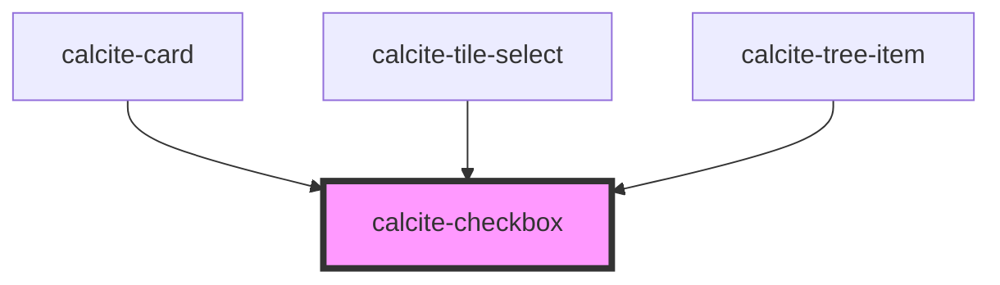

# calcite-checkbox

For comprehensive guidance on using and implementing `calcite-checkbox`, refer to the [documentation page](https://developers.arcgis.com/calcite-design-system/components/checkbox/).

<!-- Auto Generated Below -->

## Properties

| Property        | Attribute       | Description                                                                                                                                                             | Type                                                                                                                                                                                                                                                | Default                                                                                                                                                                                                                                                                     |
| --------------- | --------------- | ----------------------------------------------------------------------------------------------------------------------------------------------------------------------- | --------------------------------------------------------------------------------------------------------------------------------------------------------------------------------------------------------------------------------------------------- | --------------------------------------------------------------------------------------------------------------------------------------------------------------------------------------------------------------------------------------------------------------------------- |
| `checked`       | `checked`       | When `true`, the component is checked.                                                                                                                                  | `boolean`                                                                                                                                                                                                                                           | `false`                                                                                                                                                                                                                                                                     |
| `disabled`      | `disabled`      | When `true`, interaction is prevented and the component is displayed with lower opacity.                                                                                | `boolean`                                                                                                                                                                                                                                           | `false`                                                                                                                                                                                                                                                                     |
| `form`          | `form`          | The `id` of the form that will be associated with the component. When not set, the component will be associated with its ancestor form element, if any.                 | `string`                                                                                                                                                                                                                                            | `undefined`                                                                                                                                                                                                                                                                 |
| `guid`          | `guid`          | The `id` attribute of the component. When omitted, a globally unique identifier is used.                                                                                | `string`                                                                                                                                                                                                                                            | `undefined`                                                                                                                                                                                                                                                                 |
| `indeterminate` | `indeterminate` | When `true`, the component is initially indeterminate, which is independent from its `checked` value. The state is visual only, and can look different across browsers. | `boolean`                                                                                                                                                                                                                                           | `false`                                                                                                                                                                                                                                                                     |
| `label`         | `label`         | Accessible name for the component.                                                                                                                                      | `string`                                                                                                                                                                                                                                            | `undefined`                                                                                                                                                                                                                                                                 |
| `name`          | `name`          | Specifies the name of the component. Required to pass the component's `value` on form submission.                                                                       | `string`                                                                                                                                                                                                                                            | `undefined`                                                                                                                                                                                                                                                                 |
| `required`      | `required`      | When `true`, the component must have a value in order for the form to submit.                                                                                           | `boolean`                                                                                                                                                                                                                                           | `false`                                                                                                                                                                                                                                                                     |
| `scale`         | `scale`         | Specifies the size of the component.                                                                                                                                    | `"l" \| "m" \| "s"`                                                                                                                                                                                                                                 | `"m"`                                                                                                                                                                                                                                                                       |
| `status`        | `status`        | Specifies the status of the input field, which determines message and icons.                                                                                            | `"idle" \| "invalid" \| "valid"`                                                                                                                                                                                                                    | `"idle"`                                                                                                                                                                                                                                                                    |
| `validity`      | --              | The current validation state of the component.                                                                                                                          | `{ valid: boolean; badInput: boolean; customError: boolean; patternMismatch: boolean; rangeOverflow: boolean; rangeUnderflow: boolean; stepMismatch: boolean; tooLong: boolean; tooShort: boolean; typeMismatch: boolean; valueMissing: boolean; }` | `{     valid: false,     badInput: false,     customError: false,     patternMismatch: false,     rangeOverflow: false,     rangeUnderflow: false,     stepMismatch: false,     tooLong: false,     tooShort: false,     typeMismatch: false,     valueMissing: false,   }` |
| `value`         | `value`         | The component's value.                                                                                                                                                  | `any`                                                                                                                                                                                                                                               | `undefined`                                                                                                                                                                                                                                                                 |

## Events

| Event                   | Description                                          | Type                |
| ----------------------- | ---------------------------------------------------- | ------------------- |
| `calciteCheckboxChange` | Fires when the component's `checked` status changes. | `CustomEvent<void>` |

## Methods

### `setFocus() => Promise<void>`

Sets focus on the component.

#### Returns

Type: `Promise<void>`

## CSS Custom Properties

| Name                      | Description                                 |
| ------------------------- | ------------------------------------------- |
| `--calcite-checkbox-size` | Specifies the component's height and width. |

## Dependencies

### Used by

- [calcite-card](../card)
- [calcite-tile-select](../tile-select)
- [calcite-tree-item](../tree-item)

### Graph

---

*Built with [StencilJS](https://stenciljs.com/)*
