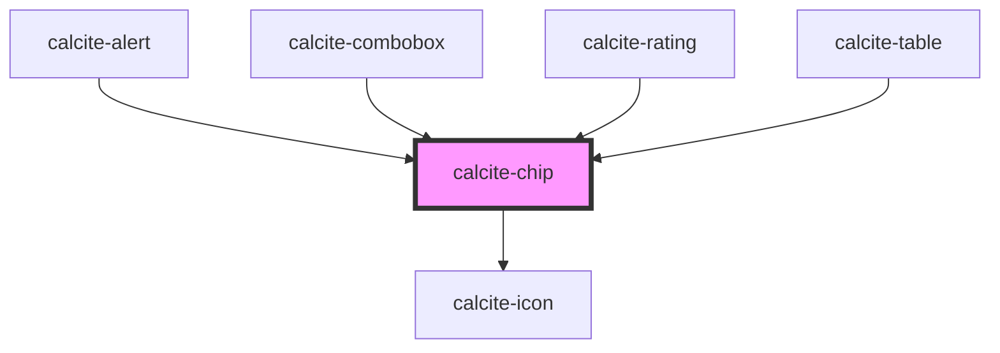

# calcite-chip

<!-- Auto Generated Below -->

## Usage

### Basic

```html
<calcite-chip value="Global" closable icon="globe" appearance="outline" kind="brand">Global</calcite-chip>
```

## Properties

| Property             | Attribute           | Description                                                                                                               | Type                                     | Default     |
| -------------------- | ------------------- | ------------------------------------------------------------------------------------------------------------------------- | ---------------------------------------- | ----------- |
| `appearance`         | `appearance`        | Specifies the appearance style of the component.                                                                          | `"outline" \| "outline-fill" \| "solid"` | `"solid"`   |
| `closable`           | `closable`          | When `true`, a close button is added to the component.                                                                    | `boolean`                                | `false`     |
| `closed`             | `closed`            | When `true`, hides the component.                                                                                         | `boolean`                                | `false`     |
| `disabled`           | `disabled`          | When `true`, interaction is prevented and the component is displayed with lower opacity.                                  | `boolean`                                | `false`     |
| `icon`               | `icon`              | Specifies an icon to display.                                                                                             | `string`                                 | `undefined` |
| `iconFlipRtl`        | `icon-flip-rtl`     | When `true`, the icon will be flipped when the element direction is right-to-left (`"rtl"`).                              | `boolean`                                | `false`     |
| `kind`               | `kind`              | Specifies the kind of the component, which will apply to border and background if applicable.                             | `"brand" \| "inverse" \| "neutral"`      | `"neutral"` |
| `label`              | `label`             | Accessible name for the component.                                                                                        | `string`                                 | `undefined` |
| `messageOverrides`   | `message-overrides` | Use this property to override individual strings used by the component.                                                   | `ChipMessages`                           | `undefined` |
| `scale`              | `scale`             | Specifies the size of the component. When contained in a parent `calcite-chip-group` inherits the parent's `scale` value. | `"l" \| "m" \| "s"`                      | `"m"`       |
| `selected`           | `selected`          | When `true`, the component is selected.                                                                                   | `boolean`                                | `false`     |
| `value` *(required)* | `value`             | The component's value.                                                                                                    | `any`                                    | `undefined` |

## Events

| Event               | Description                                             | Type                |
| ------------------- | ------------------------------------------------------- | ------------------- |
| `calciteChipClose`  | Fires when the component's close button is selected.    | `CustomEvent<void>` |
| `calciteChipSelect` | Fires when the selected state of the component changes. | `CustomEvent<void>` |

## Methods

### `setFocus() => Promise<void>`

Sets focus on the component.

#### Returns

Type: `Promise<void>`

## Slots

| Slot      | Description                 |
| --------- | --------------------------- |
|           | A slot for adding text.     |
| `"image"` | A slot for adding an image. |

## Dependencies

### Used by

- [calcite-alert](../alert)
- [calcite-combobox](../combobox)
- [calcite-rating](../rating)
- [calcite-table](../table)

### Depends on

- [calcite-icon](../icon)

### Graph



---

*Built with [StencilJS](https://stenciljs.com/)*
