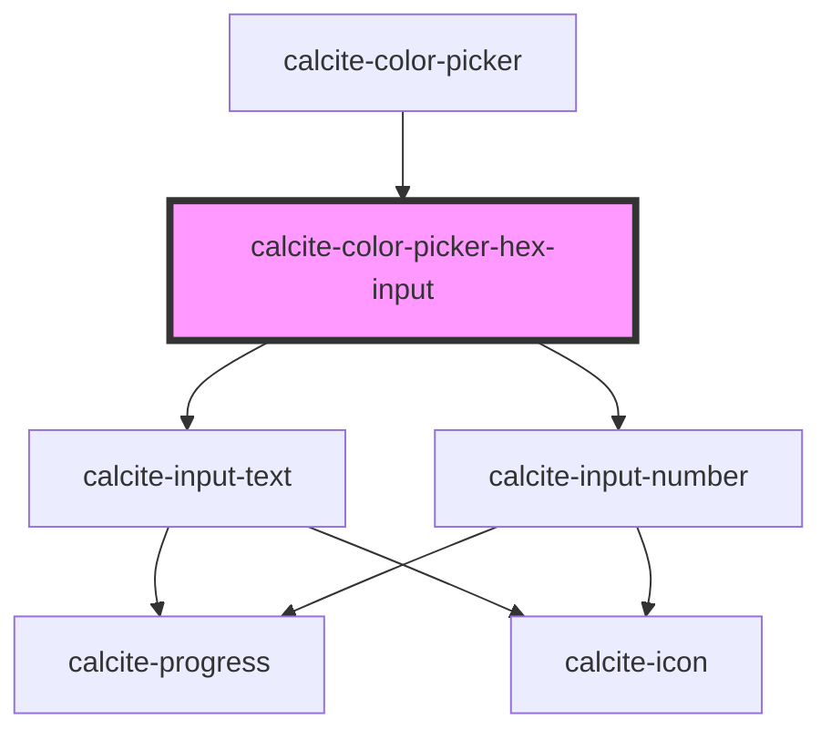

# calcite-hex-input

<!-- Auto Generated Below -->

## Properties

| Property          | Attribute          | Description                                                                                                                                                                                                                                                                                                    | Type                                                                                                                                                                                                                                    | Default                                                                                           |
| ----------------- | ------------------ | -------------------------------------------------------------------------------------------------------------------------------------------------------------------------------------------------------------------------------------------------------------------------------------------------------------- | --------------------------------------------------------------------------------------------------------------------------------------------------------------------------------------------------------------------------------------- | ------------------------------------------------------------------------------------------------- |
| `allowEmpty`      | `allow-empty`      | When `false`, an empty color (`null`) will be allowed as a `value`. Otherwise, a color value is enforced on the component. When `true`, a color value is enforced, and clearing the input or blurring will restore the last valid `value`. When `false`, an empty color (`null`) will be allowed as a `value`. | `boolean`                                                                                                                                                                                                                               | `false`                                                                                           |
| `alphaChannel`    | `alpha-channel`    | When true, the component will allow updates to the color's alpha value.                                                                                                                                                                                                                                        | `boolean`                                                                                                                                                                                                                               | `false`                                                                                           |
| `hexLabel`        | `hex-label`        | **[DEPRECATED]** use `messages` instead  Specifies accessible label for the input field.                                                                                                                                                                                | `string`                                                                                                                                                                                                                                | `"Hex"`                                                                                           |
| `numberingSystem` | `numbering-system` | Specifies the Unicode numeral system used by the component for localization.                                                                                                                                                                                                                                   | `"arab" \| "arabext" \| "bali" \| "beng" \| "deva" \| "fullwide" \| "gujr" \| "guru" \| "hanidec" \| "khmr" \| "knda" \| "laoo" \| "latn" \| "limb" \| "mlym" \| "mong" \| "mymr" \| "orya" \| "tamldec" \| "telu" \| "thai" \| "tibt"` | `undefined`                                                                                       |
| `scale`           | `scale`            | Specifies the size of the component.                                                                                                                                                                                                                                                                           | `"l" \| "m" \| "s"`                                                                                                                                                                                                                     | `"m"`                                                                                             |
| `value`           | `value`            | The hex value.                                                                                                                                                                                                                                                                                                 | `string`                                                                                                                                                                                                                                | `normalizeHex(     hexify(DEFAULT_COLOR, this.alphaChannel),     this.alphaChannel,     true   )` |

## Events

| Event                              | Description                         | Type                |
| ---------------------------------- | ----------------------------------- | ------------------- |
| `calciteColorPickerHexInputChange` | Emitted when the hex value changes. | `CustomEvent<void>` |

## Methods

### `setFocus() => Promise<void>`

Sets focus on the component.

#### Returns

Type: `Promise<void>`

## Dependencies

### Used by

- [calcite-color-picker](../color-picker)

### Depends on

- [calcite-input-text](../input-text)
- [calcite-input-number](../input-number)

### Graph

---

*Built with [StencilJS](https://stenciljs.com/)*
