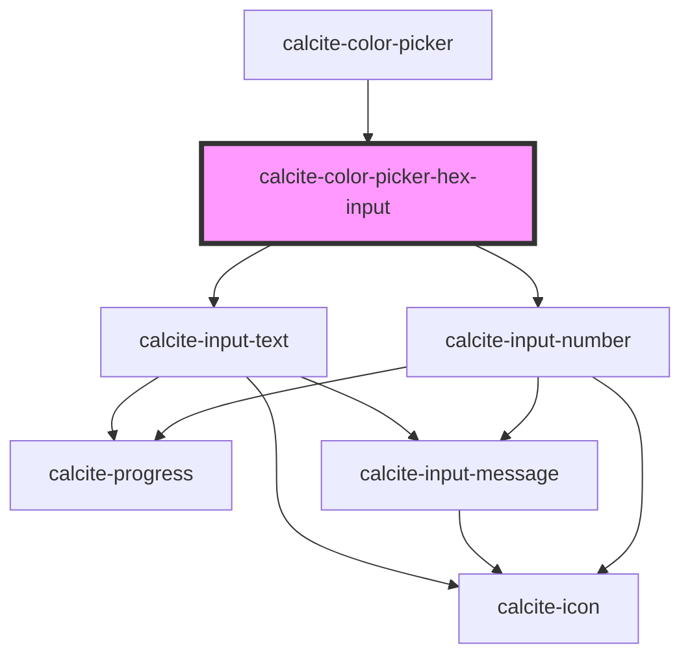

# calcite-hex-input

<!-- Auto Generated Below -->

## Properties

| Property          | Attribute          | Description                                                                                                                                                                         | Type                            | Default                                                                                            |
| ----------------- | ------------------ | ----------------------------------------------------------------------------------------------------------------------------------------------------------------------------------- | ------------------------------- | -------------------------------------------------------------------------------------------------- |
| `allowEmpty`      | `allow-empty`      | When `true`, an empty color (`null`) will be allowed as a `value`. When `false`, a color value is enforced, and clearing the input or blurring will restore the last valid `value`. | `boolean`                       | `false`                                                                                            |
| `alphaChannel`    | `alpha-channel`    | When `true`, the component will allow updates to the color's alpha value.                                                                                                           | `boolean`                       | `false`                                                                                            |
| `hexLabel`        | `hex-label`        | **[DEPRECATED]** use `messages` instead  Specifies accessible label for the input field.                                                     | `string`                        | `"Hex"`                                                                                            |
| `numberingSystem` | `numbering-system` | Specifies the Unicode numeral system used by the component for localization.                                                                                                        | `"arab" \| "arabext" \| "latn"` | `undefined`                                                                                        |
| `scale`           | `scale`            | Specifies the size of the component.                                                                                                                                                | `"l" \| "m" \| "s"`             | `"m"`                                                                                              |
| `value`           | `value`            | The hex value.                                                                                                                                                                      | `string`                        | `normalizeHex(     hexify(DEFAULT_COLOR, this.alphaChannel),     this.alphaChannel,     true,   )` |

## Events

| Event                              | Description                         | Type                |
| ---------------------------------- | ----------------------------------- | ------------------- |
| `calciteColorPickerHexInputChange` | Emitted when the hex value changes. | `CustomEvent<void>` |

## Methods

### `setFocus() => Promise<void>`

Sets focus on the component.

#### Returns

Type: `Promise<void>`

## CSS Custom Properties

| Name                                                | Description                                                                         |
| --------------------------------------------------- | ----------------------------------------------------------------------------------- |
| `--calcite-filter-input-prefix-background-color`    | defines the background color of the prefix in the input sub-component.              |
| `--calcite-filter-input-prefix-text-color`          | defines the text color of the prefix in the input sub-component.                    |
| `--calcite-filter-input-suffix-background-color`    | defines the background color of the suffix in the input sub-component.              |
| `--calcite-filter-input-suffix-text-color`          | defines the text color of the suffix in the input sub-component.                    |
| `--calcite-hex-input-background-color`              | defines the background color of the input sub-component.                            |
| `--calcite-hex-input-border-color`                  | defines the border color of the input sub-component.                                |
| `--calcite-hex-input-button-background-color`       | defines the background color of the button in the input sub-component.              |
| `--calcite-hex-input-button-background-color-hover` | defines the background color of the button when hovered in the input sub-component. |
| `--calcite-hex-input-button-border-color`           | defines the border color of the button in the input sub-component.                  |
| `--calcite-hex-input-button-icon-color`             | defines the icon color of the button in the input sub-component.                    |
| `--calcite-hex-input-button-icon-color-active`      | defines the icon color of the button when active in the input sub-component.        |
| `--calcite-hex-input-button-icon-color-hover`       | defines the icon color of the button when hovered in the input sub-component.       |
| `--calcite-hex-input-corner-radius`                 | defines the corner radius of the input sub-component.                               |
| `--calcite-hex-input-icon-color`                    | defines the icon color of the input sub-component.                                  |
| `--calcite-hex-input-text-color`                    | defines the text color of the input sub-component.                                  |

## Dependencies

### Used by

- [calcite-color-picker](../color-picker)

### Depends on

- [calcite-input-text](../input-text)
- [calcite-input-number](../input-number)

### Graph

---

*Built with [StencilJS](https://stenciljs.com/)*
