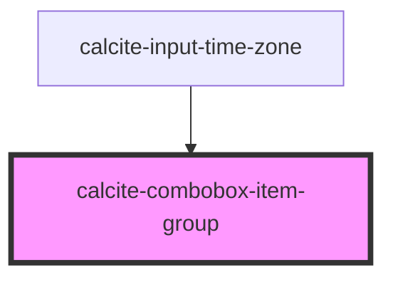

# calcite-combobox-item-group

For comprehensive guidance on using and implementing `calcite-combobox-item-group`, refer to the [documentation page](https://developers.arcgis.com/calcite-design-system/components/combobox-item-group/).

<!-- Auto Generated Below -->

## Properties

| Property             | Attribute | Description                                                                                         | Type                     | Default     |
| -------------------- | --------- | --------------------------------------------------------------------------------------------------- | ------------------------ | ----------- |
| `ancestors`          | --        | Specifies the parent and grandparent `calcite-combobox-item`s, which are set on `calcite-combobox`. | `ComboboxChildElement[]` | `undefined` |
| `label` *(required)* | `label`   | Specifies the title of the component.                                                               | `string`                 | `undefined` |

## Slots

| Slot | Description                                 |
| ---- | ------------------------------------------- |
|      | A slot for adding `calcite-combobox-item`s. |

## Dependencies

### Used by

- [calcite-input-time-zone](../input-time-zone)

### Graph

---

*Built with [StencilJS](https://stenciljs.com/)*
