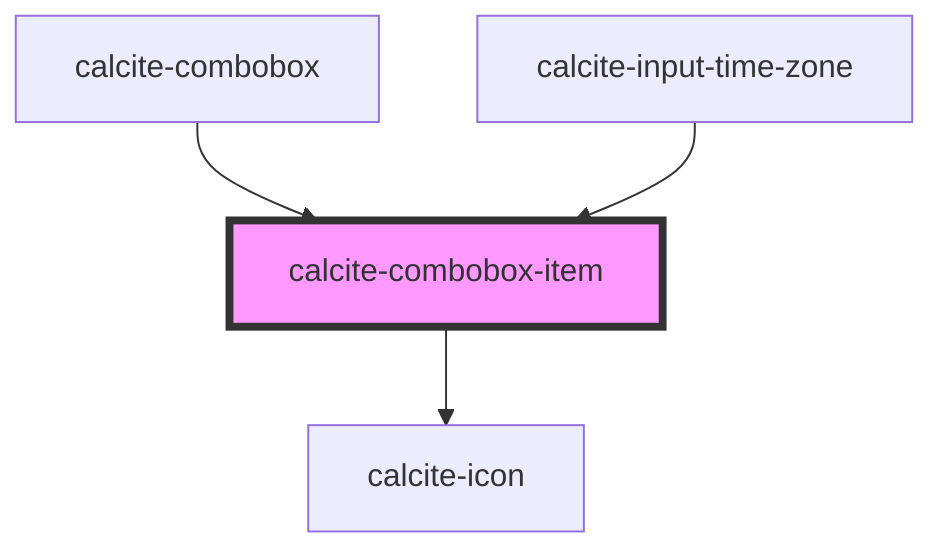

# calcite-combobox-item

<!-- Auto Generated Below -->

## Properties

| Property                 | Attribute         | Description                                                                                  | Type                     | Default     |
| ------------------------ | ----------------- | -------------------------------------------------------------------------------------------- | ------------------------ | ----------- |
| `active`                 | `active`          | When `true`, the component is active.                                                        | `boolean`                | `false`     |
| `ancestors`              | --                | Specifies the parent and grandparent items, which are set on `calcite-combobox`.             | `ComboboxChildElement[]` | `undefined` |
| `disabled`               | `disabled`        | When `true`, interaction is prevented and the component is displayed with lower opacity.     | `boolean`                | `false`     |
| `filterDisabled`         | `filter-disabled` | When `true`, omits the component from the `calcite-combobox` filtered search results.        | `boolean`                | `undefined` |
| `guid`                   | `guid`            | The `id` attribute of the component. When omitted, a globally unique identifier is used.     | `string`                 | `guid()`    |
| `icon`                   | `icon`            | Specifies an icon to display.                                                                | `string`                 | `undefined` |
| `iconFlipRtl`            | `icon-flip-rtl`   | When `true`, the icon will be flipped when the element direction is right-to-left (`"rtl"`). | `boolean`                | `false`     |
| `selected`               | `selected`        | When `true`, the component is selected.                                                      | `boolean`                | `false`     |
| `textLabel` *(required)* | `text-label`      | The component's text.                                                                        | `string`                 | `undefined` |
| `value` *(required)*     | `value`           | The component's value.                                                                       | `any`                    | `undefined` |

## Events

| Event                       | Description                                             | Type                |
| --------------------------- | ------------------------------------------------------- | ------------------- |
| `calciteComboboxItemChange` | Fires whenever the component is selected or unselected. | `CustomEvent<void>` |

## Slots

| Slot | Description                                        |
| ---- | -------------------------------------------------- |
|      | A slot for adding nested `calcite-combobox-item`s. |

## CSS Custom Properties

| Name                                                  | Description                                                                |
| ----------------------------------------------------- | -------------------------------------------------------------------------- |
| `--calcite-combobox-item-background-color`            | defines the background color of the component                              |
| `--calcite-combobox-item-background-color-active`     | defines the background color when the component is active or hovered.      |
| `--calcite-combobox-item-icon-color`                  | defines the color of a custom icon in the component.                       |
| `--calcite-combobox-item-indicator-icon-color`        | defines the indicator icon color.                                          |
| `--calcite-combobox-item-indicator-icon-color-active` | defines the color of an indicator icon when the component is active.       |
| `--calcite-combobox-item-shadow`                      | defines the shadow of the component.                                       |
| `--calcite-combobox-item-text-color`                  | defines the text color of the component.                                   |
| `--calcite-combobox-item-text-color-active`           | defines the text color when the component is selected, active, or hovered. |

## Dependencies

### Used by

- [calcite-combobox](../combobox)
- [calcite-input-time-zone](../input-time-zone)

### Depends on

- [calcite-icon](../icon)

### Graph

---

*Built with [StencilJS](https://stenciljs.com/)*
