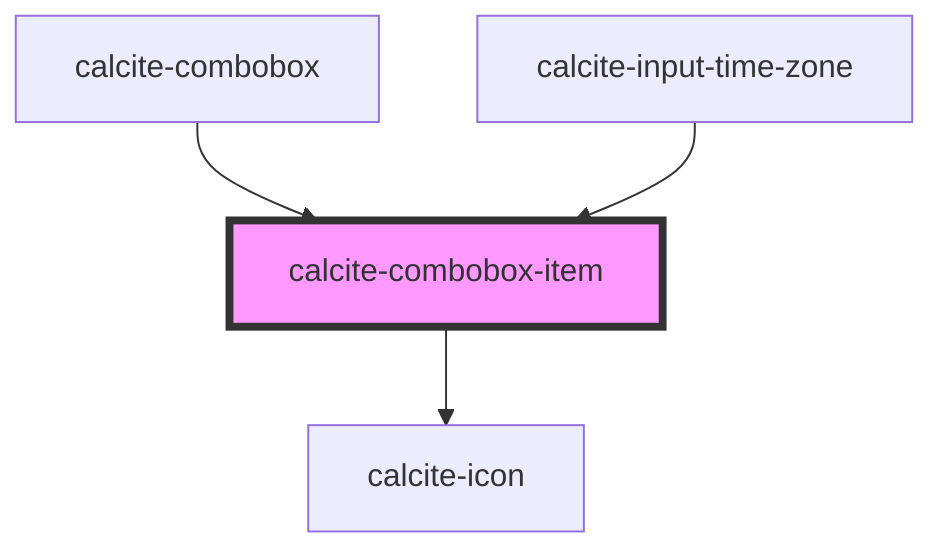

# calcite-combobox-item

For comprehensive guidance on using and implementing `calcite-combobox-item`, refer to the [documentation page](https://developers.arcgis.com/calcite-design-system/components/combobox-item/).

<!-- Auto Generated Below -->

## Properties

| Property                 | Attribute         | Description                                                                                                                                                     | Type                        | Default     |
| ------------------------ | ----------------- | --------------------------------------------------------------------------------------------------------------------------------------------------------------- | --------------------------- | ----------- |
| `active`                 | `active`          | When `true`, the component is active.                                                                                                                           | `boolean`                   | `false`     |
| `ancestors`              | --                | Specifies the parent and grandparent items, which are set on `calcite-combobox`.                                                                                | `ComboboxChildElement[]`    | `undefined` |
| `description`            | `description`     | A description for the component, which displays below the label.                                                                                                | `string`                    | `undefined` |
| `disabled`               | `disabled`        | When `true`, interaction is prevented and the component is displayed with lower opacity.                                                                        | `boolean`                   | `false`     |
| `filterDisabled`         | `filter-disabled` | When `true`, omits the component from the `calcite-combobox` filtered search results.                                                                           | `boolean`                   | `undefined` |
| `guid`                   | `guid`            | The `id` attribute of the component. When omitted, a globally unique identifier is used.                                                                        | `string`                    | `guid()`    |
| `icon`                   | `icon`            | Specifies an icon to display.                                                                                                                                   | `string`                    | `undefined` |
| `iconFlipRtl`            | `icon-flip-rtl`   | When `true`, the icon will be flipped when the element direction is right-to-left (`"rtl"`).                                                                    | `boolean`                   | `false`     |
| `metadata`               | --                | Provides additional metadata to the component used in filtering.                                                                                                | `{ [x: string]: unknown; }` | `undefined` |
| `selected`               | `selected`        | When `true`, the component is selected.                                                                                                                         | `boolean`                   | `false`     |
| `shortHeading`           | `short-heading`   | The component's short heading. When provided, the short heading will be displayed in the component's selection. It is recommended to use 5 characters or fewer. | `string`                    | `undefined` |
| `textLabel` *(required)* | `text-label`      | The component's text.                                                                                                                                           | `string`                    | `undefined` |
| `value` *(required)*     | `value`           | The component's value.                                                                                                                                          | `any`                       | `undefined` |

## Events

| Event                       | Description                                             | Type                |
| --------------------------- | ------------------------------------------------------- | ------------------- |
| `calciteComboboxItemChange` | Fires whenever the component is selected or unselected. | `CustomEvent<void>` |

## Slots

| Slot            | Description                                                              |
| --------------- | ------------------------------------------------------------------------ |
|                 | A slot for adding nested `calcite-combobox-item`s.                       |
| `"content-end"` | A slot for adding non-actionable elements after the component's content. |

## Dependencies

### Used by

- [calcite-combobox](../combobox)
- [calcite-input-time-zone](../input-time-zone)

### Depends on

- [calcite-icon](../icon)

### Graph

---

*Built with [StencilJS](https://stenciljs.com/)*
