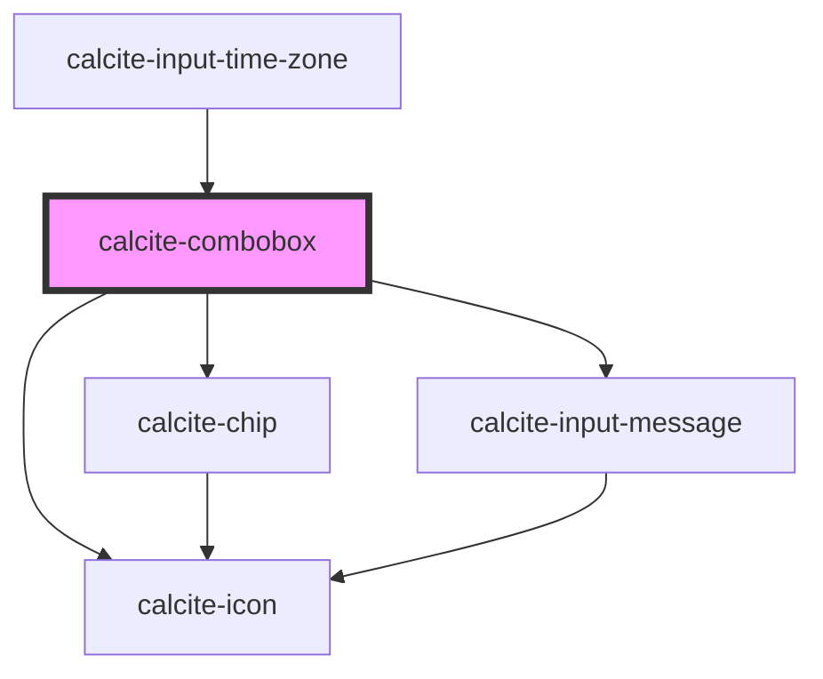

# calcite-combobox

<!-- Auto Generated Below -->

## Usage

### Ancestors

```html
<calcite-combobox label="Ancestors selection-mode combobox" selection-mode="ancestors">
  <calcite-combobox-item value="Trees" text-label="Trees">
    <calcite-combobox-item
      value="CommercialDamageAssessment - Damage to Commercial Buildings & Damage to Commercial Buildings"
      text-label="CommercialDamageAssessment - Damage to Commercial Buildings & Damage to Commercial Buildings"
      selected
    ></calcite-combobox-item>
    <calcite-combobox-item value="Sequoia" disabled text-label="Sequoia"></calcite-combobox-item>
    <calcite-combobox-item value="Douglas Fir" text-label="Douglas Fir"></calcite-combobox-item>
  </calcite-combobox-item>
</calcite-combobox>
```

### Multiple

```html
<calcite-combobox label="Mulit selection-mode combobox" selection-mode="multiple">
  <calcite-combobox-item value="Trees" text-label="Trees">
    <calcite-combobox-item
      value="CommercialDamageAssessment - Damage to Commercial Buildings & Damage to Commercial Buildings"
      text-label="CommercialDamageAssessment - Damage to Commercial Buildings & Damage to Commercial Buildings"
      selected
    ></calcite-combobox-item>
    <calcite-combobox-item value="Sequoia" disabled text-label="Sequoia"></calcite-combobox-item>
    <calcite-combobox-item value="Douglas Fir" text-label="Douglas Fir"></calcite-combobox-item>
  </calcite-combobox-item>
</calcite-combobox>
```

### Single

```html
<calcite-combobox label="Single selection-mode combobox" selection-mode="single">
  <calcite-combobox-item value="Trees" text-label="Trees">
    <calcite-combobox-item
      value="CommercialDamageAssessment - Damage to Commercial Buildings"
      text-label="CommercialDamageAssessment - Damage to Commercial Buildings"
      selected
    ></calcite-combobox-item>
    <calcite-combobox-item value="Sequoia" disabled text-label="Sequoia"></calcite-combobox-item>
    <calcite-combobox-item value="Douglas Fir" text-label="Douglas Fir"></calcite-combobox-item>
  </calcite-combobox-item>
  <calcite-combobox-item value="Rivers" text-label="Rivers"></calcite-combobox-item>
</calcite-combobox>
```

### SinglePersist

```html
<calcite-combobox label="Single selection-mode combobox" selection-mode="single-persist">
  <calcite-combobox-item value="Trees" text-label="Trees">
    <calcite-combobox-item
      value="CommercialDamageAssessment - Damage to Commercial Buildings"
      text-label="CommercialDamageAssessment - Damage to Commercial Buildings"
      selected
    ></calcite-combobox-item>
    <calcite-combobox-item value="Sequoia" disabled text-label="Sequoia"></calcite-combobox-item>
    <calcite-combobox-item value="Douglas Fir" text-label="Douglas Fir"></calcite-combobox-item>
  </calcite-combobox-item>
  <calcite-combobox-item value="Rivers" text-label="Rivers"></calcite-combobox-item>
</calcite-combobox>
```

## Properties

| Property                 | Attribute                   | Description                                                                                                                                                                                                                                                                                                                                                                                                                                                                                                    | Type                                                                                             | Default      |
| ------------------------ | --------------------------- | -------------------------------------------------------------------------------------------------------------------------------------------------------------------------------------------------------------------------------------------------------------------------------------------------------------------------------------------------------------------------------------------------------------------------------------------------------------------------------------------------------------- | ------------------------------------------------------------------------------------------------ | ------------ |
| `allowCustomValues`      | `allow-custom-values`       | When `true`, allows entry of custom values, which are not in the original set of items.                                                                                                                                                                                                                                                                                                                                                                                                                        | `boolean`                                                                                        | `undefined`  |
| `clearDisabled`          | `clear-disabled`            | When `true`, the value-clearing will be disabled.                                                                                                                                                                                                                                                                                                                                                                                                                                                              | `boolean`                                                                                        | `false`      |
| `disabled`               | `disabled`                  | When `true`, interaction is prevented and the component is displayed with lower opacity.                                                                                                                                                                                                                                                                                                                                                                                                                       | `boolean`                                                                                        | `false`      |
| `filteredItems`          | --                          | Specifies the component's filtered items.                                                                                                                                                                                                                                                                                                                                                                                                                                                                      | `HTMLCalciteComboboxItemElement[]`                                                               | `[]`         |
| `flipPlacements`         | --                          | Defines the available placements that can be used when a flip occurs.                                                                                                                                                                                                                                                                                                                                                                                                                                          | `Placement[]`                                                                                    | `undefined`  |
| `form`                   | `form`                      | The ID of the form that will be associated with the component. When not set, the component will be associated with its ancestor form element, if any.                                                                                                                                                                                                                                                                                                                                                          | `string`                                                                                         | `undefined`  |
| `label` *(required)*     | `label`                     | Accessible name for the component.                                                                                                                                                                                                                                                                                                                                                                                                                                                                             | `string`                                                                                         | `undefined`  |
| `maxItems`               | `max-items`                 | Specifies the maximum number of `calcite-combobox-item`s (including nested children) to display before displaying a scrollbar.                                                                                                                                                                                                                                                                                                                                                                                 | `number`                                                                                         | `0`          |
| `messageOverrides`       | --                          | Use this property to override individual strings used by the component.                                                                                                                                                                                                                                                                                                                                                                                                                                        | `{ all?: string; allSelected?: string; clear?: string; removeTag?: string; selected?: string; }` | `undefined`  |
| `name`                   | `name`                      | Specifies the name of the component. Required to pass the component's `value` on form submission.                                                                                                                                                                                                                                                                                                                                                                                                              | `string`                                                                                         | `undefined`  |
| `open`                   | `open`                      | When `true`, displays and positions the component.                                                                                                                                                                                                                                                                                                                                                                                                                                                             | `boolean`                                                                                        | `false`      |
| `overlayPositioning`     | `overlay-positioning`       | Determines the type of positioning to use for the overlaid content. Using `"absolute"` will work for most cases. The component will be positioned inside of overflowing parent containers and will affect the container's layout. `"fixed"` should be used to escape an overflowing parent container, or when the reference element's `position` CSS property is `"fixed"`.                                                                                                                                    | `"absolute" \| "fixed"`                                                                          | `"absolute"` |
| `placeholder`            | `placeholder`               | Specifies the placeholder text for the input.                                                                                                                                                                                                                                                                                                                                                                                                                                                                  | `string`                                                                                         | `undefined`  |
| `placeholderIcon`        | `placeholder-icon`          | Specifies the placeholder icon for the input.                                                                                                                                                                                                                                                                                                                                                                                                                                                                  | `string`                                                                                         | `undefined`  |
| `placeholderIconFlipRtl` | `placeholder-icon-flip-rtl` | When `true`, the icon will be flipped when the element direction is right-to-left (`"rtl"`).                                                                                                                                                                                                                                                                                                                                                                                                                   | `boolean`                                                                                        | `false`      |
| `scale`                  | `scale`                     | Specifies the size of the component.                                                                                                                                                                                                                                                                                                                                                                                                                                                                           | `"l" \| "m" \| "s"`                                                                              | `"m"`        |
| `selectedItems`          | --                          | Specifies the component's selected items.                                                                                                                                                                                                                                                                                                                                                                                                                                                                      | `HTMLCalciteComboboxItemElement[]`                                                               | `[]`         |
| `selectionDisplay`       | `selection-display`         | When `selectionMode` is `"ancestors"` or `"multiple"`, specifies the display of multiple `calcite-combobox-item` selections - `"all"` (displays all selections with individual `calcite-chip`s), `"fit"` (displays individual `calcite-chip`s that scale to the component's size, including a non-closable `calcite-chip`, which provides the number of additional `calcite-combobox-item` selections not visually displayed), or `"single"` (display one `calcite-chip` with the total number of selections). | `"all" \| "fit" \| "single"`                                                                     | `"all"`      |
| `selectionMode`          | `selection-mode`            | Specifies the selection mode: - "multiple" allows any number of selected items (default), - "single" allows only one selection, - "single-persist" allow and require one open item, - "ancestors" is like multiple, but shows ancestors of selected items as selected, with only deepest children shown in chips.                                                                                                                                                                                              | `"ancestors" \| "multiple" \| "single" \| "single-persist"`                                      | `"multiple"` |
| `status`                 | `status`                    | Specifies the status of the input field, which determines message and icons.                                                                                                                                                                                                                                                                                                                                                                                                                                   | `"idle" \| "invalid" \| "valid"`                                                                 | `"idle"`     |
| `validationIcon`         | `validation-icon`           | Specifies the validation icon to display under the component.                                                                                                                                                                                                                                                                                                                                                                                                                                                  | `boolean \| string`                                                                              | `undefined`  |
| `validationMessage`      | `validation-message`        | Specifies the validation message to display under the component.                                                                                                                                                                                                                                                                                                                                                                                                                                               | `string`                                                                                         | `undefined`  |
| `value`                  | `value`                     | The component's value(s) from the selected `calcite-combobox-item`(s).                                                                                                                                                                                                                                                                                                                                                                                                                                         | `string \| string[]`                                                                             | `null`       |

## Events

| Event                         | Description                                                                                              | Type                |
| ----------------------------- | -------------------------------------------------------------------------------------------------------- | ------------------- |
| `calciteComboboxBeforeClose`  | Fires when the component is requested to be closed, and before the closing transition begins.            | `CustomEvent<void>` |
| `calciteComboboxBeforeOpen`   | Fires when the component is added to the DOM but not rendered, and before the opening transition begins. | `CustomEvent<void>` |
| `calciteComboboxChange`       | Fires when the selected item(s) changes.                                                                 | `CustomEvent<void>` |
| `calciteComboboxChipClose`    | Fires when a selected item in the component is closed via its `calcite-chip`.                            | `CustomEvent<void>` |
| `calciteComboboxClose`        | Fires when the component is closed and animation is complete.                                            | `CustomEvent<void>` |
| `calciteComboboxFilterChange` | Fires when text is added to filter the options list.                                                     | `CustomEvent<void>` |
| `calciteComboboxOpen`         | Fires when the component is open and animation is complete.                                              | `CustomEvent<void>` |

## Methods

### `reposition(delayed?: boolean) => Promise<void>`

Updates the position of the component.

#### Parameters

| Name      | Type      | Description                            |
| --------- | --------- | -------------------------------------- |
| `delayed` | `boolean` | Reposition the component after a delay |

#### Returns

Type: `Promise<void>`

Promise

### `setFocus() => Promise<void>`

Sets focus on the component.

#### Returns

Type: `Promise<void>`

## Slots

| Slot | Description                                 |
| ---- | ------------------------------------------- |
|      | A slot for adding `calcite-combobox-item`s. |

## CSS Custom Properties

| Name                              | Description                                    |
| --------------------------------- | ---------------------------------------------- |
| `--calcite-combobox-input-height` | Specifies the height of the component's input. |

## Dependencies

### Used by

- [calcite-input-time-zone](../input-time-zone)

### Depends on

- [calcite-chip](../chip)
- [calcite-icon](../icon)
- [calcite-input-message](../input-message)

### Graph



---

*Built with [StencilJS](https://stenciljs.com/)*
