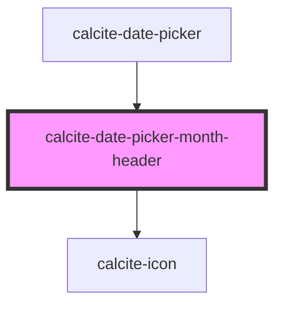

# calcite-date-month-header

<!-- Auto Generated Below -->

## Properties

| Property       | Attribute       | Description                                                                           | Type                         | Default     |
| -------------- | --------------- | ------------------------------------------------------------------------------------- | ---------------------------- | ----------- |
| `activeDate`   | --              | The focused date is indicated and will become the selected date if the user proceeds. | `Date`                       | `undefined` |
| `headingLevel` | `heading-level` | Specifies the number at which section headings should start.                          | `1 \| 2 \| 3 \| 4 \| 5 \| 6` | `undefined` |
| `localeData`   | --              | CLDR locale data for translated calendar info.                                        | `DateLocaleData`             | `undefined` |
| `max`          | --              | Specifies the latest allowed date (`"yyyy-mm-dd"`).                                   | `Date`                       | `undefined` |
| `min`          | --              | Specifies the earliest allowed date (`"yyyy-mm-dd"`).                                 | `Date`                       | `undefined` |
| `scale`        | `scale`         | Specifies the size of the component.                                                  | `"l" \| "m" \| "s"`          | `undefined` |
| `selectedDate` | --              | Already selected date.                                                                | `Date`                       | `undefined` |

## Dependencies

### Used by

- [calcite-date-picker](../date-picker)

### Depends on

- [calcite-icon](../icon)

### Graph

---

*Built with [StencilJS](https://stenciljs.com/)*
