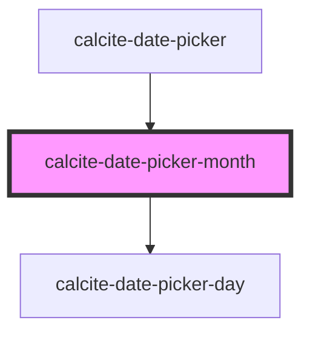

# calcite-date-month

<!-- Auto Generated Below -->

## Properties

| Property       | Attribute | Description                                           | Type                | Default      |
| -------------- | --------- | ----------------------------------------------------- | ------------------- | ------------ |
| `activeDate`   | --        | Date currently active.                                | `Date`              | `new Date()` |
| `endDate`      | --        | End date currently active                             | `Date`              | `undefined`  |
| `hoverRange`   | --        | The range of dates currently being hovered            | `HoverRange`        | `undefined`  |
| `max`          | --        | Specifies the latest allowed date (`"yyyy-mm-dd"`).   | `Date`              | `undefined`  |
| `min`          | --        | Specifies the earliest allowed date (`"yyyy-mm-dd"`). | `Date`              | `undefined`  |
| `scale`        | `scale`   | Specifies the size of the component.                  | `"l" \| "m" \| "s"` | `undefined`  |
| `selectedDate` | --        | Already selected date.                                | `Date`              | `undefined`  |
| `startDate`    | --        | Start date currently active.                          | `Date`              | `undefined`  |

## Dependencies

### Used by

- [calcite-date-picker](../date-picker)

### Depends on

- [calcite-date-picker-day](../date-picker-day)

### Graph

---

*Built with [StencilJS](https://stenciljs.com/)*
