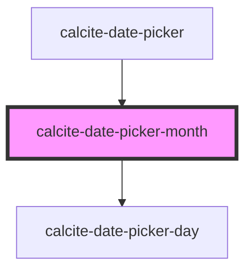

# calcite-date-month

<!-- Auto Generated Below -->

## Properties

| Property       | Attribute | Description                                           | Type                | Default      |
| -------------- | --------- | ----------------------------------------------------- | ------------------- | ------------ |
| `activeDate`   | --        | The currently active Date.                            | `Date`              | `new Date()` |
| `endDate`      | --        | End date currently active.                            | `Date`              | `undefined`  |
| `hoverRange`   | --        | The range of dates currently being hovered.           | `HoverRange`        | `undefined`  |
| `max`          | --        | Specifies the latest allowed date (`"yyyy-mm-dd"`).   | `Date`              | `undefined`  |
| `min`          | --        | Specifies the earliest allowed date (`"yyyy-mm-dd"`). | `Date`              | `undefined`  |
| `scale`        | `scale`   | Specifies the size of the component.                  | `"l" \| "m" \| "s"` | `undefined`  |
| `selectedDate` | --        | Already selected date.                                | `Date`              | `undefined`  |
| `startDate`    | --        | Start date currently active.                          | `Date`              | `undefined`  |

## CSS Custom Properties

| Name                                                              | Description                                                |
| ----------------------------------------------------------------- | ---------------------------------------------------------- |
| `--calcite-date-picker-month-day-background-color`                | Specifies the background color of day.                     |
| `--calcite-date-picker-month-day-background-color-hover`          | Specifies the background color of day when hovered.        |
| `--calcite-date-picker-month-day-background-color-selected`       | Specifies the background color of day range when selected. |
| `--calcite-date-picker-month-day-corner-radius`                   | Specifies the border radius of day.                        |
| `--calcite-date-picker-month-day-font-size`                       | Specifies the font size of day.                            |
| `--calcite-date-picker-month-day-range-background-color-hovered`  | Specifies the background color of day range when hovered.  |
| `--calcite-date-picker-month-day-range-background-color-selected` | Specifies the background color of day range when selected. |
| `--calcite-date-picker-month-day-text-color`                      | Specifies the text color of day.                           |
| `--calcite-date-picker-month-day-text-color-hover`                | Specifies the text color of day when hovered.              |
| `--calcite-date-picker-month-day-text-selected`                   | Specifies the text color of day when selected.             |
| `--calcite-date-picker-month-week-headers-border-color`           | Specifies the border color of week headers.                |
| `--calcite-date-picker-month-week-headers-text-color`             | Specifies the text color of week headers.                  |

## Dependencies

### Used by

- [calcite-date-picker](../date-picker)

### Depends on

- [calcite-date-picker-day](../date-picker-day)

### Graph

---

*Built with [StencilJS](https://stenciljs.com/)*
