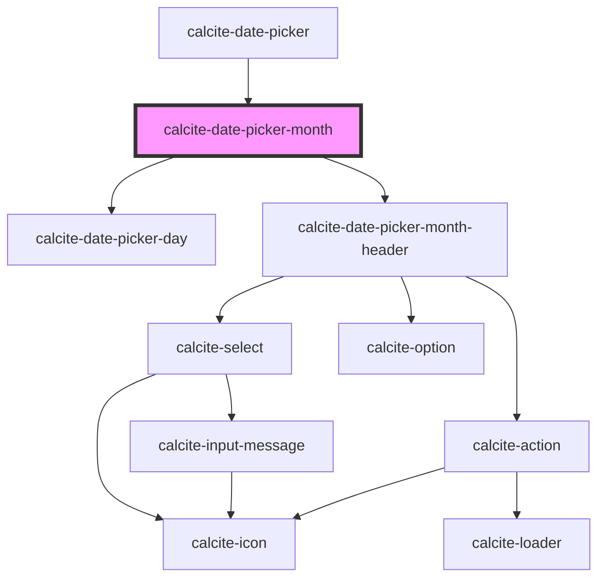

# calcite-date-month

<!-- Auto Generated Below -->

## Properties

| Property       | Attribute       | Description                                                                                                  | Type                         | Default      |
| -------------- | --------------- | ------------------------------------------------------------------------------------------------------------ | ---------------------------- | ------------ |
| `activeDate`   | --              | The currently active Date.                                                                                   | `Date`                       | `new Date()` |
| `endDate`      | --              | End date currently active.                                                                                   | `Date`                       | `undefined`  |
| `headingLevel` | `heading-level` | Specifies the number at which section headings should start.                                                 | `1 \| 2 \| 3 \| 4 \| 5 \| 6` | `undefined`  |
| `hoverRange`   | --              | The range of dates currently being hovered.                                                                  | `HoverRange`                 | `undefined`  |
| `max`          | --              | Specifies the latest allowed date (`"yyyy-mm-dd"`).                                                          | `Date`                       | `undefined`  |
| `min`          | --              | Specifies the earliest allowed date (`"yyyy-mm-dd"`).                                                        | `Date`                       | `undefined`  |
| `monthStyle`   | `month-style`   | Specifies the monthStyle used by the component.                                                              | `"abbreviated" \| "wide"`    | `undefined`  |
| `range`        | `range`         | When `true`, activates the component's range mode which renders two calendars for selecting ranges of dates. | `boolean`                    | `false`      |
| `scale`        | `scale`         | Specifies the size of the component.                                                                         | `"l" \| "m" \| "s"`          | `undefined`  |
| `selectedDate` | --              | Already selected date.                                                                                       | `Date`                       | `undefined`  |
| `startDate`    | --              | Start date currently active.                                                                                 | `Date`                       | `undefined`  |

## Dependencies

### Used by

- [calcite-date-picker](../date-picker)

### Depends on

- [calcite-date-picker-day](../date-picker-day)
- [calcite-date-picker-month-header](../date-picker-month-header)

### Graph

---
