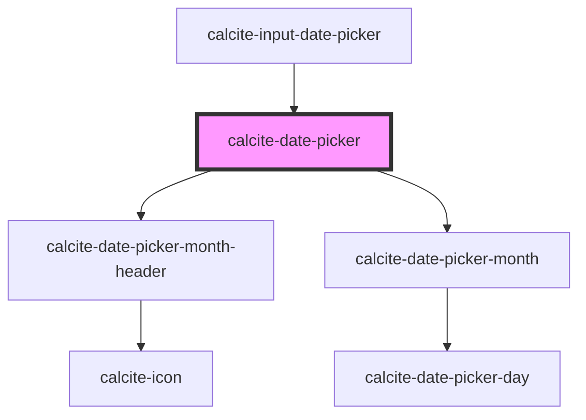

# calcite-date-picker

The `calcite-date-picker` component allows for selecting a date via a calendar or text input. It supports multiple locales, languages, right to left, and is fully keyboard accessible.

<!-- Auto Generated Below -->

## Usage

### Basic

You can set a min and max range, as well as an initial value with ISO 8601 formatted strings:

```html
<calcite-date-picker value="2020-03-27" min="2020-02-01" max="2021-01-01"></calcite-date-picker>
```

### Range

You can also add range property to activate date range mode. In this mode, you will have to set the value property directly on the component's instance to an array of date strings.

```html
<calcite-date-picker min="2020-01-01" max="2021-01-31" range />
```

```js
document.querySelector("calcite-date-picker").value = ["2020-01-03", "2020-01-05"];
```

## Properties

| Property                     | Attribute                      | Description                                                                                                                                                                  | Type                            | Default     |
| ---------------------------- | ------------------------------ | ---------------------------------------------------------------------------------------------------------------------------------------------------------------------------- | ------------------------------- | ----------- |
| `activeDate`                 | --                             | Specifies the component's active date.                                                                                                                                       | `Date`                          | `undefined` |
| `activeRange`                | `active-range`                 | When `range` is true, specifies the active `range`. Where `"start"` specifies the starting range date and `"end"` the ending range date.                                     | `"end" \| "start"`              | `undefined` |
| `headingLevel`               | `heading-level`                | Specifies the number at which section headings should start.                                                                                                                 | `1 \| 2 \| 3 \| 4 \| 5 \| 6`    | `undefined` |
| `max`                        | `max`                          | Specifies the latest allowed date (`"yyyy-mm-dd"`).                                                                                                                          | `string`                        | `undefined` |
| `maxAsDate`                  | --                             | Specifies the latest allowed date as a full date object (`new Date("yyyy-mm-dd")`).                                                                                          | `Date`                          | `undefined` |
| `messageOverrides`           | `message-overrides`            | Use this property to override individual strings used by the component.                                                                                                      | `DatePickerMessages`            | `undefined` |
| `min`                        | `min`                          | Specifies the earliest allowed date (`"yyyy-mm-dd"`).                                                                                                                        | `string`                        | `undefined` |
| `minAsDate`                  | --                             | Specifies the earliest allowed date as a full date object (`new Date("yyyy-mm-dd")`).                                                                                        | `Date`                          | `undefined` |
| `numberingSystem`            | `numbering-system`             | Specifies the Unicode numeral system used by the component for localization. This property cannot be dynamically changed.                                                    | `"arab" \| "arabext" \| "latn"` | `undefined` |
| `proximitySelectionDisabled` | `proximity-selection-disabled` | When `true`, disables the default behavior on the third click of narrowing or extending the range and instead starts a new range.                                            | `boolean`                       | `false`     |
| `range`                      | `range`                        | When `true`, activates the component's range mode to allow a start and end date.                                                                                             | `boolean`                       | `false`     |
| `scale`                      | `scale`                        | Specifies the size of the component.                                                                                                                                         | `"l" \| "m" \| "s"`             | `"m"`       |
| `value`                      | `value`                        | Specifies the selected date as a string (`"yyyy-mm-dd"`), or an array of strings for `range` values (`["yyyy-mm-dd", "yyyy-mm-dd"]`).                                        | `string \| string[]`            | `undefined` |
| `valueAsDate`                | --                             | Specifies the selected date as a full date object (`new Date("yyyy-mm-dd")`), or an array containing full date objects (`[new Date("yyyy-mm-dd"), new Date("yyyy-mm-dd")]`). | `Date \| Date[]`                | `undefined` |

## Events

| Event                          | Description                                                                                                           | Type                |
| ------------------------------ | --------------------------------------------------------------------------------------------------------------------- | ------------------- |
| `calciteDatePickerChange`      | Fires when a user changes the component's date. For `range` events, use `calciteDatePickerRangeChange`.               | `CustomEvent<void>` |
| `calciteDatePickerRangeChange` | Fires when a user changes the component's date `range`. For components without `range` use `calciteDatePickerChange`. | `CustomEvent<void>` |

## Methods

### `setFocus() => Promise<void>`

Sets focus on the component's first focusable element.

#### Returns

Type: `Promise<void>`

## Dependencies

### Used by

- [calcite-input-date-picker](../input-date-picker)

### Depends on

- [calcite-date-picker-month-header](../date-picker-month-header)
- [calcite-date-picker-month](../date-picker-month)

### Graph



---

*Built with [StencilJS](https://stenciljs.com/)*
