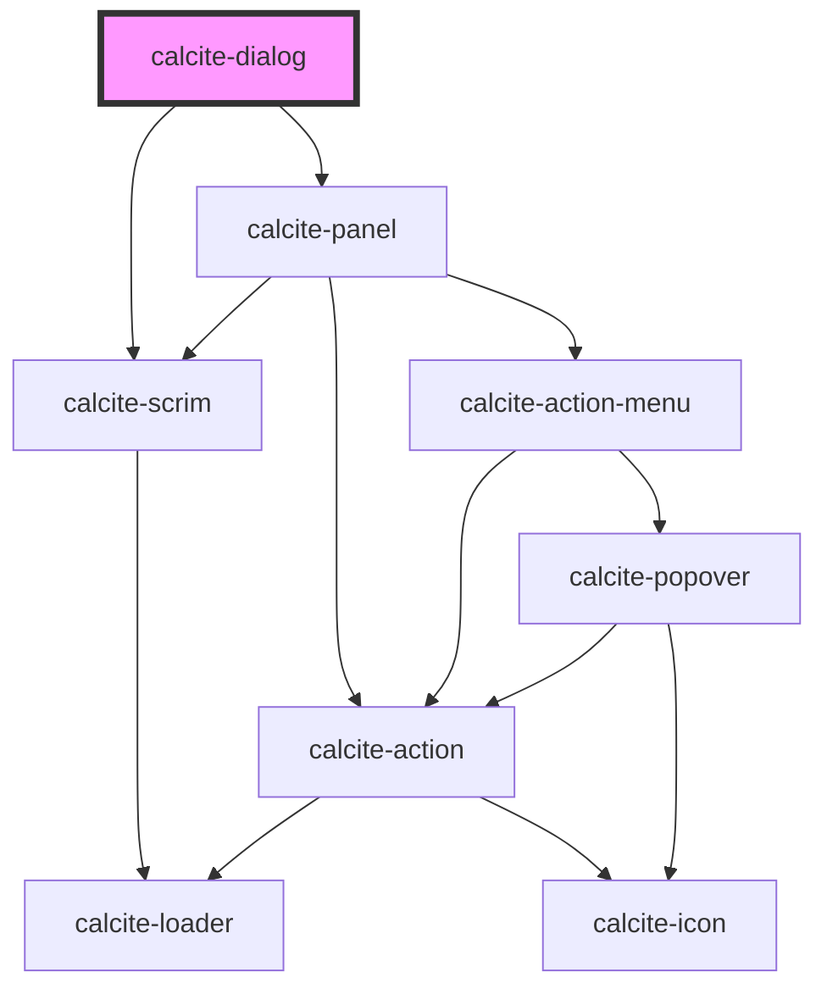

# calcite-dialog

For comprehensive guidance on using and implementing `calcite-dialog`, refer to the [documentation page](https://developers.arcgis.com/calcite-design-system/components/dialog/).

<!-- Auto Generated Below -->

## Properties

| Property             | Attribute             | Description                                                                                                                                                                                                                                                                                                                                                                 | Type                                                                                                     | Default      |
| -------------------- | --------------------- | --------------------------------------------------------------------------------------------------------------------------------------------------------------------------------------------------------------------------------------------------------------------------------------------------------------------------------------------------------------------------- | -------------------------------------------------------------------------------------------------------- | ------------ |
| `beforeClose`        | --                    | Passes a function to run before the component closes.                                                                                                                                                                                                                                                                                                                       | `() => Promise<void>`                                                                                    | `undefined`  |
| `closeDisabled`      | `close-disabled`      | When `true`, disables the component's close button.                                                                                                                                                                                                                                                                                                                         | `boolean`                                                                                                | `false`      |
| `description`        | `description`         | A description for the component.                                                                                                                                                                                                                                                                                                                                            | `string`                                                                                                 | `undefined`  |
| `heading`            | `heading`             | The component header text.                                                                                                                                                                                                                                                                                                                                                  | `string`                                                                                                 | `undefined`  |
| `headingLevel`       | `heading-level`       | Specifies the heading level of the component's `heading` for proper document structure, without affecting visual styling.                                                                                                                                                                                                                                                   | `1 \| 2 \| 3 \| 4 \| 5 \| 6`                                                                             | `undefined`  |
| `kind`               | `kind`                | Specifies the kind of the component, which will style the top border.                                                                                                                                                                                                                                                                                                       | `"brand" \| "danger" \| "info" \| "success" \| "warning"`                                                | `undefined`  |
| `loading`            | `loading`             | When `true`, a busy indicator is displayed.                                                                                                                                                                                                                                                                                                                                 | `boolean`                                                                                                | `false`      |
| `menuOpen`           | `menu-open`           | When `true`, the action menu items in the `header-menu-actions` slot are open.                                                                                                                                                                                                                                                                                              | `boolean`                                                                                                | `false`      |
| `messageOverrides`   | `message-overrides`   | Use this property to override individual strings used by the component.                                                                                                                                                                                                                                                                                                     | `DialogMessages`                                                                                         | `undefined`  |
| `modal`              | `modal`               | When `true`, displays a scrim blocking interaction underneath the component.                                                                                                                                                                                                                                                                                                | `boolean`                                                                                                | `false`      |
| `open`               | `open`                | When `true`, displays and positions the component.                                                                                                                                                                                                                                                                                                                          | `boolean`                                                                                                | `false`      |
| `overlayPositioning` | `overlay-positioning` | Determines the type of positioning to use for the overlaid content. Using `"absolute"` will work for most cases. The component will be positioned inside of overflowing parent containers and will affect the container's layout. `"fixed"` should be used to escape an overflowing parent container, or when the reference element's `position` CSS property is `"fixed"`. | `"absolute" \| "fixed"`                                                                                  | `"absolute"` |
| `placement`          | `placement`           | Specifies the placement of the dialog.                                                                                                                                                                                                                                                                                                                                      | `"bottom" \| "bottom-end" \| "bottom-start" \| "center" \| "cover" \| "top" \| "top-end" \| "top-start"` | `"center"`   |
| `scale`              | `scale`               | Specifies the size of the component.                                                                                                                                                                                                                                                                                                                                        | `"l" \| "m" \| "s"`                                                                                      | `"m"`        |
| `widthScale`         | `width-scale`         | Specifies the width of the component.                                                                                                                                                                                                                                                                                                                                       | `"l" \| "m" \| "s"`                                                                                      | `"m"`        |

## Events

| Event                      | Description                                                                                              | Type                |
| -------------------------- | -------------------------------------------------------------------------------------------------------- | ------------------- |
| `calciteDialogBeforeClose` | Fires when the component is requested to be closed and before the closing transition begins.             | `CustomEvent<void>` |
| `calciteDialogBeforeOpen`  | Fires when the component is added to the DOM but not rendered, and before the opening transition begins. | `CustomEvent<void>` |
| `calciteDialogClose`       | Fires when the component is closed and animation is complete.                                            | `CustomEvent<void>` |
| `calciteDialogOpen`        | Fires when the component is open and animation is complete.                                              | `CustomEvent<void>` |
| `calciteDialogScroll`      | Fires when the content is scrolled.                                                                      | `CustomEvent<void>` |

## Methods

### `scrollContentTo(options?: ScrollToOptions) => Promise<void>`

Scrolls the component's content to a specified set of coordinates.

#### Parameters

| Name      | Type              | Description                                  |
| --------- | ----------------- | -------------------------------------------- |
| `options` | `ScrollToOptions` | - allows specific coordinates to be defined. |

#### Returns

Type: `Promise<void>`

- promise that resolves once the content is scrolled to.

### `setFocus() => Promise<void>`

Sets focus on the component's "close" button (the first focusable item).

#### Returns

Type: `Promise<void>`

- A promise that is resolved when the operation has completed.

### `updateFocusTrapElements() => Promise<void>`

Updates the element(s) that are used within the focus-trap of the component.

#### Returns

Type: `Promise<void>`

## Slots

| Slot                     | Description                                                                                                                       |
| ------------------------ | --------------------------------------------------------------------------------------------------------------------------------- |
|                          | A slot for adding content.                                                                                                        |
| `"action-bar"`           | A slot for adding a `calcite-action-bar` to the component.                                                                        |
| `"alerts"`               | A slot for adding `calcite-alert`s to the component.                                                                              |
| `"content"`              | A slot for adding custom content.                                                                                                 |
| `"content-bottom"`       | A slot for adding content below the unnamed (default) slot and - if populated - the `footer` slot.                                |
| `"content-top"`          | A slot for adding content above the unnamed (default) slot and - if populated - below the `action-bar` slot.                      |
| `"fab"`                  | A slot for adding a `calcite-fab` (floating action button) to perform an action.                                                  |
| `"footer"`               | A slot for adding custom content to the component's footer. Should not be used with the `"footer-start"` or `"footer-end"` slots. |
| `"footer-end"`           | A slot for adding a trailing footer custom content. Should not be used with the `"footer"` slot.                                  |
| `"footer-start"`         | A slot for adding a leading footer custom content. Should not be used with the `"footer"` slot.                                   |
| `"header-actions-end"`   | A slot for adding actions or content to the ending side of the component's header.                                                |
| `"header-actions-start"` | A slot for adding actions or content to the starting side of the component's header.                                              |
| `"header-content"`       | A slot for adding custom content to the component's header.                                                                       |
| `"header-menu-actions"`  | A slot for adding an overflow menu with actions inside a `calcite-dropdown`.                                                      |

## CSS Custom Properties

| Name                                      | Description                                                                                                                                                    |
| ----------------------------------------- | -------------------------------------------------------------------------------------------------------------------------------------------------------------- |
| `--calcite-dialog-border-color`           | Specifies the component's border color.                                                                                                                        |
| `--calcite-dialog-footer-space`           | Specifies the padding of the component's footer.                                                                                                               |
| `--calcite-dialog-scrim-background-color` | Specifies the background color of the component's scrim.                                                                                                       |
| `--calcite-dialog-size-x`                 | Specifies the width of the component, using `px`, `em`, `rem`, `vw`, or `%`. Does not exceed the viewport's width - applies when `placement="cover"` is set.   |
| `--calcite-dialog-size-y`                 | Specifies the height of the component, using `px`, `em`, `rem`, `vh`, or `%`. Does not exceed the viewport's height - applies when `placement="cover"` is set. |

## Dependencies

### Depends on

- [calcite-scrim](../scrim)
- [calcite-panel](../panel)

### Graph

---

*Built with [StencilJS](https://stenciljs.com/)*
