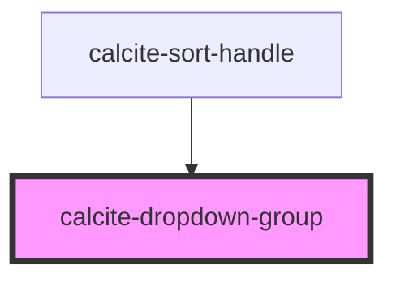

# calcite-dropdown-group

For comprehensive guidance on using and implementing `calcite-dropdown-group`, refer to the [documentation page](https://developers.arcgis.com/calcite-design-system/components/dropdown-group/).

<!-- Auto Generated Below -->

## Properties

| Property        | Attribute        | Description                                                                                                                                                                           | Type                               | Default     |
| --------------- | ---------------- | ------------------------------------------------------------------------------------------------------------------------------------------------------------------------------------- | ---------------------------------- | ----------- |
| `groupTitle`    | `group-title`    | Specifies and displays a group title.                                                                                                                                                 | `string`                           | `undefined` |
| `selectionMode` | `selection-mode` | Specifies the selection mode of the component, where: `"multiple"` allows any number of selections, `"single"` allows only one selection, and `"none"` does not allow any selections. | `"multiple" \| "none" \| "single"` | `"single"`  |

## Slots

| Slot | Description                                 |
| ---- | ------------------------------------------- |
|      | A slot for adding `calcite-dropdown-item`s. |

## Dependencies

### Used by

- [calcite-sort-handle](../sort-handle)

### Graph

---

*Built with [StencilJS](https://stenciljs.com/)*
