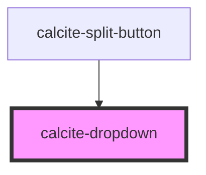

# calcite-dropdown

A `calcite-dropdown` can be used to provide an absolutely positioned set of selectable items. You can combine multiple groups of items and selection modes, and optionally pass a title for each group. Every `calcite-dropdown-item` must have a parent `calcite-dropdown-group`, even if the `groupTitle` property is not set.

<!-- Auto Generated Below -->

## Usage

### Basic

Every `calcite-dropdown-item` must have a parent `calcite-dropdown-group`.

```html
<calcite-dropdown>
  <calcite-button slot="trigger">Choose a fruit</calcite-button>
  <calcite-dropdown-group>
    <calcite-dropdown-item>Apple</calcite-dropdown-item>
    <calcite-dropdown-item selected>Orange</calcite-dropdown-item>
    <calcite-dropdown-item>Banana</calcite-dropdown-item>
  </calcite-dropdown-group>
</calcite-dropdown>
```

### Disabling-close-on-select

You can choose to leave the Dropdown open when an item is selected with the `close-on-select-disabled` attribute. Note that this will only apply when the `calcite-dropdown-group`'s `selectionMode` is set to `"single"` or `"multiple"`. Dropdowns will always close when the `calcite-dropdown-group`'s `selectionMode` is `"none"`.

```html
<calcite-dropdown close-on-select-disabled>
  <calcite-button id="trigger" slot="trigger">Choose a fruit</calcite-button>
  <calcite-dropdown-group id="fruits" selection-mode="single">
    <calcite-dropdown-item id="apple">Apple</calcite-dropdown-item>
    <calcite-dropdown-item id="orange" selected>Orange</calcite-dropdown-item>
    <calcite-dropdown-item id="banana">Banana</calcite-dropdown-item>
  </calcite-dropdown-group>
</calcite-dropdown>
```

### Groups

You can combine groups in a single Dropdown, with different `selectionMode`s:

```html
<calcite-dropdown>
  <calcite-button slot="trigger">Add to cart</calcite-button>
  <calcite-dropdown-group group-title="Select one fruit">
    <calcite-dropdown-item>Apple</calcite-dropdown-item>
    <calcite-dropdown-item selected>Orange</calcite-dropdown-item>
    <calcite-dropdown-item>Banana</calcite-dropdown-item>
  </calcite-dropdown-group>
  <calcite-dropdown-group group-title="Select multiple vegetables" selection-mode="multiple">
    <calcite-dropdown-item>Asparagus</calcite-dropdown-item>
    <calcite-dropdown-item selected>Potato</calcite-dropdown-item>
    <calcite-dropdown-item>Yam</calcite-dropdown-item>
  </calcite-dropdown-group>
  <calcite-dropdown-group group-title="Select none (useful for actions)" selection-mode="none">
    <calcite-dropdown-item>Plant beans</calcite-dropdown-item>
    <calcite-dropdown-item selected>Add peas</calcite-dropdown-item>
  </calcite-dropdown-group>
</calcite-dropdown>
```

## Properties

| Property                | Attribute                  | Description                                                                                                                                                                                                                                                                                                                                                                 | Type                                                                              | Default                |
| ----------------------- | -------------------------- | --------------------------------------------------------------------------------------------------------------------------------------------------------------------------------------------------------------------------------------------------------------------------------------------------------------------------------------------------------------------------- | --------------------------------------------------------------------------------- | ---------------------- |
| `closeOnSelectDisabled` | `close-on-select-disabled` | When `true`, the component will remain open after a selection is made. If the `selectionMode` of the selected `calcite-dropdown-item`'s containing `calcite-dropdown-group` is `"none"`, the component will always close.                                                                                                                                                   | `boolean`                                                                         | `false`                |
| `disabled`              | `disabled`                 | When `true`, interaction is prevented and the component is displayed with lower opacity.                                                                                                                                                                                                                                                                                    | `boolean`                                                                         | `false`                |
| `flipPlacements`        | --                         | Defines the available placements that can be used when a flip occurs.                                                                                                                                                                                                                                                                                                       | `Placement[]`                                                                     | `undefined`            |
| `maxItems`              | `max-items`                | Specifies the maximum number of `calcite-dropdown-item`s to display before showing a scroller. Value must be greater than `0`, and does not include `groupTitle`'s from `calcite-dropdown-group`.                                                                                                                                                                           | `number`                                                                          | `0`                    |
| `open`                  | `open`                     | When `true`, displays and positions the component.                                                                                                                                                                                                                                                                                                                          | `boolean`                                                                         | `false`                |
| `overlayPositioning`    | `overlay-positioning`      | Determines the type of positioning to use for the overlaid content. Using `"absolute"` will work for most cases. The component will be positioned inside of overflowing parent containers and will affect the container's layout. `"fixed"` should be used to escape an overflowing parent container, or when the reference element's `position` CSS property is `"fixed"`. | `"absolute" \| "fixed"`                                                           | `"absolute"`           |
| `placement`             | `placement`                | Determines where the component will be positioned relative to the container element.                                                                                                                                                                                                                                                                                        | `"bottom" \| "bottom-end" \| "bottom-start" \| "top" \| "top-end" \| "top-start"` | `defaultMenuPlacement` |
| `scale`                 | `scale`                    | Specifies the size of the component.                                                                                                                                                                                                                                                                                                                                        | `"l" \| "m" \| "s"`                                                               | `"m"`                  |
| `selectedItems`         | --                         | Specifies the component's selected items.                                                                                                                                                                                                                                                                                                                                   | `HTMLCalciteDropdownItemElement[]`                                                | `[]`                   |
| `type`                  | `type`                     | Specifies the action to open the component from the container element.                                                                                                                                                                                                                                                                                                      | `"click" \| "hover"`                                                              | `"click"`              |
| `width`                 | `width`                    | Specifies the width of the component.                                                                                                                                                                                                                                                                                                                                       | `"l" \| "m" \| "s"`                                                               | `undefined`            |

## Events

| Event                        | Description                                                                                              | Type                |
| ---------------------------- | -------------------------------------------------------------------------------------------------------- | ------------------- |
| `calciteDropdownBeforeClose` | Fires when the component is requested to be closed and before the closing transition begins.             | `CustomEvent<void>` |
| `calciteDropdownBeforeOpen`  | Fires when the component is added to the DOM but not rendered, and before the opening transition begins. | `CustomEvent<void>` |
| `calciteDropdownClose`       | Fires when the component is closed and animation is complete.                                            | `CustomEvent<void>` |
| `calciteDropdownOpen`        | Fires when the component is open and animation is complete.                                              | `CustomEvent<void>` |
| `calciteDropdownSelect`      | Fires when a `calcite-dropdown-item`'s selection changes.                                                | `CustomEvent<void>` |

## Methods

### `reposition(delayed?: boolean) => Promise<void>`

Updates the position of the component.

#### Returns

Type: `Promise<void>`

### `setFocus() => Promise<void>`

Sets focus on the component's first focusable element.

#### Returns

Type: `Promise<void>`

## Slots

| Slot        | Description                                                                                                                                                                   |
| ----------- | ----------------------------------------------------------------------------------------------------------------------------------------------------------------------------- |
|             | A slot for adding `calcite-dropdown-group` elements. Every `calcite-dropdown-item` must have a parent `calcite-dropdown-group`, even if the `groupTitle` property is not set. |
| `"trigger"` | A slot for the element that triggers the `calcite-dropdown`.                                                                                                                  |

## CSS Custom Properties

| Name                       | Description                                     |
| -------------------------- | ----------------------------------------------- |
| `--calcite-dropdown-width` | Specifies the width of the component's wrapper. |

## Dependencies

### Used by

- [calcite-split-button](../split-button)

### Graph



---

_Built with [StencilJS](https://stenciljs.com/)_
