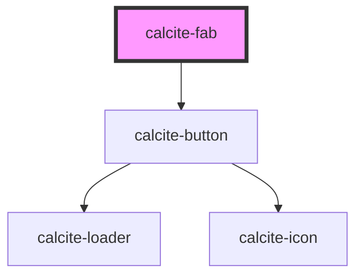

# calcite-fab

<!-- Auto Generated Below -->

## Usage

### Basic

Renders a `calcite-fab` that displays only an icon and a tooltip label.

```html
<calcite-fab label="Performs my custom action"></calcite-fab>
```

### Loading-and-disabled

Renders a `calcite-fab` that is `loading` and `disabled`.

```html
<calcite-fab loading disabled></calcite-fab>
```

### Styling

Configure styling for a `calcite-fab` to fit your UI and branding with the `appearance` and `kind` attributes/properties:

```html
<calcite-fab appearance="outline-fill" kind="danger" icon="trash" label="Remove layer"></calcite-fab>
```

### With-text

Renders a `calcite-fab` that displays text alongside an icon.

```html
<calcite-fab label="Performs my custom action" text="Perform Action!" text-enabled></calcite-fab>
```

## Properties

| Property      | Attribute       | Description                                                                                  | Type                                            | Default      |
| ------------- | --------------- | -------------------------------------------------------------------------------------------- | ----------------------------------------------- | ------------ |
| `appearance`  | `appearance`    | Specifies the appearance style of the component.                                             | `"outline-fill" \| "solid"`                     | `"solid"`    |
| `disabled`    | `disabled`      | When `true`, interaction is prevented and the component is displayed with lower opacity.     | `boolean`                                       | `false`      |
| `icon`        | `icon`          | Specifies an icon to display.                                                                | `string`                                        | `ICONS.plus` |
| `iconFlipRtl` | `icon-flip-rtl` | When `true`, the icon will be flipped when the element direction is right-to-left (`"rtl"`). | `boolean`                                       | `false`      |
| `kind`        | `kind`          | Specifies the kind of the component, which will apply to border and background.              | `"brand" \| "danger" \| "inverse" \| "neutral"` | `"brand"`    |
| `label`       | `label`         | Accessible name for the component.                                                           | `string`                                        | `undefined`  |
| `loading`     | `loading`       | When `true`, a busy indicator is displayed.                                                  | `boolean`                                       | `false`      |
| `scale`       | `scale`         | Specifies the size of the component.                                                         | `"l" \| "m" \| "s"`                             | `"m"`        |
| `text`        | `text`          | Specifies text to accompany the component's icon.                                            | `string`                                        | `undefined`  |
| `textEnabled` | `text-enabled`  | When `true`, displays the `text` value in the component.                                     | `boolean`                                       | `false`      |

## Methods

### `setFocus() => Promise<void>`

Sets focus on the component.

#### Returns

Type: `Promise<void>`

## CSS Custom Properties

| Name                                    | Description                                                            |
| --------------------------------------- | ---------------------------------------------------------------------- |
| `--calcite-fab-background-color`        | defines the component's background color.                              |
| `--calcite-fab-background-color-active` | defines the component's background color in an active state.           |
| `--calcite-fab-background-color-hover`  | defines the component's background color in a hover state.             |
| `--calcite-fab-border-color`            | defines the component's border color.                                  |
| `--calcite-fab-border-color-active`     | defines the component's border color in an active state.               |
| `--calcite-fab-border-color-focus`      | defines the component's border color in a focus state.                 |
| `--calcite-fab-border-color-hover`      | defines the component's border color in a hover state.                 |
| `--calcite-fab-corner-radius`           | defines the component's corner radius.                                 |
| `--calcite-fab-icon-color`              | defines the color of an icon in the component.                         |
| `--calcite-fab-icon-color-active`       | defines the color of an icon in the component when in an active state. |
| `--calcite-fab-icon-color-focus`        | defines the color of an icon in the component when in a focused state. |
| `--calcite-fab-icon-color-hover`        | defines the color of an icon in the component when in a hover state.   |
| `--calcite-fab-loader-color`            | defines the component's loader color.                                  |
| `--calcite-fab-shadow`                  | defines the component's shadow.                                        |
| `--calcite-fab-shadow-active`           | defines the component's shadow color in an active state.               |
| `--calcite-fab-shadow-focus`            | defines the component's shadow color in a focus state.                 |
| `--calcite-fab-shadow-hover`            | defines the component's shadow color in a hover state.                 |
| `--calcite-fab-text-color`              | defines the component's text color.                                    |
| `--calcite-fab-text-color-active`       | defines the component's text color in an active state.                 |
| `--calcite-fab-text-color-focus`        | defines the component's text color in a focus state.                   |
| `--calcite-fab-text-color-hover`        | defines the component's text color in a hover state.                   |

## Dependencies

### Depends on

- [calcite-button](../button)

### Graph



---

*Built with [StencilJS](https://stenciljs.com/)*
