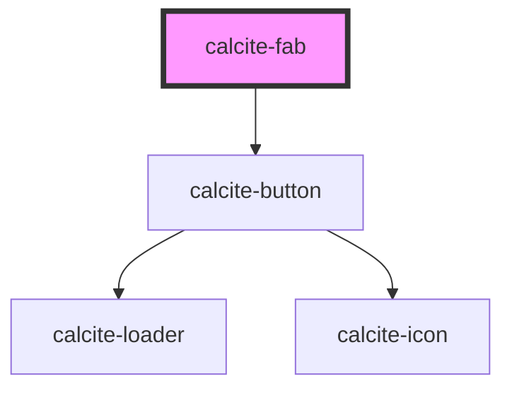

# calcite-fab

For comprehensive guidance on using and implementing `calcite-fab`, refer to the [documentation page](https://developers.arcgis.com/calcite-design-system/components/fab/).

<!-- Auto Generated Below -->

## Properties

| Property      | Attribute       | Description                                                                                  | Type                                            | Default      |
| ------------- | --------------- | -------------------------------------------------------------------------------------------- | ----------------------------------------------- | ------------ |
| `appearance`  | `appearance`    | Specifies the appearance style of the component.                                             | `"outline-fill" \| "solid"`                     | `"solid"`    |
| `disabled`    | `disabled`      | When `true`, interaction is prevented and the component is displayed with lower opacity.     | `boolean`                                       | `false`      |
| `icon`        | `icon`          | Specifies an icon to display.                                                                | `string`                                        | `ICONS.plus` |
| `iconFlipRtl` | `icon-flip-rtl` | When `true`, the icon will be flipped when the element direction is right-to-left (`"rtl"`). | `boolean`                                       | `false`      |
| `kind`        | `kind`          | Specifies the kind of the component, which will apply to border and background.              | `"brand" \| "danger" \| "inverse" \| "neutral"` | `"brand"`    |
| `label`       | `label`         | Accessible name for the component.                                                           | `string`                                        | `undefined`  |
| `loading`     | `loading`       | When `true`, a busy indicator is displayed.                                                  | `boolean`                                       | `false`      |
| `scale`       | `scale`         | Specifies the size of the component.                                                         | `"l" \| "m" \| "s"`                             | `"m"`        |
| `text`        | `text`          | Specifies text to accompany the component's icon.                                            | `string`                                        | `undefined`  |
| `textEnabled` | `text-enabled`  | When `true`, displays the `text` value in the component.                                     | `boolean`                                       | `false`      |

## Methods

### `setFocus() => Promise<void>`

Sets focus on the component.

#### Returns

Type: `Promise<void>`

## Dependencies

### Depends on

- [calcite-button](../button)

### Graph

---

*Built with [StencilJS](https://stenciljs.com/)*
