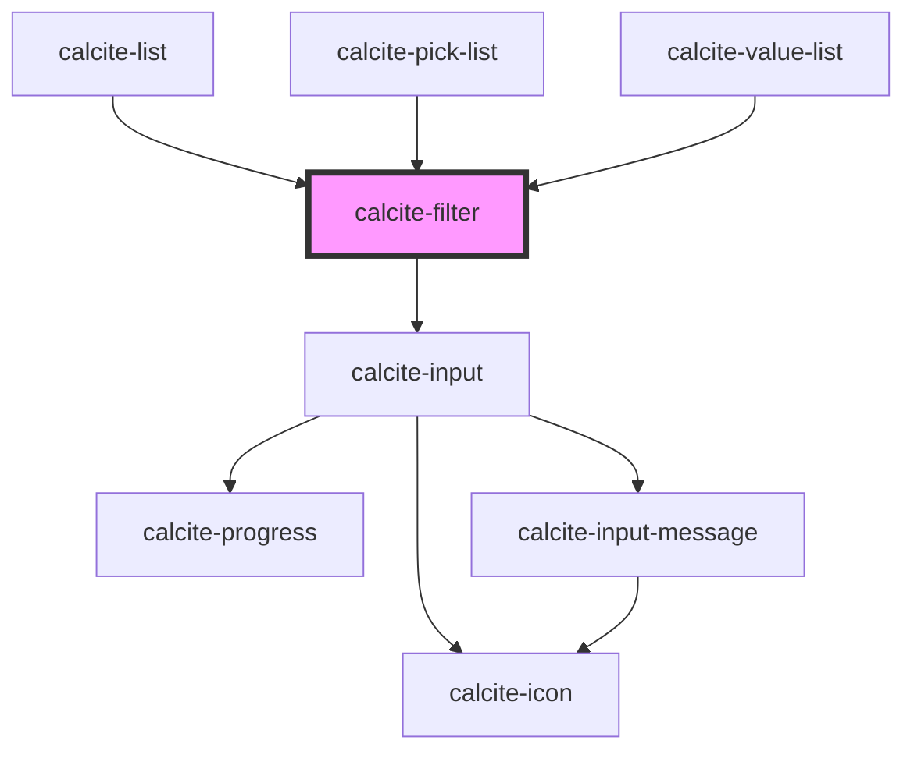

# calcite-filter

<!-- Auto Generated Below -->

## Properties

| Property           | Attribute     | Description                                                                                                                                                                                                                                 | Type                                  | Default     |
| ------------------ | ------------- | ------------------------------------------------------------------------------------------------------------------------------------------------------------------------------------------------------------------------------------------- | ------------------------------------- | ----------- |
| `disabled`         | `disabled`    | When `true`, interaction is prevented and the component is displayed with lower opacity.                                                                                                                                                    | `boolean`                             | `false`     |
| `filteredItems`    | --            | The component's resulting items after filtering.                                                                                                                                                                                            | `object[]`                            | `[]`        |
| `items`            | --            | Defines the items to filter. The component uses the values as the starting point, and returns items that contain the string entered in the input, using a partial match and recursive search. This property is needed to conduct filtering. | `object[]`                            | `[]`        |
| `messageOverrides` | --            | Use this property to override individual strings used by the component.                                                                                                                                                                     | `{ label?: string; clear?: string; }` | `undefined` |
| `placeholder`      | `placeholder` | Specifies placeholder text for the input element.                                                                                                                                                                                           | `string`                              | `undefined` |
| `scale`            | `scale`       | Specifies the size of the component.                                                                                                                                                                                                        | `"l" \| "m" \| "s"`                   | `"m"`       |
| `value`            | `value`       | The component's value.                                                                                                                                                                                                                      | `string`                              | `""`        |

## Events

| Event                 | Description                         | Type                |
| --------------------- | ----------------------------------- | ------------------- |
| `calciteFilterChange` | Fires when the filter text changes. | `CustomEvent<void>` |

## Methods

### `filter(value?: string) => Promise<void>`

Performs a filter on the component.

This method can be useful because filtering is delayed and asynchronous.

#### Parameters

| Name    | Type     | Description              |
| ------- | -------- | ------------------------ |
| `value` | `string` | - The filter text value. |

#### Returns

Type: `Promise<void>`

### `setFocus() => Promise<void>`

Sets focus on the component.

#### Returns

Type: `Promise<void>`

## CSS Custom Properties

| Name                                                   | Description                                                                         |
| ------------------------------------------------------ | ----------------------------------------------------------------------------------- |
| `--calcite-filter-background-color`                    | Specifies the background color of the filter.                                       |
| `--calcite-filter-input-background-color`              | defines the background color of the input sub-component.                            |
| `--calcite-filter-input-border-color`                  | defines the border color of the input sub-component.                                |
| `--calcite-filter-input-button-background-color`       | defines the background color of the button in the input sub-component.              |
| `--calcite-filter-input-button-background-color-hover` | defines the background color of the button when hovered in the input sub-component. |
| `--calcite-filter-input-button-border-color`           | defines the border color of the button in the input sub-component.                  |
| `--calcite-filter-input-button-icon-color`             | defines the icon color of the button in the input sub-component.                    |
| `--calcite-filter-input-button-icon-color-active`      | defines the icon color of the button when active in the input sub-component.        |
| `--calcite-filter-input-button-icon-color-hover`       | defines the icon color of the button when hovered in the input sub-component.       |
| `--calcite-filter-input-corner-radius`                 | defines the corner radius of the input sub-component.                               |
| `--calcite-filter-input-icon-color`                    | defines the icon color of the input sub-component.                                  |
| `--calcite-filter-input-placeholder-text-color`        | defines the placeholder text color of the input sub-component.                      |
| `--calcite-filter-input-text-color`                    | defines the text color of the input sub-component.                                  |

## Dependencies

### Used by

- [calcite-list](../list)
- [calcite-pick-list](../pick-list)
- [calcite-value-list](../value-list)

### Depends on

- [calcite-input](../input)

### Graph

---

*Built with [StencilJS](https://stenciljs.com/)*
