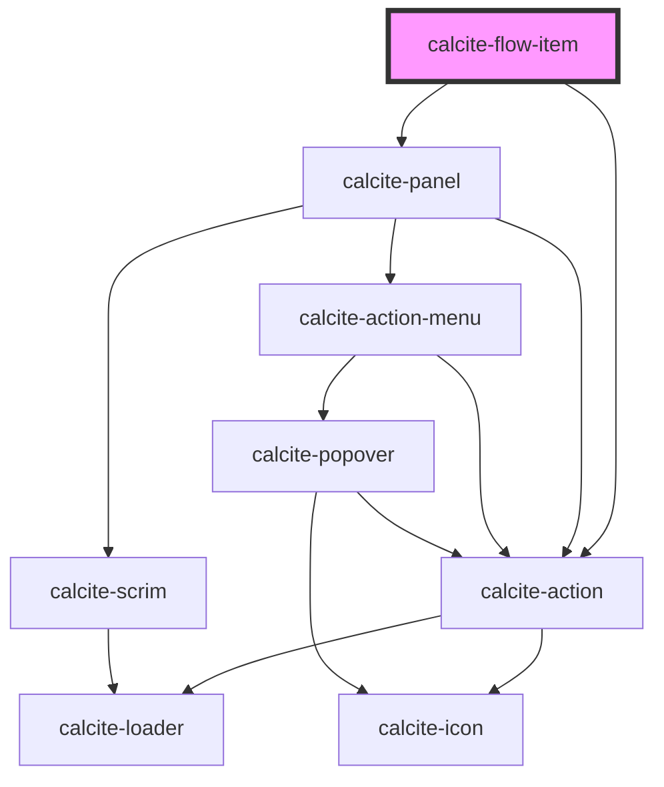

# calcite-flow-item

<!-- Auto Generated Below -->

## Properties

| Property           | Attribute       | Description                                                                                   | Type                                                   | Default     |
| ------------------ | --------------- | --------------------------------------------------------------------------------------------- | ------------------------------------------------------ | ----------- |
| `beforeBack`       | --              | When provided, the method will be called before it is removed from its parent `calcite-flow`. | `() => Promise<void>`                                  | `undefined` |
| `closable`         | `closable`      | When `true`, displays a close button in the trailing side of the component's header.          | `boolean`                                              | `false`     |
| `closed`           | `closed`        | When `true`, the component will be hidden.                                                    | `boolean`                                              | `false`     |
| `description`      | `description`   | A description for the component.                                                              | `string`                                               | `undefined` |
| `disabled`         | `disabled`      | When `true`, interaction is prevented and the component is displayed with lower opacity.      | `boolean`                                              | `false`     |
| `heading`          | `heading`       | The component header text.                                                                    | `string`                                               | `undefined` |
| `headingLevel`     | `heading-level` | Specifies the number at which section headings should start.                                  | `1 \| 2 \| 3 \| 4 \| 5 \| 6`                           | `undefined` |
| `loading`          | `loading`       | When `true`, a busy indicator is displayed.                                                   | `boolean`                                              | `false`     |
| `menuOpen`         | `menu-open`     | When `true`, the action menu items in the `header-menu-actions` slot are open.                | `boolean`                                              | `false`     |
| `messageOverrides` | --              | Use this property to override individual strings used by the component.                       | `{ back?: string; close?: string; options?: string; }` | `undefined` |

## Events

| Event                   | Description                             | Type                |
| ----------------------- | --------------------------------------- | ------------------- |
| `calciteFlowItemBack`   | Fires when the back button is clicked.  | `CustomEvent<void>` |
| `calciteFlowItemClose`  | Fires when the close button is clicked. | `CustomEvent<void>` |
| `calciteFlowItemScroll` | Fires when the content is scrolled.     | `CustomEvent<void>` |

## Methods

### `scrollContentTo(options?: ScrollToOptions) => Promise<void>`

Scrolls the component's content to a specified set of coordinates.

#### Returns

Type: `Promise<void>`

### `setFocus() => Promise<void>`

Sets focus on the component.

#### Returns

Type: `Promise<void>`

## Slots

| Slot                     | Description                                                                                                  |
| ------------------------ | ------------------------------------------------------------------------------------------------------------ |
|                          | A slot for adding custom content.                                                                            |
| `"action-bar"`           | A slot for adding a `calcite-action-bar` to the component.                                                   |
| `"fab"`                  | A slot for adding a `calcite-fab` (floating action button) to perform an action.                             |
| `"footer"`               | A slot for adding custom content to the component's footer.                                                  |
| `"footer-actions"`       | [Deprecated] Use the `"footer"` slot instead. A slot for adding `calcite-button`s to the component's footer. |
| `"header-actions-end"`   | A slot for adding `calcite-action`s or content to the end side of the component's header.                    |
| `"header-actions-start"` | A slot for adding `calcite-action`s or content to the start side of the component's header.                  |
| `"header-content"`       | A slot for adding custom content to the component's header.                                                  |
| `"header-menu-actions"`  | A slot for adding an overflow menu with `calcite-action`s inside a `calcite-dropdown`.                       |

## CSS Custom Properties

| Name                                 | Description                                      |
| ------------------------------------ | ------------------------------------------------ |
| `--calcite-flow-item-footer-padding` | Specifies the padding of the component's footer. |

## Dependencies

### Depends on

- [calcite-action](../action)
- [calcite-panel](../panel)

### Graph

---

*Built with [StencilJS](https://stenciljs.com/)*
