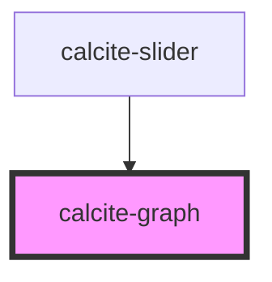

# calcite-graph

The graph component is used to show small, lightweight graphs in places where a full interactive chart is not needed. This includes sparklines, histograms, and small trend plots.

<!-- Auto Generated Below -->

## Properties

| Property           | Attribute       | Description                                                                                                                  | Type          | Default     |
| ------------------ | --------------- | ---------------------------------------------------------------------------------------------------------------------------- | ------------- | ----------- |
| `colorStops`       | --              | Array of values describing a single color stop ([offset, color, opacity]) These color stops should be sorted by offset value | `ColorStop[]` | `undefined` |
| `data`             | --              | Array of tuples describing a single data point ([x, y]) These data points should be sorted by x-axis value                   | `Point[]`     | `[]`        |
| `highlightMax`     | `highlight-max` | End of highlight color if highlighting range                                                                                 | `number`      | `undefined` |
| `highlightMin`     | `highlight-min` | Start of highlight color if highlighting range                                                                               | `number`      | `undefined` |
| `max` *(required)* | `max`           | Highest point of the range                                                                                                   | `number`      | `undefined` |
| `min` *(required)* | `min`           | Lowest point of the range                                                                                                    | `number`      | `undefined` |

## Dependencies

### Used by

- [calcite-slider](../slider)

### Graph

---

*Built with [StencilJS](https://stenciljs.com/)*
