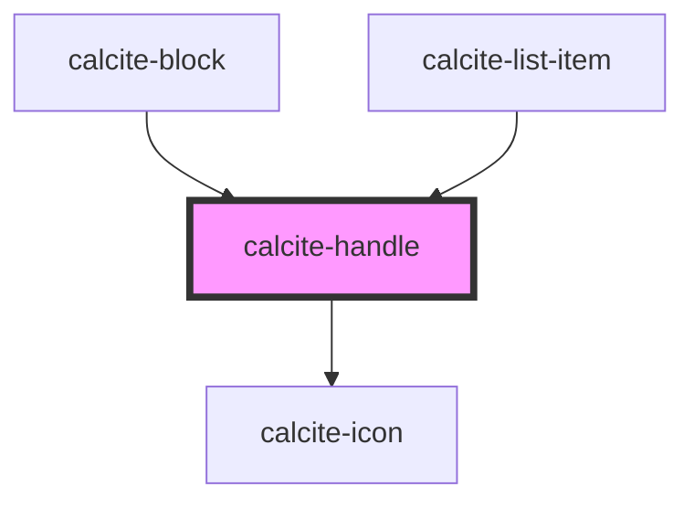

# calcite-handle

<!-- Auto Generated Below -->

## Properties

| Property           | Attribute           | Description                                                                              | Type             | Default     |
| ------------------ | ------------------- | ---------------------------------------------------------------------------------------- | ---------------- | ----------- |
| `disabled`         | `disabled`          | When `true`, interaction is prevented and the component is displayed with lower opacity. | `boolean`        | `false`     |
| `dragHandle`       | `drag-handle`       | Value for the button title attribute                                                     | `string`         | `undefined` |
| `messageOverrides` | `message-overrides` | Use this property to override individual strings used by the component.                  | `HandleMessages` | `undefined` |
| `selected`         | `selected`          | When `true`, the component is selected.                                                  | `boolean`        | `false`     |

## Events

| Event                 | Description                                                                  | Type                       |
| --------------------- | ---------------------------------------------------------------------------- | -------------------------- |
| `calciteHandleChange` | Emits whenever the component is selected or unselected.                      | `CustomEvent<void>`        |
| `calciteHandleNudge`  | Emitted when the handle is selected and the up or down arrow key is pressed. | `CustomEvent<HandleNudge>` |

## Methods

### `setFocus() => Promise<void>`

Sets focus on the component.

#### Returns

Type: `Promise<void>`

## Dependencies

### Used by

- [calcite-block](../block)
- [calcite-list-item](../list-item)

### Depends on

- [calcite-icon](../icon)

### Graph

---

*Built with [StencilJS](https://stenciljs.com/)*
