# calcite-icon

<!-- Auto Generated Below -->

## Usage

### Custom-icon-color

To use a custom color for the icon fill, you can supply your desired color to the `--calcite-ui-icon-color` CSS variable:

```html
<calcite-icon class="my-icon-color-class" icon="arrowBoldLeft"></calcite-icon>
```

```css
.my-icon-color-class {
  --calcite-ui-icon-color: #007ac2;
}
```

## Properties

| Property    | Attribute    | Description                                                                                      | Type                | Default     |
| ----------- | ------------ | ------------------------------------------------------------------------------------------------ | ------------------- | ----------- |
| `flipRtl`   | `flip-rtl`   | When `true`, the icon will be flipped when the element direction is right-to-left (`"rtl"`).     | `boolean`           | `false`     |
| `icon`      | `icon`       | Displays a specific icon.                                                                        | `string`            | `null`      |
| `scale`     | `scale`      | Specifies the size of the component.                                                             | `"l" \| "m" \| "s"` | `"m"`       |
| `textLabel` | `text-label` | Accessible name for the component. It is recommended to set this value if your icon is semantic. | `string`            | `undefined` |

## CSS Custom Properties

| Name                      | Description                                                                                         |
| ------------------------- | --------------------------------------------------------------------------------------------------- |
| `--calcite-ui-icon-color` | [Deprecated] in favor of `--calcite-icon-color`. The component's color. Defaults to `currentColor`. |

## Dependencies

### Used by

- [calcite-accordion-item](../accordion-item)
- [calcite-action](../action)
- [calcite-alert](../alert)
- [calcite-avatar](../avatar)
- [calcite-block](../block)
- [calcite-block-section](../block-section)
- [calcite-button](../button)
- [calcite-card](../card)
- [calcite-chip](../chip)
- [calcite-combobox](../combobox)
- [calcite-combobox-item](../combobox-item)
- [calcite-date-picker-month-header](../date-picker-month-header)
- [calcite-dropdown-item](../dropdown-item)
- [calcite-handle](../handle)
- [calcite-input](../input)
- [calcite-input-date-picker](../input-date-picker)
- [calcite-input-message](../input-message)
- [calcite-input-number](../input-number)
- [calcite-input-text](../input-text)
- [calcite-input-time-picker](../input-time-picker)
- [calcite-link](../link)
- [calcite-list-item](../list-item)
- [calcite-menu-item](../menu-item)
- [calcite-modal](../modal)
- [calcite-navigation-logo](../navigation-logo)
- [calcite-notice](../notice)
- [calcite-pagination](../pagination)
- [calcite-pick-list-item](../pick-list-item)
- [calcite-popover](../popover)
- [calcite-rating](../rating)
- [calcite-segmented-control-item](../segmented-control-item)
- [calcite-select](../select)
- [calcite-stepper-item](../stepper-item)
- [calcite-tab-title](../tab-title)
- [calcite-table-header](../table-header)
- [calcite-table-row](../table-row)
- [calcite-tile](../tile)
- [calcite-tile-select](../tile-select)
- [calcite-time-picker](../time-picker)
- [calcite-tip-manager](../tip-manager)
- [calcite-tree-item](../tree-item)
- [calcite-value-list-item](../value-list-item)

### Graph

```mermaid
graph TD;
  calcite-accordion-item --> calcite-icon
  calcite-action --> calcite-icon
  calcite-alert --> calcite-icon
  calcite-avatar --> calcite-icon
  calcite-block --> calcite-icon
  calcite-block-section --> calcite-icon
  calcite-button --> calcite-icon
  calcite-card --> calcite-icon
  calcite-chip --> calcite-icon
  calcite-combobox --> calcite-icon
  calcite-combobox-item --> calcite-icon
  calcite-date-picker-month-header --> calcite-icon
  calcite-dropdown-item --> calcite-icon
  calcite-handle --> calcite-icon
  calcite-input --> calcite-icon
  calcite-input-date-picker --> calcite-icon
  calcite-input-message --> calcite-icon
  calcite-input-number --> calcite-icon
  calcite-input-text --> calcite-icon
  calcite-input-time-picker --> calcite-icon
  calcite-link --> calcite-icon
  calcite-list-item --> calcite-icon
  calcite-menu-item --> calcite-icon
  calcite-modal --> calcite-icon
  calcite-navigation-logo --> calcite-icon
  calcite-notice --> calcite-icon
  calcite-pagination --> calcite-icon
  calcite-pick-list-item --> calcite-icon
  calcite-popover --> calcite-icon
  calcite-rating --> calcite-icon
  calcite-segmented-control-item --> calcite-icon
  calcite-select --> calcite-icon
  calcite-stepper-item --> calcite-icon
  calcite-tab-title --> calcite-icon
  calcite-table-header --> calcite-icon
  calcite-table-row --> calcite-icon
  calcite-tile --> calcite-icon
  calcite-tile-select --> calcite-icon
  calcite-time-picker --> calcite-icon
  calcite-tip-manager --> calcite-icon
  calcite-tree-item --> calcite-icon
  calcite-value-list-item --> calcite-icon
  style calcite-icon fill:#f9f,stroke:#333,stroke-width:4px
```



---

*Built with [StencilJS](https://stenciljs.com/)*
