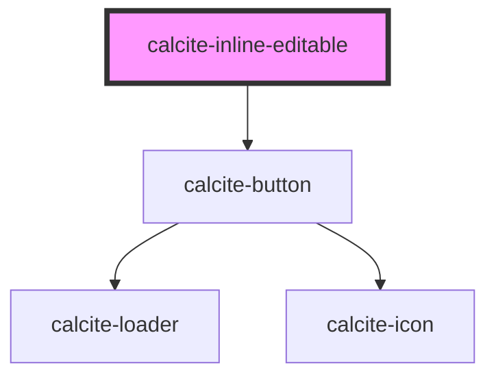

# calcite-inline-editable

<!-- Auto Generated Below -->

## Usage

### Basic

There is no need to set a theme or scale on the `<calcite-inline-editable>` component, as it inherits these values from the wrapped `<calcite-input>`, or the closest parent component where these props are set.

```html
<calcite-inline-editable>
  <calcite-input value="City of Acme Tree Survey" placeholder="City of Acme Tree Survey"></calcite-input>
</calcite-inline-editable>
```

### With-label

```html
<calcite-label>
  Survey name
  <calcite-inline-editable>
    <calcite-input value="City of Acme Tree Survey" placeholder="City of Acme Tree Survey"></calcite-input>
  </calcite-inline-editable>
</calcite-label>
```

### With-save-and-cancel-controls

Add "Save" and "Cancel" controls:

```html
<calcite-inline-editable controls>
  <calcite-input value="City of Acme Tree Survey" placeholder="City of Acme Tree Survey"></calcite-input>
</calcite-inline-editable>
```

## Properties

| Property           | Attribute           | Description                                                                                                                                                  | Type                     | Default     |
| ------------------ | ------------------- | ------------------------------------------------------------------------------------------------------------------------------------------------------------ | ------------------------ | ----------- |
| `afterConfirm`     | --                  | Specifies a callback to be executed prior to disabling editing via the controls. When provided, the component's loading state will be handled automatically. | `() => Promise<void>`    | `undefined` |
| `controls`         | `controls`          | When `true` and `editingEnabled` is `true`, displays save and cancel controls on the component.                                                              | `boolean`                | `false`     |
| `disabled`         | `disabled`          | When `true`, interaction is prevented and the component is displayed with lower opacity.                                                                     | `boolean`                | `false`     |
| `editingEnabled`   | `editing-enabled`   | When `true`, inline editing is enabled on the component.                                                                                                     | `boolean`                | `false`     |
| `loading`          | `loading`           | When `true`, a busy indicator is displayed.                                                                                                                  | `boolean`                | `false`     |
| `messageOverrides` | `message-overrides` | Use this property to override individual strings used by the component.                                                                                      | `InlineEditableMessages` | `undefined` |
| `scale`            | `scale`             | Specifies the size of the component. Defaults to the scale of the wrapped `calcite-input` or the scale of the closest wrapping component with a set scale.   | `"l" \| "m" \| "s"`      | `undefined` |

## Events

| Event                              | Description                                                    | Type                |
| ---------------------------------- | -------------------------------------------------------------- | ------------------- |
| `calciteInlineEditableEditCancel`  | Emits when the component's "cancel editing" button is pressed. | `CustomEvent<void>` |
| `calciteInlineEditableEditConfirm` | Emits when the component's "confirm edits" button is pressed.  | `CustomEvent<void>` |

## Methods

### `setFocus() => Promise<void>`

Sets focus on the component.

#### Returns

Type: `Promise<void>`

## Slots

| Slot | Description                          |
| ---- | ------------------------------------ |
|      | A slot for adding a `calcite-input`. |

## Dependencies

### Depends on

- [calcite-button](../button)

### Graph



---

*Built with [StencilJS](https://stenciljs.com/)*
