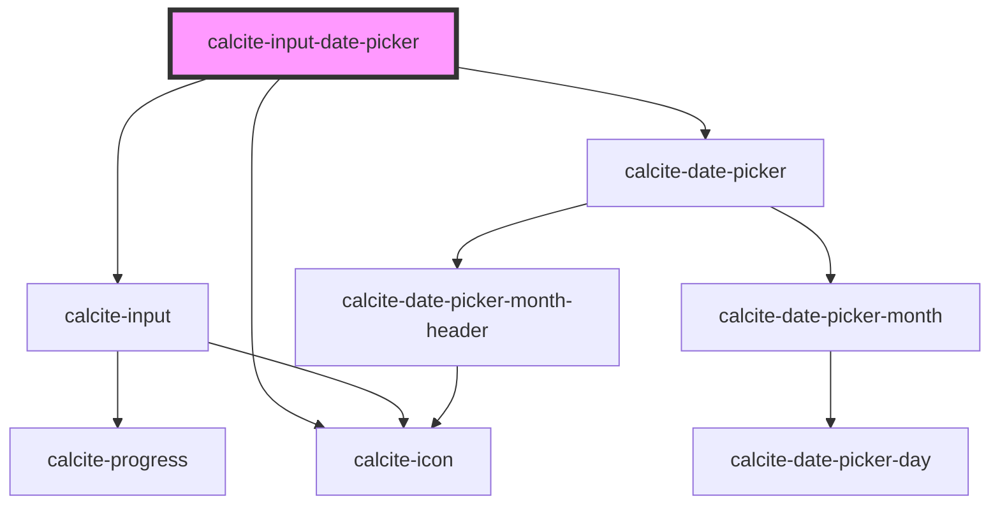

# calcite-input-date-picker

<!-- Auto Generated Below -->

## Usage

### Basic

```html
<div style="width: 400px">
  <calcite-label layout="inline">
    Date
    <calcite-input-date-picker min="2016-08-09" max="2023-12-18" lang="en"></calcite-input-date-picker>
  </calcite-label>
</div>
```

### Range

Add a `range` to the component. To set the component's value use the JavaScript `value` property with an array of strings:

```html
<calcite-input-date-picker min="2016-08-09" max="2023-12-18" lang="en" range></calcite-input-date-picker>
```

```js
document.querySelector("calcite-input-date-picker").value = ["2023-10-01", "2023-11-30"];
```

## Properties

| Property                     | Attribute                      | Description                                                                                                                                                                                                                                                                                                                                                                 | Type                                                                                                                                                                                                                                    | Default                |
| ---------------------------- | ------------------------------ | --------------------------------------------------------------------------------------------------------------------------------------------------------------------------------------------------------------------------------------------------------------------------------------------------------------------------------------------------------------------------- | --------------------------------------------------------------------------------------------------------------------------------------------------------------------------------------------------------------------------------------- | ---------------------- |
| `disabled`                   | `disabled`                     | When `true`, interaction is prevented and the component is displayed with lower opacity.                                                                                                                                                                                                                                                                                    | `boolean`                                                                                                                                                                                                                               | `false`                |
| `flipPlacements`             | --                             | Defines the available placements that can be used when a flip occurs.                                                                                                                                                                                                                                                                                                       | `Placement[]`                                                                                                                                                                                                                           | `undefined`            |
| `focusTrapDisabled`          | `focus-trap-disabled`          | When `true`, prevents focus trapping.                                                                                                                                                                                                                                                                                                                                       | `boolean`                                                                                                                                                                                                                               | `false`                |
| `form`                       | `form`                         | The ID of the form that will be associated with the component. When not set, the component will be associated with its ancestor form element, if any.                                                                                                                                                                                                                       | `string`                                                                                                                                                                                                                                | `undefined`            |
| `headingLevel`               | `heading-level`                | Specifies the number at which section headings should start.                                                                                                                                                                                                                                                                                                                | `1 \| 2 \| 3 \| 4 \| 5 \| 6`                                                                                                                                                                                                            | `undefined`            |
| `layout`                     | `layout`                       | Defines the layout of the component.                                                                                                                                                                                                                                                                                                                                        | `"horizontal" \| "vertical"`                                                                                                                                                                                                            | `"horizontal"`         |
| `max`                        | `max`                          | Specifies the latest allowed date ("yyyy-mm-dd").                                                                                                                                                                                                                                                                                                                           | `string`                                                                                                                                                                                                                                | `undefined`            |
| `maxAsDate`                  | --                             | Specifies the latest allowed date as a full date object.                                                                                                                                                                                                                                                                                                                    | `Date`                                                                                                                                                                                                                                  | `undefined`            |
| `messageOverrides`           | --                             | Use this property to override individual strings used by the component.                                                                                                                                                                                                                                                                                                     | `{ chooseDate?: string; dateFormat?: string; nextMonth?: string; prevMonth?: string; year?: string; }`                                                                                                                                  | `undefined`            |
| `min`                        | `min`                          | Specifies the earliest allowed date ("yyyy-mm-dd").                                                                                                                                                                                                                                                                                                                         | `string`                                                                                                                                                                                                                                | `undefined`            |
| `minAsDate`                  | --                             | Specifies the earliest allowed date as a full date object.                                                                                                                                                                                                                                                                                                                  | `Date`                                                                                                                                                                                                                                  | `undefined`            |
| `name`                       | `name`                         | Specifies the name of the component. Required to pass the component's `value` on form submission.                                                                                                                                                                                                                                                                           | `string`                                                                                                                                                                                                                                | `undefined`            |
| `numberingSystem`            | `numbering-system`             | Specifies the Unicode numeral system used by the component for localization. This property cannot be dynamically changed.                                                                                                                                                                                                                                                   | `"arab" \| "arabext" \| "bali" \| "beng" \| "deva" \| "fullwide" \| "gujr" \| "guru" \| "hanidec" \| "khmr" \| "knda" \| "laoo" \| "latn" \| "limb" \| "mlym" \| "mong" \| "mymr" \| "orya" \| "tamldec" \| "telu" \| "thai" \| "tibt"` | `undefined`            |
| `open`                       | `open`                         | When `true`, displays the `calcite-date-picker` component.                                                                                                                                                                                                                                                                                                                  | `boolean`                                                                                                                                                                                                                               | `false`                |
| `overlayPositioning`         | `overlay-positioning`          | Determines the type of positioning to use for the overlaid content. Using `"absolute"` will work for most cases. The component will be positioned inside of overflowing parent containers and will affect the container's layout. `"fixed"` should be used to escape an overflowing parent container, or when the reference element's `position` CSS property is `"fixed"`. | `"absolute" \| "fixed"`                                                                                                                                                                                                                 | `"absolute"`           |
| `placement`                  | `placement`                    | Specifies the placement of the `calcite-date-picker` relative to the component.                                                                                                                                                                                                                                                                                             | `"bottom" \| "bottom-end" \| "bottom-start" \| "top" \| "top-end" \| "top-start"`                                                                                                                                                       | `defaultMenuPlacement` |
| `proximitySelectionDisabled` | `proximity-selection-disabled` | When `true`, disables the default behavior on the third click of narrowing or extending the range. Instead starts a new range.                                                                                                                                                                                                                                              | `boolean`                                                                                                                                                                                                                               | `false`                |
| `range`                      | `range`                        | When `true`, activates a range for the component.                                                                                                                                                                                                                                                                                                                           | `boolean`                                                                                                                                                                                                                               | `false`                |
| `readOnly`                   | `read-only`                    | When `true`, the component's value can be read, but controls are not accessible and the value cannot be modified.                                                                                                                                                                                                                                                           | `boolean`                                                                                                                                                                                                                               | `false`                |
| `scale`                      | `scale`                        | Specifies the size of the component.                                                                                                                                                                                                                                                                                                                                        | `"l" \| "m" \| "s"`                                                                                                                                                                                                                     | `"m"`                  |
| `value`                      | `value`                        | Selected date as a string in ISO format (YYYY-MM-DD)                                                                                                                                                                                                                                                                                                                        | `string \| string[]`                                                                                                                                                                                                                    | `""`                   |
| `valueAsDate`                | --                             | The component's value as a full date object.                                                                                                                                                                                                                                                                                                                                | `Date \| Date[]`                                                                                                                                                                                                                        | `undefined`            |

## Events

| Event                               | Description                                                                                              | Type                |
| ----------------------------------- | -------------------------------------------------------------------------------------------------------- | ------------------- |
| `calciteInputDatePickerBeforeClose` | Fires when the component is requested to be closed and before the closing transition begins.             | `CustomEvent<void>` |
| `calciteInputDatePickerBeforeOpen`  | Fires when the component is added to the DOM but not rendered, and before the opening transition begins. | `CustomEvent<void>` |
| `calciteInputDatePickerChange`      | Fires when the component's value changes.                                                                | `CustomEvent<void>` |
| `calciteInputDatePickerClose`       | Fires when the component is closed and animation is complete.                                            | `CustomEvent<void>` |
| `calciteInputDatePickerOpen`        | Fires when the component is open and animation is complete.                                              | `CustomEvent<void>` |

## Methods

### `reposition(delayed?: boolean) => Promise<void>`

Updates the position of the component.

#### Returns

Type: `Promise<void>`

### `setFocus() => Promise<void>`

Sets focus on the component.

#### Returns

Type: `Promise<void>`

## Dependencies

### Depends on

- [calcite-input](../input)
- [calcite-date-picker](../date-picker)
- [calcite-icon](../icon)

### Graph



---

*Built with [StencilJS](https://stenciljs.com/)*
