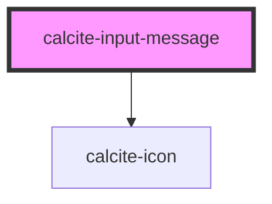

# calcite-input-message

Displays a contextual message to a user. Allows the passing of content, links, etc.

<!-- Auto Generated Below -->

## Usage

### Basic

```html
<calcite-label>
  Desired subdomain
  <calcite-input suffix-text=".city-of-acme.gov" placeholder="Enter your subdomain" value="big-map-fan">
  </calcite-input>
  <calcite-input-message icon="check-circle" status="valid">
    Excellent news - this domain is available.
  </calcite-input-message>
</calcite-label>
```

## Properties

| Property      | Attribute       | Description                                                                                  | Type                             | Default     |
| ------------- | --------------- | -------------------------------------------------------------------------------------------- | -------------------------------- | ----------- |
| `icon`        | `icon`          | Specifies an icon to display.                                                                | `boolean \| string`              | `undefined` |
| `iconFlipRtl` | `icon-flip-rtl` | When `true`, the icon will be flipped when the element direction is right-to-left (`"rtl"`). | `boolean`                        | `false`     |
| `scale`       | `scale`         | Specifies the size of the component.                                                         | `"l" \| "m" \| "s"`              | `"m"`       |
| `status`      | `status`        | Specifies the status of the input field, which determines message and icons.                 | `"idle" \| "invalid" \| "valid"` | `"idle"`    |

## Slots

| Slot | Description             |
| ---- | ----------------------- |
|      | A slot for adding text. |

## CSS Custom Properties

| Name                                    | Description                                 |
| --------------------------------------- | ------------------------------------------- |
| `--calcite-input-message-spacing-value` | The top margin spacing above the component. |

## Dependencies

### Depends on

- [calcite-icon](../icon)

### Graph



---

_Built with [StencilJS](https://stenciljs.com/)_
