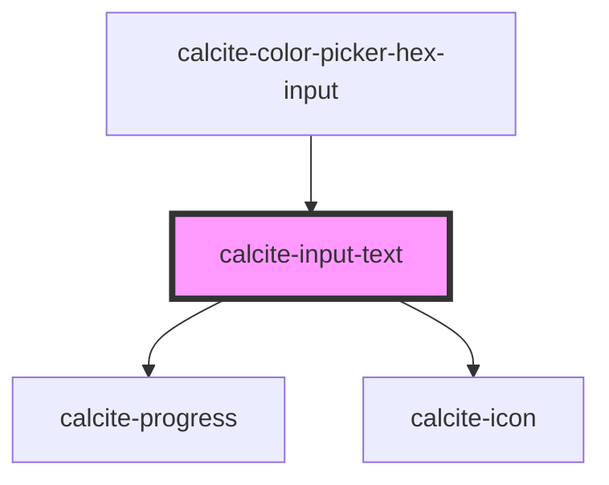

# calcite-input-text

<!-- Auto Generated Below -->

## Usage

### Basic

```html
<calcite-input-text placeholder="Enter your region"></calcite-input-text>
```

## Properties

| Property           | Attribute        | Description                                                                                                                                                                | Type                                    | Default     |
| ------------------ | ---------------- | -------------------------------------------------------------------------------------------------------------------------------------------------------------------------- | --------------------------------------- | ----------- |
| `alignment`        | `alignment`      | Specifies the text alignment of the component's value.                                                                                                                     | `"end" \| "start"`                      | `"start"`   |
| `autocomplete`     | `autocomplete`   | Specifies the type of content to autocomplete, for use in forms. Read the native attribute's documentation on MDN for more info.                                           | `string`                                | `undefined` |
| `autofocus`        | `autofocus`      | When `true`, the component is focused on page load. Only one element can contain `autofocus`. If multiple elements have `autofocus`, the first element will receive focus. | `boolean`                               | `false`     |
| `clearable`        | `clearable`      | When `true`, a clear button is displayed when the component has a value.                                                                                                   | `boolean`                               | `false`     |
| `disabled`         | `disabled`       | When `true`, interaction is prevented and the component is displayed with lower opacity.                                                                                   | `boolean`                               | `false`     |
| `enterKeyHint`     | `enter-key-hint` | Specifies the action label or icon for the Enter key on virtual keyboards. Read the native attribute's documentation on MDN for more info.                                 | `string`                                | `undefined` |
| `form`             | `form`           | The ID of the form that will be associated with the component. When not set, the component will be associated with its ancestor form element, if any.                      | `string`                                | `undefined` |
| `hidden`           | `hidden`         | When `true`, the component will not be visible.                                                                                                                            | `boolean`                               | `false`     |
| `icon`             | `icon`           | Specifies an icon to display.                                                                                                                                              | `boolean \| string`                     | `undefined` |
| `iconFlipRtl`      | `icon-flip-rtl`  | When `true`, the icon will be flipped when the element direction is right-to-left (`"rtl"`).                                                                               | `boolean`                               | `false`     |
| `inputMode`        | `input-mode`     | Specifies the type of content to help devices display an appropriate virtual keyboard. Read the native attribute's documentation on MDN for more info.                     | `string`                                | `"text"`    |
| `label`            | `label`          | Accessible name for the component's button or hyperlink.                                                                                                                   | `string`                                | `undefined` |
| `loading`          | `loading`        | When `true`, the component is in the loading state and `calcite-progress` is displayed.                                                                                    | `boolean`                               | `false`     |
| `maxLength`        | `max-length`     | Specifies the maximum length of text for the component's value.                                                                                                            | `number`                                | `undefined` |
| `messageOverrides` | --               | Use this property to override individual strings used by the component.                                                                                                    | `{ clear?: string; loading?: string; }` | `undefined` |
| `minLength`        | `min-length`     | Specifies the minimum length of text for the component's value.                                                                                                            | `number`                                | `undefined` |
| `name`             | `name`           | Specifies the name of the component. Required to pass the component's `value` on form submission.                                                                          | `string`                                | `undefined` |
| `pattern`          | `pattern`        | Specifies a regex pattern the component's `value` must match for validation. Read the native attribute's documentation on MDN for more info.                               | `string`                                | `undefined` |
| `placeholder`      | `placeholder`    | Specifies placeholder text for the component.                                                                                                                              | `string`                                | `undefined` |
| `prefixText`       | `prefix-text`    | Adds text to the start of the component.                                                                                                                                   | `string`                                | `undefined` |
| `readOnly`         | `read-only`      | When `true`, the component's value can be read, but cannot be modified.                                                                                                    | `boolean`                               | `false`     |
| `required`         | `required`       | When `true`, the component must have a value in order for the form to submit.                                                                                              | `boolean`                               | `false`     |
| `scale`            | `scale`          | Specifies the size of the component.                                                                                                                                       | `"l" \| "m" \| "s"`                     | `"m"`       |
| `status`           | `status`         | Specifies the status of the input field, which determines message and icons.                                                                                               | `"idle" \| "invalid" \| "valid"`        | `"idle"`    |
| `suffixText`       | `suffix-text`    | Adds text to the end of the component.                                                                                                                                     | `string`                                | `undefined` |
| `value`            | `value`          | The component's value.                                                                                                                                                     | `string`                                | `""`        |

## Events

| Event                    | Description                                         | Type                |
| ------------------------ | --------------------------------------------------- | ------------------- |
| `calciteInputTextChange` | Fires each time a new value is typed and committed. | `CustomEvent<void>` |
| `calciteInputTextInput`  | Fires each time a new value is typed.               | `CustomEvent<void>` |

## Methods

### `selectText() => Promise<void>`

Selects the text of the component's `value`.

#### Returns

Type: `Promise<void>`

### `setFocus() => Promise<void>`

Sets focus on the component.

#### Returns

Type: `Promise<void>`

## Slots

| Slot       | Description                                            |
| ---------- | ------------------------------------------------------ |
| `"action"` | A slot for positioning a button next to the component. |

## Dependencies

### Used by

- [calcite-color-picker-hex-input](../color-picker-hex-input)

### Depends on

- [calcite-progress](../progress)
- [calcite-icon](../icon)

### Graph



---

_Built with [StencilJS](https://stenciljs.com/)_
