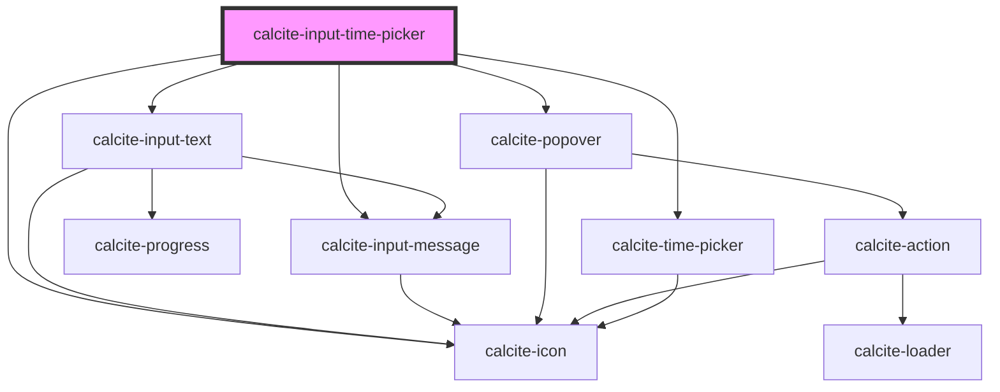

# calcite-input-time-picker

<!-- Auto Generated Below -->

## Usage

### Basic

```html
<calcite-input-time-picker name="light" scale="m" step="1" value="12:21:30"></calcite-input-time-picker>
```

### Fractional-seconds

```html
<calcite-input-time-picker name="light" scale="m" step=".001" value="12:21:30.045"></calcite-input-time-picker>
```

## Properties

| Property             | Attribute             | Description                                                                                                                                                                                                                                                                                                                                                                 | Type                                                                                                                                                                                                                                                                                                              | Default      |
| -------------------- | --------------------- | --------------------------------------------------------------------------------------------------------------------------------------------------------------------------------------------------------------------------------------------------------------------------------------------------------------------------------------------------------------------------- | ----------------------------------------------------------------------------------------------------------------------------------------------------------------------------------------------------------------------------------------------------------------------------------------------------------------- | ------------ |
| `disabled`           | `disabled`            | When `true`, interaction is prevented and the component is displayed with lower opacity.                                                                                                                                                                                                                                                                                    | `boolean`                                                                                                                                                                                                                                                                                                         | `false`      |
| `focusTrapDisabled`  | `focus-trap-disabled` | When `true`, prevents focus trapping.                                                                                                                                                                                                                                                                                                                                       | `boolean`                                                                                                                                                                                                                                                                                                         | `false`      |
| `form`               | `form`                | The `id` of the form that will be associated with the component. When not set, the component will be associated with its ancestor form element, if any.                                                                                                                                                                                                                     | `string`                                                                                                                                                                                                                                                                                                          | `undefined`  |
| `messageOverrides`   | --                    | Use this property to override individual strings used by the component.                                                                                                                                                                                                                                                                                                     | `{ [x: string]: any; }`                                                                                                                                                                                                                                                                                           | `undefined`  |
| `name`               | `name`                | Specifies the name of the component on form submission.                                                                                                                                                                                                                                                                                                                     | `string`                                                                                                                                                                                                                                                                                                          | `undefined`  |
| `numberingSystem`    | `numbering-system`    | Specifies the Unicode numeral system used by the component for localization.                                                                                                                                                                                                                                                                                                | `"arab" \| "arabext" \| "latn"`                                                                                                                                                                                                                                                                                   | `undefined`  |
| `open`               | `open`                | When `true`, displays the `calcite-time-picker` component.                                                                                                                                                                                                                                                                                                                  | `boolean`                                                                                                                                                                                                                                                                                                         | `false`      |
| `overlayPositioning` | `overlay-positioning` | Determines the type of positioning to use for the overlaid content. Using `"absolute"` will work for most cases. The component will be positioned inside of overflowing parent containers and will affect the container's layout. `"fixed"` should be used to escape an overflowing parent container, or when the reference element's `position` CSS property is `"fixed"`. | `"absolute" \| "fixed"`                                                                                                                                                                                                                                                                                           | `"absolute"` |
| `placement`          | `placement`           | Determines where the popover will be positioned relative to the input.                                                                                                                                                                                                                                                                                                      | `"auto" \| "top" \| "right" \| "bottom" \| "left" \| "top-start" \| "top-end" \| "right-start" \| "right-end" \| "bottom-start" \| "bottom-end" \| "left-start" \| "left-end" \| "auto-start" \| "auto-end" \| "leading-start" \| "leading" \| "leading-end" \| "trailing-end" \| "trailing" \| "trailing-start"` | `"auto"`     |
| `readOnly`           | `read-only`           | When `true`, the component's value can be read, but controls are not accessible and the value cannot be modified.                                                                                                                                                                                                                                                           | `boolean`                                                                                                                                                                                                                                                                                                         | `false`      |
| `required`           | `required`            | When `true`, the component must have a value in order for the form to submit.                                                                                                                                                                                                                                                                                               | `boolean`                                                                                                                                                                                                                                                                                                         | `false`      |
| `scale`              | `scale`               | Specifies the size of the component.                                                                                                                                                                                                                                                                                                                                        | `"l" \| "m" \| "s"`                                                                                                                                                                                                                                                                                               | `"m"`        |
| `status`             | `status`              | Specifies the status of the input field, which determines message and icons.                                                                                                                                                                                                                                                                                                | `"idle" \| "invalid" \| "valid"`                                                                                                                                                                                                                                                                                  | `"idle"`     |
| `step`               | `step`                | Specifies the granularity the component's `value` must adhere to (in seconds).                                                                                                                                                                                                                                                                                              | `number`                                                                                                                                                                                                                                                                                                          | `60`         |
| `validationIcon`     | `validation-icon`     | Specifies the validation icon to display under the component.                                                                                                                                                                                                                                                                                                               | `boolean \| string`                                                                                                                                                                                                                                                                                               | `undefined`  |
| `validationMessage`  | `validation-message`  | Specifies the validation message to display under the component.                                                                                                                                                                                                                                                                                                            | `string`                                                                                                                                                                                                                                                                                                          | `undefined`  |
| `value`              | `value`               | The time value in ISO (24-hour) format.                                                                                                                                                                                                                                                                                                                                     | `string`                                                                                                                                                                                                                                                                                                          | `null`       |

## Events

| Event                               | Description                                                                                              | Type                |
| ----------------------------------- | -------------------------------------------------------------------------------------------------------- | ------------------- |
| `calciteInputTimePickerBeforeClose` | Fires when the component is requested to be closed and before the closing transition begins.             | `CustomEvent<void>` |
| `calciteInputTimePickerBeforeOpen`  | Fires when the component is added to the DOM but not rendered, and before the opening transition begins. | `CustomEvent<void>` |
| `calciteInputTimePickerChange`      | Fires when the component's `value` is changes.                                                           | `CustomEvent<void>` |
| `calciteInputTimePickerClose`       | Fires when the component is closed and animation is complete.                                            | `CustomEvent<void>` |
| `calciteInputTimePickerOpen`        | Fires when the component is open and animation is complete.                                              | `CustomEvent<void>` |

## Methods

### `reposition(delayed?: boolean) => Promise<void>`

Updates the position of the component.

#### Parameters

| Name      | Type      | Description |
| --------- | --------- | ----------- |
| `delayed` | `boolean` |             |

#### Returns

Type: `Promise<void>`

### `setFocus() => Promise<void>`

Sets focus on the component.

#### Returns

Type: `Promise<void>`

## Dependencies

### Depends on

- [calcite-input-text](../input-text)
- [calcite-popover](../popover)
- [calcite-time-picker](../time-picker)
- [calcite-icon](../icon)
- [calcite-input-message](../input-message)

### Graph



---

*Built with [StencilJS](https://stenciljs.com/)*
