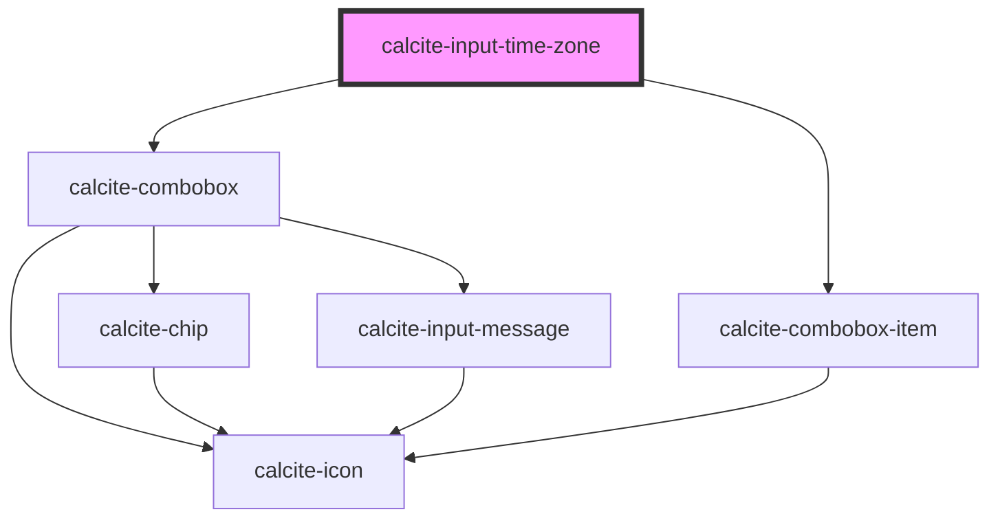

# calcite-input-time-zone

<!-- Auto Generated Below -->

## Usage

### Basic

Displays options to select a time zone offset (in minutes).

```html
<calcite-input-time-zone value="-360"></calcite-input-time-zone>
```

### TimeZoneNames

Displays options to select a IANA time zone name.

```html
<calcite-input-time-zone mode="name" value="America/Ciudad_Juarez"></calcite-input-time-zone>
```

## Properties

| Property             | Attribute             | Description                                                                                                                                                                                                                                                                                                                                                                 | Type                             | Default      |
| -------------------- | --------------------- | --------------------------------------------------------------------------------------------------------------------------------------------------------------------------------------------------------------------------------------------------------------------------------------------------------------------------------------------------------------------------- | -------------------------------- | ------------ |
| `disabled`           | `disabled`            | When `true`, interaction is prevented and the component is displayed with lower opacity.                                                                                                                                                                                                                                                                                    | `boolean`                        | `false`      |
| `form`               | `form`                | The `id` of the form that will be associated with the component. When not set, the component will be associated with its ancestor form element, if any.                                                                                                                                                                                                                     | `string`                         | `undefined`  |
| `maxItems`           | `max-items`           | Specifies the component's maximum number of options to display before displaying a scrollbar.                                                                                                                                                                                                                                                                               | `number`                         | `0`          |
| `messageOverrides`   | `message-overrides`   | Use this property to override individual strings used by the component.                                                                                                                                                                                                                                                                                                     | `InputTimeZoneMessages`          | `undefined`  |
| `mode`               | `mode`                | This specifies the type of `value` and the associated options presented to the user: Using `"offset"` will provide options that show timezone offsets. Using `"name"` will provide options that show the IANA time zone names.                                                                                                                                              | `"name" \| "offset"`             | `"offset"`   |
| `name`               | `name`                | Specifies the name of the component. Required to pass the component's `value` on form submission.                                                                                                                                                                                                                                                                           | `string`                         | `undefined`  |
| `open`               | `open`                | When `true`, displays and positions the component.                                                                                                                                                                                                                                                                                                                          | `boolean`                        | `false`      |
| `overlayPositioning` | `overlay-positioning` | Determines the type of positioning to use for the overlaid content. Using `"absolute"` will work for most cases. The component will be positioned inside of overflowing parent containers and will affect the container's layout. `"fixed"` should be used to escape an overflowing parent container, or when the reference element's `position` CSS property is `"fixed"`. | `"absolute" \| "fixed"`          | `"absolute"` |
| `referenceDate`      | `reference-date`      | This `date` will be used as a reference to Daylight Savings Time when creating time zone item groups. It can be either a Date instance or a string in ISO format (`"YYYY-MM-DD"`, `"YYYY-MM-DDTHH:MM:SS.SSSZ"`).                                                                                                                                                            | `Date \| string`                 | `undefined`  |
| `scale`              | `scale`               | Specifies the size of the component.                                                                                                                                                                                                                                                                                                                                        | `"l" \| "m" \| "s"`              | `"m"`        |
| `status`             | `status`              | Specifies the status of the input field, which determines message and icons.                                                                                                                                                                                                                                                                                                | `"idle" \| "invalid" \| "valid"` | `"idle"`     |
| `validationIcon`     | `validation-icon`     | Specifies the validation icon to display under the component.                                                                                                                                                                                                                                                                                                               | `boolean \| string`              | `undefined`  |
| `validationMessage`  | `validation-message`  | Specifies the validation message to display under the component.                                                                                                                                                                                                                                                                                                            | `string`                         | `undefined`  |
| `value`              | `value`               | The component's value, where the value is the time zone offset or the difference, in minutes, between the selected time zone and UTC. If no value is provided, the user's time zone offset will be selected by default.                                                                                                                                                     | `string`                         | `undefined`  |

## Events

| Event                             | Description                                                                                              | Type                |
| --------------------------------- | -------------------------------------------------------------------------------------------------------- | ------------------- |
| `calciteInputTimeZoneBeforeClose` | Fires when the component is requested to be closed and before the closing transition begins.             | `CustomEvent<void>` |
| `calciteInputTimeZoneBeforeOpen`  | Fires when the component is added to the DOM but not rendered, and before the opening transition begins. | `CustomEvent<void>` |
| `calciteInputTimeZoneChange`      | Fires when the component's `value` changes.                                                              | `CustomEvent<void>` |
| `calciteInputTimeZoneClose`       | Fires after the component is closed and animation is complete.                                           | `CustomEvent<void>` |
| `calciteInputTimeZoneOpen`        | Fires after the component is opened and animation is complete.                                           | `CustomEvent<void>` |

## Methods

### `setFocus() => Promise<void>`

#### Returns

Type: `Promise<void>`

## Dependencies

### Depends on

- [calcite-combobox](../combobox)
- [calcite-combobox-item](../combobox-item)

### Graph



---

*Built with [StencilJS](https://stenciljs.com/)*
